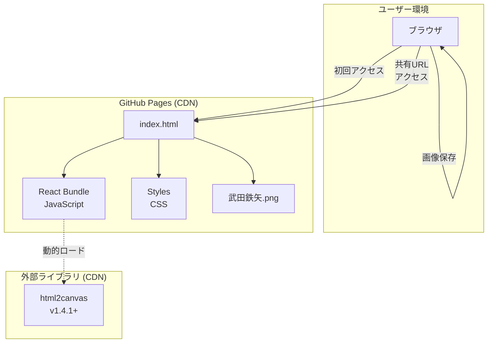
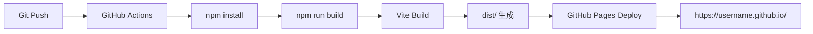

# 贈る言葉BOT アーキテクチャ設計

## システム概要

贈る言葉BOTは、ユーザーがオリジナルの言葉とその意味を入力し、武田鉄矢が黒板の前で言葉を贈ってくれる画像を生成・共有できるWebアプリケーションです。

**【信頼性レベル】**: 🔵 本ドキュメントは要件定義書と技術スタック定義に基づいて作成されています

### システム特性

- **アプリケーション種別**: SPA (Single Page Application)
- **デプロイ形態**: 静的Webサイト (GitHub Pages)
- **データ永続化**: URLパラメータのみ（サーバー・DB不要）
- **対象デバイス**: スマートフォン、タブレット、PC

## アーキテクチャパターン

### 選択パターン: Client-Side Only Architecture 🔵

**パターン名**: Pure Frontend / Jamstack Pattern

**理由** 🔵 *要件定義書 CONST-001, CONST-002, CONST-003より*:
1. バックエンドサーバー不要の制約（CONST-001）
2. データベース不使用の制約（CONST-002）
3. URLパラメータでのデータ永続化（CONST-003）
4. GitHub Pages静的ホスティング（CONST-201）
5. コスト最小化（無料ツール中心）

**利点**:
- デプロイが簡単（静的ファイルのみ）
- サーバー運用コスト0円
- スケーラビリティ高い（CDN配信）
- セキュリティリスク低い（攻撃対象面が小さい）

**制約**:
- バックエンド処理不可
- データベース永続化不可
- URL長さ制限あり（500文字）

## システムアーキテクチャ図



## コンポーネント構成

### フロントエンド 🔵

#### コア技術
- **フレームワーク**: React 18.3+ *tech-stack.mdより*
- **言語**: TypeScript 5.0+ *tech-stack.mdより*
- **ビルドツール**: Vite 5.x *tech-stack.mdより*
- **ルーティング**: React Router v6 *tech-stack.mdより*

#### 状態管理 🔵
- **グローバル状態**: React Context API *tech-stack.mdより*
  - チュートリアル表示状態
  - トーストメッセージ状態
- **フォーム状態**: React useState/useReducer *tech-stack.mdより*
  - 入力フォームデータ
  - バリデーションエラー
- **URL状態**: React Router useSearchParams *tech-stack.mdより*
  - 共有リンクのパラメータ

#### UIスタイリング 🔵
- **手法**: CSS Modules + 標準CSS *tech-stack.mdより*
- **アニメーション**: CSS Animations (タイプライター) *tech-stack.mdより*
- **縦書き**: CSS `writing-mode: vertical-rl` *要件定義書 REQ-232より*
- **レスポンシブ**: CSS Grid + Flexbox *tech-stack.mdより*

### バックエンド

**該当なし** 🔵 *CONST-001: バックエンドサーバーを持たない*

### データベース

**該当なし** 🔵 *CONST-002: データベースを使用しない*

### データ永続化方式 🔵

**URLパラメータベース** *CONST-003より*

```
https://example.github.io/gift-words/#/display?data={Base64EncodedData}
```

- **エンコード方式**: Base64 *REQ-103より*
- **データ形式**: JSON文字列をエンコード
- **最大長**: 500文字 *REQ-111より*
- **文字コード**: UTF-8 *REQ-112より*

## レイヤー構成

### プレゼンテーション層 (Presentation Layer)

**責務**: UI表示、ユーザー操作の受付

**構成要素**:
- Reactコンポーネント
- CSS Modules
- カスタムフック (UI ロジック)

### ビジネスロジック層 (Business Logic Layer)

**責務**: バリデーション、データ変換、アニメーション制御

**構成要素**:
- カスタムフック (ビジネスロジック)
- ユーティリティ関数
- バリデーションロジック

### データアクセス層 (Data Access Layer)

**責務**: URLパラメータのエンコード/デコード、localStorage操作

**構成要素**:
- URL エンコーダー/デコーダー
- localStorage ラッパー（チュートリアル表示フラグ用）

## コンポーネントツリー構造 🔵

```
App (ルートコンポーネント)
├── Router (React Router)
│   ├── Route: "/" (トップページ)
│   │   └── HomePage
│   │       ├── TutorialModal (初回訪問時) 🔵 REQ-004
│   │       ├── InputForm 🔵 F-001
│   │       │   ├── WordInput 🔵 REQ-001
│   │       │   ├── MeaningTextarea 🔵 REQ-002
│   │       │   ├── CharacterCounter 🟡
│   │       │   ├── ValidationMessage 🟡 REQ-011/012
│   │       │   └── SubmitButton 🔵 REQ-003
│   │       └── ShareModal (送信後) 🔵 F-002
│   │           ├── GeneratedURL 🔵 REQ-101
│   │           └── CopyButton 🔵 REQ-104
│   │
│   └── Route: "/display" (表示ページ)
│       └── DisplayPage 🔵 F-003
│           ├── BackgroundImage (武田鉄矢) 🔵 REQ-201
│           ├── VerticalTextDisplay 🔵 REQ-203
│           │   ├── WordDisplay (タイプライター) 🔵 REQ-205
│   │       │   └── MeaningDisplay (タイプライター) 🔵 REQ-205
│           ├── ImageSaveButton 🔵 REQ-301
│           └── NewWordButton 🔵 REQ-206
│
└── ToastContainer (グローバル) 🔵 REQ-105
    └── Toast (エラー/成功メッセージ) 🔵 REQ-105, REQ-311
```

## ルーティング設計 🔵

### ルート定義

| パス | コンポーネント | 説明 | 要件 |
|------|--------------|------|------|
| `/` | HomePage | 入力フォームページ | F-001, F-002 |
| `/display` | DisplayPage | 言葉表示ページ | F-003, F-004 |
| `/error` | ErrorPage | エラーページ（オプション）| REQ-211 |
| `*` | NotFound | 404ページ | 🟡 |

### URLパラメータ

#### `/display` のクエリパラメータ

```typescript
interface DisplayParams {
  data: string; // Base64エンコードされたJSON文字列
}

// デコード後のデータ構造
interface GiftWordData {
  word: string;      // 贈りたい言葉（最大50文字）
  meaning: string;   // その意味（最大300文字）
  timestamp?: number; // 生成日時（オプション）
}
```

**例**:
```
/display?data=eyJ3b3JkIjoi44GC44KK44GM44Go44GGIiwibWVhbmluZyI6Iuato...
```

## セキュリティアーキテクチャ 🔵

### XSS対策 *NFR-101, NFR-102, NFR-103より*

1. **Reactデフォルトエスケープ**: すべてのユーザー入力を自動エスケープ
2. **dangerouslySetInnerHTML禁止**: 絶対に使用しない
3. **サニタイゼーション**: 入力時にサニタイズ処理

### URLパラメータセキュリティ *NFR-104より*

1. **Base64エンコード**: 基本的な難読化
2. **長さ制限**: 500文字以内 *REQ-111*
3. **不正データ検証**: デコード失敗時のエラーハンドリング *REQ-213*

### コンテンツセキュリティポリシー (CSP) 🟡

```html
<meta http-equiv="Content-Security-Policy"
      content="default-src 'self';
               script-src 'self';
               style-src 'self' 'unsafe-inline';
               img-src 'self' data:;">
```

## パフォーマンスアーキテクチャ 🔵

### 最適化戦略 *NFR-001, NFR-002, NFR-003, NFR-004より*

#### バンドルサイズ最適化

- **目標**: 500KB以下（gzip圧縮後）*NFR-003*
- **手法**:
  - Code Splitting (ルート単位)
  - Tree Shaking (Vite自動)
  - Dynamic Import (html2canvas)

```typescript
// html2canvasの動的インポート
const html2canvas = await import('html2canvas');
```

#### ページ読み込み最適化

- **目標**: 3秒以内 *NFR-001*
- **手法**:
  - 画像最適化（武田鉄矢.png）
  - クリティカルCSS インライン化
  - プリロード設定

```html
<link rel="preload" href="/武田鉄矢.png" as="image">
```

#### アニメーションパフォーマンス

- **目標**: 60fps以上 *NFR-002*
- **手法**:
  - CSS Animations優先（GPU加速）
  - requestAnimationFrame使用
  - will-change プロパティ活用

```css
.typewriter-text {
  will-change: contents;
}
```

### Lighthouse目標スコア *NFR-004*

- Performance: 90+点
- Accessibility: 85+点
- Best Practices: 90+点
- SEO: 90+点

## デプロイアーキテクチャ 🔵

### CI/CDパイプライン *CONST-201, CONST-202より*



### ビルド設定

**vite.config.ts** 🔵 *tech-stack.md設定ファイル例より*:
```typescript
export default defineConfig({
  plugins: [react()],
  base: '/贈る言葉/',
  build: {
    outDir: 'dist',
    sourcemap: false,
    minify: 'terser',
  },
})
```

### GitHub Actions ワークフロー 🟡

```.github/workflows/deploy.yml
name: Deploy to GitHub Pages

on:
  push:
    branches: [ main ]

jobs:
  build-and-deploy:
    runs-on: ubuntu-latest
    steps:
      - uses: actions/checkout@v3
      - uses: actions/setup-node@v3
        with:
          node-version: '18'
      - run: npm ci
      - run: npm run build
      - uses: peaceiris/actions-gh-pages@v3
        with:
          github_token: ${{ secrets.GITHUB_TOKEN }}
          publish_dir: ./dist
```

## エラーハンドリングアーキテクチャ 🔵

### エラー分類

#### ユーザー入力エラー 🔵
- バリデーションエラー *REQ-011, REQ-012, REQ-013, REQ-014*
- 表示方法: インラインメッセージ

#### システムエラー 🔵
- URLデコードエラー *REQ-213*
- 画像生成エラー *REQ-311*
- ネットワークエラー *EDGE-001*
- 表示方法: トーストメッセージ

#### ブラウザ互換性エラー 🟡
- html2canvas非対応 *EDGE-002*
- クリップボードAPI非対応 *EDGE-003*
- 表示方法: 警告メッセージ + 代替手段提示

### エラーバウンダリ 🟡

```typescript
<ErrorBoundary>
  <App />
</ErrorBoundary>
```

## 状態管理アーキテクチャ 🔵

### Context構成

```typescript
// AppContext: グローバル状態管理
AppContext
├── TutorialContext (チュートリアル表示状態) 🔵 REQ-004
│   ├── isFirstVisit: boolean
│   └── setFirstVisit: (value: boolean) => void
│
└── ToastContext (トーストメッセージ) 🔵 REQ-105, REQ-311
    ├── toasts: Toast[]
    ├── showToast: (message: string, type: ToastType) => void
    └── hideToast: (id: string) => void
```

### ローカルストレージ使用 🟡

```typescript
// チュートリアル表示フラグ
localStorage.setItem('tutorial_shown', 'true');

// 将来の拡張: 言葉作成履歴（スコープ外）
// localStorage.setItem('word_history', JSON.stringify(history));
```

## アクセシビリティアーキテクチャ 🔵

### 基本方針 *NFR-204, NFR-205, NFR-206より*

1. **セマンティックHTML**: 適切なHTML5要素使用 *NFR-204*
2. **キーボード操作**: 全機能をキーボードで操作可能 *NFR-205*
3. **ARIA属性**: 基本的なARIA属性適用 *NFR-206*

### 実装例

```tsx
// セマンティックHTML + ARIA
<form aria-label="言葉入力フォーム">
  <label htmlFor="word">贈りたい言葉</label>
  <input
    id="word"
    type="text"
    aria-required="true"
    aria-invalid={hasError}
    aria-describedby="word-error"
  />
  {hasError && (
    <span id="word-error" role="alert">
      50文字以内で入力してください
    </span>
  )}
</form>
```

## レスポンシブアーキテクチャ 🔵

### ブレイクポイント戦略 *NFR-203, NFR-401, NFR-402より*

```css
/* スマートフォン縦 (デフォルト) */
/* 〜768px */

/* スマートフォン横 / タブレット縦 */
@media (min-width: 769px) and (orientation: landscape) {
  /* PC版と同じレイアウト */ /* NFR-401 */
}

/* タブレット横 / PC */
@media (min-width: 1024px) {
  /* PC最適化レイアウト */
}
```

### レイアウト方針

- **モバイルファースト**: 小さい画面から設計
- **フレキシブル**: CSS Grid + Flexbox
- **タッチフレンドリー**: ボタンサイズ44px以上

## 拡張性設計 🔴

将来の拡張可能性（現バージョンスコープ外）:

### 考慮事項

1. **複数キャラクター対応**:
   - 画像アセットの動的切り替え
   - キャラクター選択UI

2. **カスタマイズ機能**:
   - フォント選択
   - 色選択
   - 背景画像アップロード

3. **SNS連携**:
   - Twitter/X共有API
   - LINE共有API
   - OGP画像生成

4. **履歴保存**:
   - LocalStorage永続化
   - エクスポート/インポート機能

### 設計原則

- **疎結合**: コンポーネント間の依存を最小化
- **単一責任**: 1コンポーネント1責務
- **拡張開放**: 新機能追加時に既存コードを変更しない

## 非機能要件への対応

### パフォーマンス 🔵
- 初回ロード3秒以内 *NFR-001* → Code Splitting + 画像最適化
- 60fps維持 *NFR-002* → CSS Animations + GPU加速
- バンドル500KB以下 *NFR-003* → Tree Shaking + 動的インポート
- Lighthouse 90点+ *NFR-004* → 総合最適化

### セキュリティ 🔵
- XSS防止 *NFR-101/102/103* → Reactエスケープ + サニタイズ
- URL難読化 *NFR-104* → Base64エンコード

### ユーザビリティ 🔵
- シンプルUI *NFR-201* → ミニマルデザイン
- 3ステップ以内 *NFR-202* → 直感的フロー
- レスポンシブ *NFR-203* → モバイルファースト
- A11y対応 *NFR-204/205/206* → セマンティックHTML + キーボード操作

### ブラウザ対応 🔵
- モダンブラウザ *NFR-301* → Chrome, Firefox, Edge, Safari最新版

## 更新履歴

- 2025-01-20: 初回作成（/tsumiki:kairo-designにより生成）
