# データフロー図

## 概要

このドキュメントは贈る言葉BOTのデータフロー全体を可視化します。

**【信頼性レベル】**: 🔵 要件定義書とユーザストーリーに基づいて作成

## システム全体のデータフロー

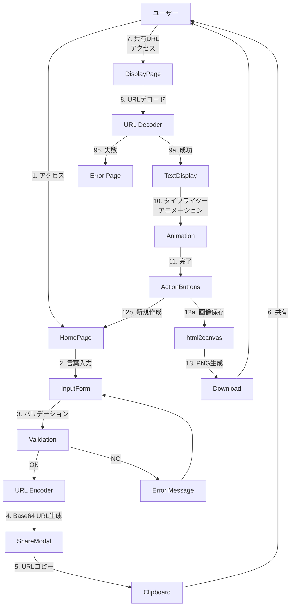

## ユーザージャーニー別データフロー

### ジャーニー1: 言葉を作成して共有する 🔵

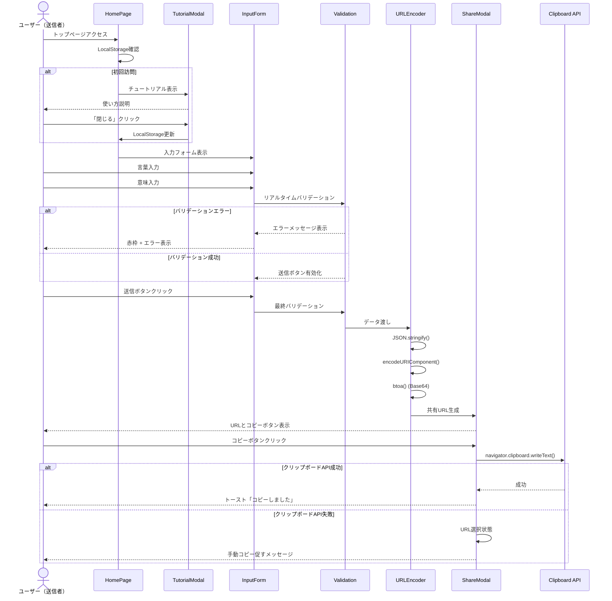

### ジャーニー2: 贈られた言葉を見る 🔵

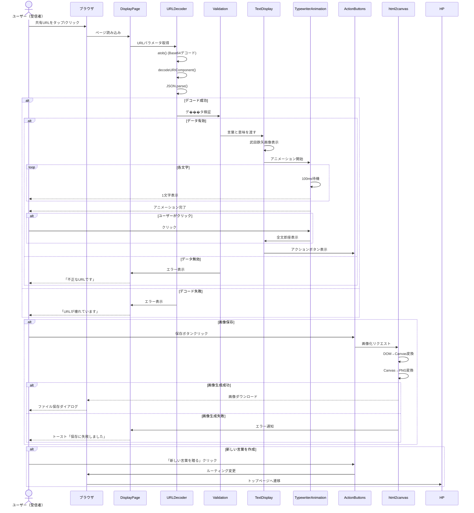

## データ構造とフロー

### 入力データフロー 🔵

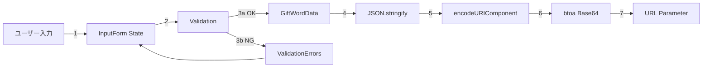

**データ変換例**:
```
Step 1: ユーザー入力
{
  word: "ありがとう",
  meaning: "いつも支えてくれてありがとう"
}

Step 2: JSON文字列化
'{"word":"ありがとう","meaning":"いつも支えてくれてありがとう"}'

Step 3: URIエンコード
'%7B%22word%22%3A%22%E3%81%82%E3%82%8A%E3%81%8C%E3%81%A8%E3%81%86%22...'

Step 4: Base64エンコード
'eyJ3b3JkIjoi44GC44KK44GM44Go44GGIiwibWVhbmluZyI6Iuato...'

Step 5: URL
'/display?data=eyJ3b3JkIjoi44GC44KK44GM44Go44GGIiwibWVhbmluZyI6Iuato...'
```

### 出力データフロー 🔵

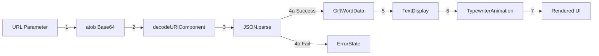

## 状態管理フロー

### Context Stateフロー 🔵

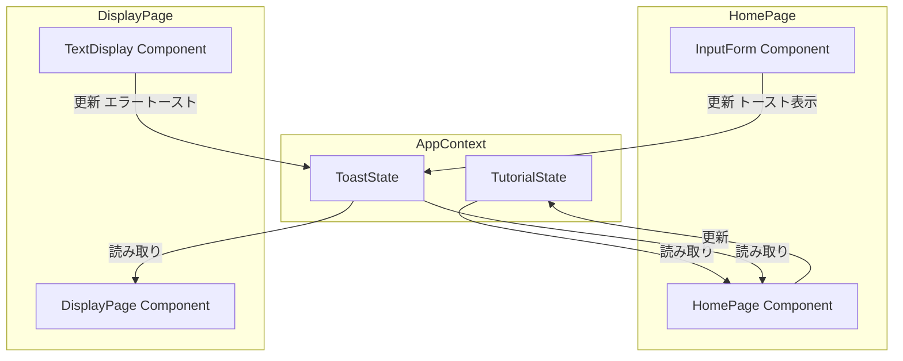

### ローカルストレージフロー 🔵

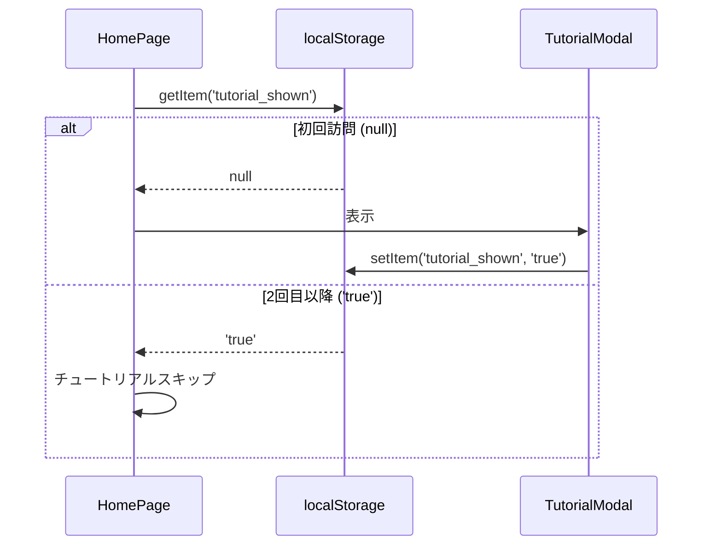

## バリデーションフロー 🔵

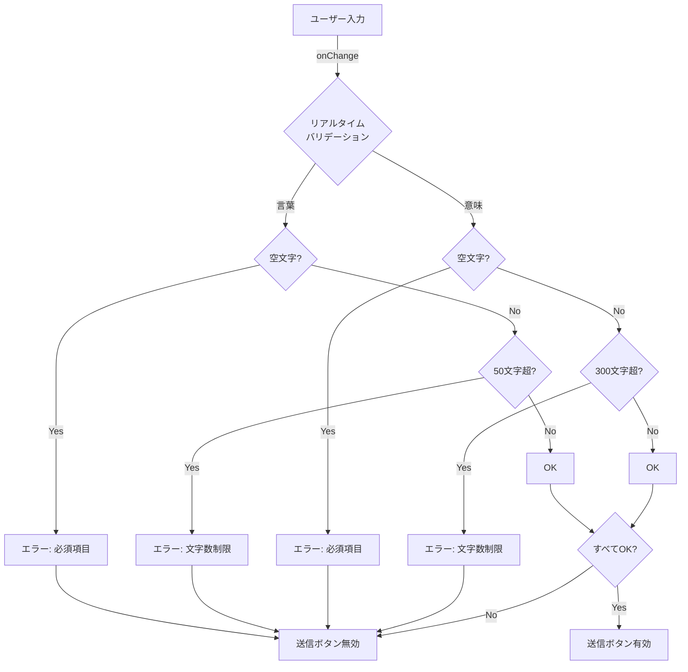

## アニメーションフロー 🔵

### タイプライターアニメーション 🔵

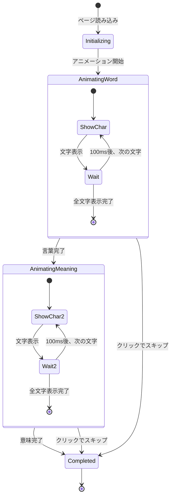

## 画像生成フロー 🔵

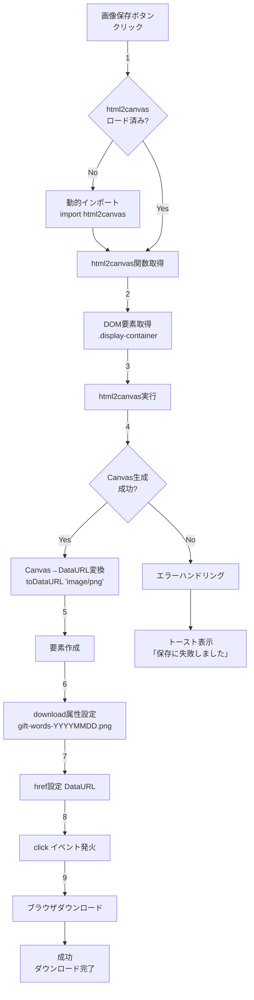

## エラーハンドリングフロー 🔵

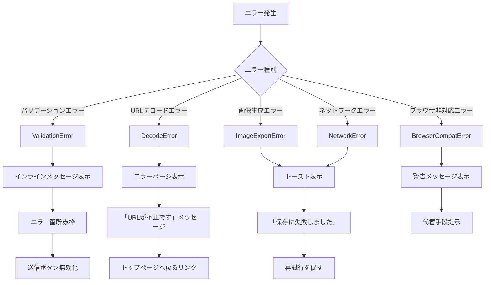

## 非同期処理フロー

### 動的インポートフロー 🟡

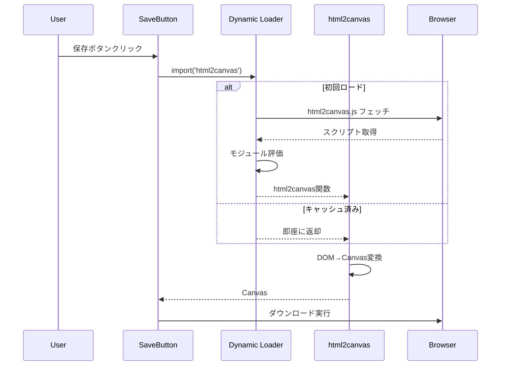

## レスポンシブフロー 🔵

### デバイス別レンダリングフロー

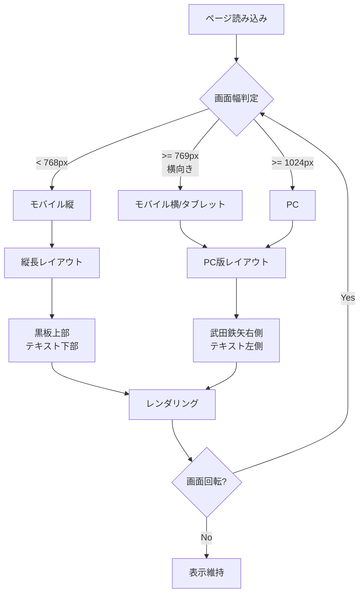

## パフォーマンス最適化フロー

### Code Splittingフロー 🟡

```mermaid
graph LR
    A[初回アクセス] --> B[メインバンドル読み込み]
    B --> C[App + HomePage]

    D[/displayへ遷移] --> E{DisplayPageロード済み?}
    E -->|No| F[DisplayPage chunk読み込み]
    F --> G[DisplayPage表示]
    E -->|Yes| G

    H[画像保存クリック] --> I{html2canvasロード済み?}
    I -->|No| J[html2canvas chunk読み込み]
    J --> K[画像生成実行]
    I -->|Yes| K
```

## 更新履歴

- 2025-01-20: 初回作成（/tsumiki:kairo-designにより生成）
