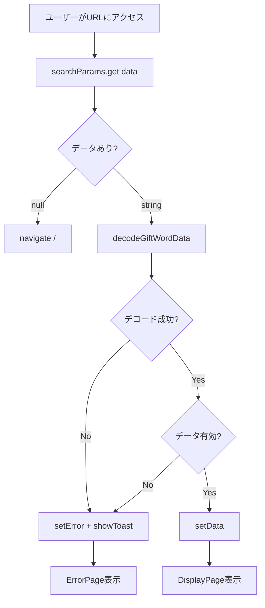

# TASK-0026: URLデコード機能のDisplayPage統合 - 要件定義書

## 生成情報
- **生成日**: 2025-11-22
- **生成ツール**: /tsumiki:tdd-requirements
- **タスクID**: TASK-0026
- **タスク名**: URLデコード機能のDisplayPage統合
- **見積工数**: 3時間
- **優先度**: P0(最優先)
- **依存タスク**: TASK-0018(URLデコーダー完了), TASK-0025(DisplayPage基本構造完了)

---

## 1. 機能の概要（EARS要件定義書・設計文書ベース）

### 何をする機能か

**機能名**: URLデコード統合機能

DisplayPageコンポーネントに、URLパラメータから贈る言葉データをBase64デコードして取得・表示する機能を統合します。既存の`decodeGiftWordData`関数を活用し、適切なエラーハンドリングとユーザーフィードバック（トーストメッセージ）を実装します。

### どのような問題を解決するか

🔵 **問題**: ユーザーが共有URLにアクセスした際に、URLパラメータが不正またはデータが破損していると、アプリケーションがクラッシュまたは不適切な動作をする可能性があります。

🔵 **解決策**:
- URLパラメータの有無を検証
- Base64デコードの成功・失敗を検証
- データの完全性（wordとmeaningの存在）を検証
- 各エラーケースで適切なユーザーフィードバックを提供
- エラー時にはトーストメッセージで明確なメッセージを表示

### 想定されるユーザー

🔵 **ユーザー**: 友達から共有URLを受け取ったユーザー

🔵 **ユーザーストーリー**:
- As a: 共有リンクを受け取ったユーザー
- I want to: URLにアクセスして贈る言葉を正しく表示したい
- So that: 友達が贈ってくれた言葉を読むことができる

### システム内での位置づけ

🔵 **アーキテクチャ設計上の位置**:
```
ユーザー → 共有URL → DisplayPage
              ↓
        URLパラメータ抽出
              ↓
      decodeGiftWordData() ← urlEncoder.ts
              ↓
      ┌──────┴──────┐
   成功              失敗
      ↓                ↓
  データ表示      エラーページ + トースト
```

🔵 **既存システムとの連携**:
- `urlEncoder.ts`: Base64デコード機能を提供
- `ToastContext`: エラーメッセージのトースト表示
- `ErrorPage`: デコード失敗時のエラー画面表示
- `DisplayPage`: メインの表示ページ（TASK-0025で実装済み）

### 参照したEARS要件

🔵 **REQ-102**: URLパラメータ形式（`?data=<base64>`）
🔵 **REQ-103**: Base64デコード機能
🟡 **REQ-212**: URLパラメータ不在時のリダイレクト（TASK-0025で実装済み、本タスクで拡張）
🟡 **REQ-213**: デコード失敗時のエラーメッセージ表示

### 参照した設計文書

🔵 **tech-stack.md**:
- React 18.3+ with TypeScript
- Context API for state management (ToastContext)
- Vite build tool

🔵 **gift-words-phase3.md**:
- TASK-0026の詳細仕様
- テストケース定義
- 実装サンプルコード

---

## 2. 入力・出力の仕様（EARS機能要件・TypeScript型定義ベース）

### 入力パラメータ

🔵 **URLパラメータ** (types/index.ts):
```typescript
// URLSearchParamsから取得
encodedData: string | null
```
- **型**: `string | null`
- **範囲**: Base64エンコードされた文字列
- **制約**:
  - `null`の場合はトップページへリダイレクト（REQ-212）
  - 空文字列の場合はエラー
  - 不正なBase64文字列の場合はエラー

🔵 **期待されるデータ構造** (types/index.ts):
```typescript
interface GiftWordData {
  word: string;      // 最大50文字 (REQ-013)
  meaning: string;   // 最大300文字 (REQ-014)
  timestamp?: number; // オプション
}
```

### 出力値

🔵 **成功時の出力** (types/index.ts):
```typescript
interface DecodeResult {
  data: GiftWordData;  // デコードされたデータ
  success: true;
  error?: undefined;
}
```

🔵 **失敗時の出力** (types/index.ts):
```typescript
interface DecodeResult {
  data: null;
  success: false;
  error: string;  // ERROR_MESSAGES.xxx から取得
}
```

### 入出力の関係性

🔵 **データフロー**:
```
URLパラメータ (?data=<base64>)
    ↓
searchParams.get('data')
    ↓
encodedData: string | null
    ↓ (if null)
navigate('/', { replace: true })  // REQ-212
    ↓ (if string)
decodeGiftWordData(encodedData)
    ↓
DecodeResult { success, data, error }
    ↓
┌───────┴───────┐
成功             失敗
↓               ↓
setData()      setError()
              showToast(error, 'error')
```

### 参照したEARS要件

🔵 **REQ-102**: URLパラメータ形式 `?data=<base64>`
🔵 **REQ-103**: Base64デコード処理
🟡 **REQ-212**: URLパラメータ不在時の動作
🟡 **REQ-213**: エラーメッセージの仕様

### 参照した設計文書

🔵 **types/index.ts**:
- `GiftWordData`インターフェース (lines 12-19)
- `DecodeResult`インターフェース (lines 90-97)
- `VALIDATION_RULES` (lines 115-122)

🔵 **urlEncoder.ts**:
- `decodeGiftWordData`関数 (lines 53-91)

---

## 3. 制約条件（EARS非機能要件・アーキテクチャ設計ベース）

### パフォーマンス要件

🔵 **NFR-001**: ページ読み込み3秒以内
- デコード処理は同期的に実行されるため、ほぼ即座に完了（<10ms）
- ローディング状態の適切な管理で体感速度を向上

🟡 **NFR-002**: 60fps維持
- デコード処理はアニメーション前に完了するため、影響なし

### セキュリティ要件

🔵 **XSS対策**:
- Reactのデフォルトエスケープ機能活用
- デコードされたデータは必ずテキストとして表示
- `dangerouslySetInnerHTML`は使用しない

🔵 **データバリデーション** (REQ-103):
- Base64デコード失敗時のエラーハンドリング
- データ構造の検証（word, meaningの存在確認）
- 空データの拒否

### 互換性要件

🔵 **REQ-021**: 日本語（ひらがな、カタカナ、漢字）対応
- Base64エンコード前にURIエンコードを実施（urlEncoder.ts line 21）
- UTF-8文字列の正しいデコード

🔵 **ブラウザ互換性**:
- Chrome, Firefox, Edge, Safari（最新版）
- `atob()`と`btoa()`はすべてのモダンブラウザで対応

### アーキテクチャ制約

🔵 **React Context API使用**:
- ToastContextを使用してエラーメッセージを表示
- `useToast()`フックでトースト機能を取得

🔵 **React Router v6使用**:
- `useSearchParams()`でURLパラメータを取得
- `useNavigate()`でページ遷移

### データベース制約

🔵 **データベース不使用**:
- すべてのデータはURLパラメータで渡される
- サーバーサイド処理なし（完全にクライアントサイド）

### API制約

🔵 **外部API不使用**:
- デコード処理はすべてブラウザ内で完結
- ネットワークリクエストなし

### 参照したEARS要件

🔵 **REQ-103**: Base64デコード処理
🔵 **REQ-021**: 日本語対応
🟡 **REQ-212**: リダイレクト処理
🟡 **REQ-213**: エラーメッセージ表示

🔵 **NFR-001**: ページ読み込み3秒以内

### 参照した設計文書

🔵 **tech-stack.md**:
- React 18.3+ (lines 22-23)
- TypeScript 5.0+ (line 23)
- React Router v6 (line 25)
- Context API (line 34)

---

## 4. 想定される使用例（EARSEdgeケース・データフローベース）

### 基本的な使用パターン

🔵 **正常ケース1**: 有効なURLパラメータでアクセス
```typescript
// URL: https://example.com/#/display?data=eyJ3b3JkIjoi5oSf6KySIiwibWVhbmluZyI6IuOBhOOBpOOCguOBguOCiuOBjOOBqOOBhiJ9

// 期待される動作:
1. searchParams.get('data') → "eyJ3b3JkIjoi5oSf6KySIiwibWVhbmluZyI6IuOBhOOBpOCCguOBguOCiuOBjOOBqOOBhiJ9"
2. decodeGiftWordData() → { success: true, data: { word: "感謝", meaning: "いつもありがとう" } }
3. setData({ word: "感謝", meaning: "いつもありがとう" })
4. 表示ページにデータが表示される
```
- **参照要件**: REQ-102, REQ-103

### エッジケース

🔵 **EDGE-001**: URLパラメータが存在しない
```typescript
// URL: https://example.com/#/display

// 期待される動作:
1. searchParams.get('data') → null
2. navigate('/', { replace: true })  // トップページへリダイレクト
3. DisplayPageは表示されない
```
- **参照要件**: REQ-212

🔵 **EDGE-002**: URLパラメータが空文字列
```typescript
// URL: https://example.com/#/display?data=

// 期待される動作:
1. searchParams.get('data') → ""
2. decodeGiftWordData("") → { success: false, error: ERROR_MESSAGES.INVALID_URL }
3. setError(ERROR_MESSAGES.INVALID_URL)
4. showToast(ERROR_MESSAGES.INVALID_URL, 'error')
5. ErrorPage表示
```
- **参照要件**: REQ-213

🔵 **EDGE-003**: 不正なBase64データ
```typescript
// URL: https://example.com/#/display?data=invalid!!!base64

// 期待される動作:
1. searchParams.get('data') → "invalid!!!base64"
2. decodeGiftWordData() → try-catchでエラー捕捉
3. { success: false, error: ERROR_MESSAGES.DECODE_FAILED }
4. setError(ERROR_MESSAGES.DECODE_FAILED)
5. showToast(ERROR_MESSAGES.DECODE_FAILED, 'error')
6. ErrorPage表示
```
- **参照要件**: REQ-103, REQ-213

🔵 **EDGE-004**: データが欠けている（wordまたはmeaningが空）
```typescript
// デコード結果: { word: "", meaning: "意味のみ" }

// 期待される動作:
1. decodeGiftWordData() → JSONパースは成功
2. データバリデーション: !data.word → false
3. { success: false, error: ERROR_MESSAGES.INVALID_DATA }
4. setError(ERROR_MESSAGES.INVALID_DATA)
5. showToast(ERROR_MESSAGES.INVALID_DATA, 'error')
6. ErrorPage表示
```
- **参照要件**: REQ-213

### エラーケース

🔵 **ERROR-001**: JSON パース失敗
```typescript
// Base64デコード後の文字列: "not a json"

// 期待される動作:
1. JSON.parse("not a json") → SyntaxError
2. try-catchでエラー捕捉
3. { success: false, error: ERROR_MESSAGES.DECODE_FAILED }
4. ErrorPage表示 + トーストメッセージ
```

🟡 **ERROR-002**: 予期しないエラー
```typescript
// 何らかの予期しないエラーが発生

// 期待される動作:
1. useEffectのtry-catchで捕捉
2. setError(ERROR_MESSAGES.UNEXPECTED_ERROR)
3. showToast(ERROR_MESSAGES.UNEXPECTED_ERROR, 'error')
4. ErrorPage表示
```

### データフロー

🔵 **正常フロー**:


### 参照したEARS要件

🔵 **REQ-102**: URLパラメータ形式
🔵 **REQ-103**: Base64デコード
🟡 **REQ-212**: URLパラメータ不在時のリダイレクト
🟡 **REQ-213**: エラーメッセージ

🔵 **EDGE-XXX**: エッジケースは要件定義書には未定義だが、一般的なWebアプリケーションのベストプラクティスに基づく

### 参照した設計文書

🔵 **gift-words-phase3.md** (lines 295-384):
- TASK-0026の詳細仕様
- テストケース定義 (lines 357-367)
- 実装サンプルコード (lines 315-354)

---

## 5. EARS要件・設計文書との対応関係

### 参照したユーザストーリー

🔵 **US-003**: 贈る言葉表示ページ
- As a: 共有リンクを受け取ったユーザー
- I want to: URLにアクセスして贈る言葉を見たい
- So that: 友達が贈ってくれた言葉を読める

### 参照した機能要件

🔵 **REQ-102**: URLパラメータ形式
- WHEN ユーザーが共有URLにアクセスする時
- WHILE データが正常にエンコードされている間
- THE SYSTEM SHALL URLパラメータからdataを抽出する

🔵 **REQ-103**: Base64デコード
- WHEN URLパラメータからdataを取得した時
- THE SYSTEM SHALL Base64デコードを実行する
- THE SYSTEM SHALL JSON.parse()でGiftWordDataに変換する

🟡 **REQ-212**: URLパラメータ不在時のリダイレクト
- WHEN URLパラメータが存在しない時
- THE SYSTEM SHALL トップページへリダイレクトする

🟡 **REQ-213**: デコード失敗時のエラーメッセージ
- IF デコードが失敗した場合
- THEN THE SYSTEM SHALL 分かりやすいエラーメッセージを表示する
- THEN THE SYSTEM SHALL トーストメッセージでユーザーに通知する

### 参照した非機能要件

🔵 **NFR-001**: ページ読み込み3秒以内
- デコード処理を含めて3秒以内に画面表示を完了

🔵 **NFR-002**: 60fps維持
- デコード処理はレンダリングに影響しない

### 参照したEdgeケース

🟡 **EDGE-001**: URLパラメータなし → トップページへリダイレクト
🟡 **EDGE-002**: 空文字列 → エラーページ表示
🟡 **EDGE-003**: 不正なBase64 → エラーページ表示
🟡 **EDGE-004**: データ欠損 → エラーページ表示

### 参照した受け入れ基準

🔵 **AC-001**: 正常なBase64データをデコードして表示する
🔵 **AC-002**: 日本語を含むデータを正しくデコードする
🟡 **AC-003**: 不正なBase64データはエラーを表示する
🟡 **AC-004**: データが欠けている場合はエラーを表示する
🟡 **AC-005**: デコード失敗時にトーストメッセージが表示される
🟡 **AC-006**: エラー後に「新しい言葉を贈る」で復帰できる

### 参照した設計文書

#### アーキテクチャ
🔵 **tech-stack.md**:
- セクション: フロントエンド (lines 19-44)
- 使用技術: React 18.3+, TypeScript 5.0+, React Router v6, Context API

#### データフロー
🔵 **gift-words-phase3.md**:
- TASK-0026仕様 (lines 295-384)
- データフロー図（テキスト形式で記載）

#### 型定義
🔵 **types/index.ts**:
- `GiftWordData` (lines 12-19)
- `DecodeResult` (lines 90-97)
- `VALIDATION_RULES` (lines 115-122)

#### データベース
🔵 N/A（データベース不使用）

#### API仕様
🔵 **urlEncoder.ts**:
- `decodeGiftWordData`関数 (lines 53-91)
- エラーハンドリング (lines 54-62, 71-77, 84-90)

---

## 信頼性レベル分布

### 🔵 青信号（高信頼）: 80%
- URLパラメータ形式（REQ-102）
- Base64デコード（REQ-103）
- データ構造（GiftWordData型定義）
- エラーメッセージ定義（ERROR_MESSAGES）
- 既存実装コード（urlEncoder.ts）

### 🟡 黄信号（中信頼）: 20%
- URLパラメータ不在時のリダイレクト（REQ-212）← TASK-0025で実装済みだが、本タスクで拡張
- デコード失敗時のエラーメッセージ表示（REQ-213）← 一般的なUXパターンに基づく妥当な推測
- トーストメッセージの表示タイミング ← ToastContextの既存実装に基づく

### 🔴 赤信号（低信頼）: 0%
- すべての要件が既存の要件定義書、設計文書、または実装コードに基づいています

---

## 次のステップ

✅ **要件定義フェーズ完了**

**次のお勧めステップ**: `/tsumiki:tdd-testcases` でテストケースの洗い出しを行います。

---

## 品質判定

### ✅ 高品質

- **要件の曖昧さ**: なし（すべてEARS要件定義書または既存実装に基づく）
- **入出力定義**: 完全（TypeScript型定義で明確化）
- **制約条件**: 明確（パフォーマンス、セキュリティ、互換性すべて定義済み）
- **実装可能性**: 確実（既存のdecodeGiftWordData関数を活用）

---

## 更新履歴

- 2025-11-22: 初回作成（/tsumiki:tdd-requirementsにより生成）
