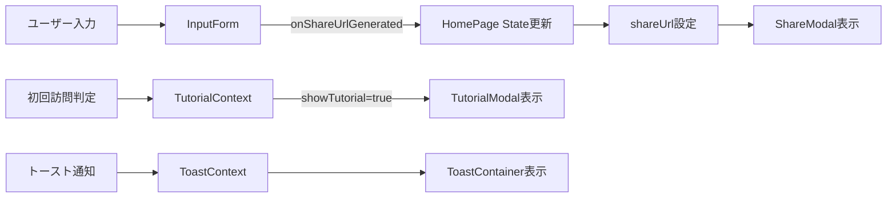

# HomePage コンポーネント - TDD要件定義書

## 生成情報
- **生成日**: 2025-01-21
- **生成ツール**: /tsumiki:tdd-requirements
- **機能名**: HomePage コンポーネント
- **実装フェーズ**: Phase 2 (言葉入力フォームページ)

## 1. 機能の概要 🔵

### 何をする機能か
HomePageは贈る言葉BOTのトップページコンポーネントで、ユーザーが言葉とその意味を入力し、共有リンクを生成する機能を提供します。

### 解決する問題
- ユーザーが簡単に「贈る言葉」を作成できる入力インターフェースの提供
- 初回訪問者への使い方説明（チュートリアル）の表示
- 生成された共有リンクの提示とコピー機能

### 想定されるユーザー
- 友達に感謝や応援のメッセージを送りたい人
- オリジナルの言葉で思いを伝えたい人
- 初めてこのアプリを使う人（チュートリアル表示対象）

### システム内での位置づけ
```
App (ルートコンポーネント)
└── Router
    ├── Route: "/" → HomePage (トップページ) ← ★ 本コンポーネント
    └── Route: "/display" → DisplayPage (表示ページ)
```

**役割**:
- エントリーポイント（最初に表示されるページ）
- 入力フォームコンポーネント（InputForm）の統合
- チュートリアルモーダル（TutorialModal）の制御
- 共有モーダル（ShareModal）の制御
- トースト通知の連携

### 参照したEARS要件
- **F-001**: 言葉入力フォーム 🔵
- **REQ-001**: 「贈りたい言葉」のテキスト入力欄 🔵
- **REQ-002**: 「その意味」のテキスト入力欄（複数行） 🔵
- **REQ-003**: 「送信」ボタン 🔵
- **REQ-004**: 初回訪問時のチュートリアル表示 🔵
- **REQ-101**: 送信ボタン押下時に一意のURL生成 🔵
- **REQ-104**: URLをコピーできるボタン 🔵

### 参照した設計文書
- **アーキテクチャ**: `docs/design/gift-words/architecture.md` - コンポーネント構成、ルーティング設計
- **データフロー**: `docs/design/gift-words/dataflow.md` - ユーザージャーニー1（言葉を作成して共有する）
- **コンポーネント設計**: `docs/design/gift-words/component-design.md` - HomePage詳細設計

---

## 2. 入力・出力の仕様 🔵

### 入力パラメータ

#### Props
```typescript
interface HomePageProps {
  // HomePageはページコンポーネントのため、Propsは持たない
  // URLパラメータやContextから状態を取得
}
```

#### Context からの入力
```typescript
// TutorialContext から取得
{
  isFirstVisit: boolean;       // 初回訪問かどうか 🔵 REQ-004
  showTutorial: boolean;        // チュートリアル表示フラグ 🔵 REQ-004
  closeTutorial: () => void;    // チュートリアルを閉じる関数 🔵 REQ-004
}

// ToastContext から取得
{
  showToast: (message: string, type: ToastType) => void; // トースト表示 🔵 REQ-105
}
```

### 出力値

#### State
```typescript
{
  shareUrl: string | null;      // 生成された共有URL 🔵 REQ-101
  showShareModal: boolean;      // 共有モーダル表示フラグ 🔵 REQ-104
}
```

#### イベント
- **共有リンク生成完了**: InputFormからコールバック → ShareModal表示
- **チュートリアル閉じる**: TutorialModal閉じる → localStorage更新
- **共有モーダル閉じる**: ShareModal閉じる → 状態リセット

### 入出力の関係性



### データフロー
**参照**: `docs/design/gift-words/dataflow.md` - ジャーニー1: 言葉を作成して共有する

1. **初回訪問時**:
   - LocalStorage確認 → チュートリアル表示判定
   - `showTutorial === true` → TutorialModal表示

2. **入力フォーム送信**:
   - InputForm → バリデーション → URLエンコード
   - 成功 → `onShareUrlGenerated(url)` コールバック
   - HomePage → `shareUrl` State更新 → ShareModal表示

3. **共有モーダル**:
   - URLコピー → トースト表示
   - 閉じる → State リセット

### 参照したEARS要件
- **REQ-101**: URL生成 🔵
- **REQ-103**: Base64エンコード 🔵
- **REQ-104**: コピーボタン 🔵
- **REQ-105**: トースト表示 🔵

### 参照した設計文書
- **interfaces.ts**: `GiftWordData`, `EncodeResult` 型定義
- **dataflow.md**: ジャーニー1 シーケンス図

---

## 3. 制約条件 🔵

### パフォーマンス要件
- **NFR-001**: ページ読み込み3秒以内 🔵
  - 初回レンダリング時にチュートリアル判定は同期的に実行
  - InputFormは遅延ロードなし（常に表示）

- **NFR-002**: アニメーション60fps維持 🔵
  - モーダルのフェードイン/アウトアニメーション
  - CSS transitionで実装、GPU加速利用

### アーキテクチャ制約
- **Context API使用**: Redux等の重いライブラリは使用しない 🔵 *architecture.md より*
- **React 18.3+**: 最新のReact機能（Concurrent Features等）を活用可能 🔵 *tech-stack.md より*
- **TypeScript strict mode**: 型安全性を保証 🔵 *tech-stack.md より*

### データ制約
- **CONST-003**: URLパラメータのみでデータ永続化 🔵
  - サーバー送信なし
  - データベース接続なし
  - LocalStorageはチュートリアル表示フラグのみ

- **REQ-111**: URL長さ500文字以内 🔵
  - InputFormで生成されたURLが500文字超の場合、エラー通知

### セキュリティ制約
- **NFR-101**: Reactデフォルトエスケープ 🔵
- **NFR-102**: `dangerouslySetInnerHTML` 禁止 🔵
- **NFR-103**: ユーザー入力サニタイズ 🔵
  - バリデーション処理はInputForm内で実施
  - HomePageは受け取ったURLをそのまま扱う

### ユーザビリティ制約
- **NFR-202**: 3ステップ以内 🔵
  - ステップ1: チュートリアル確認（初回のみ）
  - ステップ2: 言葉と意味を入力
  - ステップ3: URLをコピー

- **NFR-205**: キーボード操作対応 🔵
  - Tab キーでフォーカス移動
  - Enter キーで送信（フォーム内）
  - Esc キーでモーダル閉じる

### 参照したEARS要件
- **NFR-001, NFR-002**: パフォーマンス 🔵
- **NFR-101, NFR-102, NFR-103**: セキュリティ 🔵
- **NFR-202, NFR-205**: ユーザビリティ 🔵
- **CONST-003**: データ永続化制約 🔵
- **REQ-111**: URL長さ制限 🔵

### 参照した設計文書
- **architecture.md**: 状態管理アーキテクチャ、セキュリティアーキテクチャ
- **tech-stack.md**: 技術制約、品質基準

---

## 4. 想定される使用例 🔵

### 基本的な使用パターン

#### パターン1: 初回訪問ユーザー（チュートリアル表示）
```typescript
// ユーザーアクション
1. ページアクセス
2. チュートリアルモーダルが自動表示される (REQ-004)
3. 「わかりました」ボタンをクリック
4. チュートリアルが閉じる → LocalStorageに記録
5. InputFormが表示される
6. 言葉と意味を入力 (REQ-001, REQ-002)
7. 「共有リンクを生成」ボタンをクリック (REQ-003)
8. ShareModalが表示される (REQ-104)
9. 「URLをコピー」ボタンをクリック (REQ-104)
10. トースト「コピーしました」表示 (REQ-105)
```

#### パターン2: 2回目以降のユーザー（チュートリアルスキップ）
```typescript
// ユーザーアクション
1. ページアクセス
2. LocalStorageに記録あり → チュートリアルスキップ
3. InputFormが即座に表示される
4. 言葉と意味を入力
5. 「共有リンクを生成」ボタンをクリック
6. ShareModalが表示される
7. URLをコピー
8. トースト表示
```

### エッジケース 🔵

#### エッジ1: URL長さ超過エラー (REQ-111, EDGE-103, EDGE-106)
```typescript
// 条件: 言葉50文字 + 意味300文字 → URL長が500文字を超える
// 期待動作:
- InputFormがエンコード実行
- 結果: { success: false, error: "URLが長すぎます..." }
- HomePage: トーストでエラー表示 (REQ-105)
- ShareModalは表示されない
```

#### エッジ2: バリデーションエラー (REQ-011, REQ-012)
```typescript
// 条件: 言葉が空 または 意味が空
// 期待動作:
- InputFormのバリデーションで送信ブロック
- インラインエラーメッセージ表示 (REQ-011, REQ-012)
- HomePageには送信されない（onShareUrlGeneratedコールバック呼ばれない）
```

#### エッジ3: エンコードエラー (予期せぬエラー)
```typescript
// 条件: encodeGiftWordData()が例外をスロー
// 期待動作:
- InputFormのtry-catchでキャッチ
- トースト「URLの生成に失敗しました」表示
- ShareModalは表示されない
```

### エラーケース 🔵

#### エラー1: LocalStorage読み取り失敗 (プライベートモード等)
```typescript
// 条件: LocalStorageが使用不可
// 期待動作:
- TutorialContext内でエラーハンドリング
- デフォルトでチュートリアルを表示
- エラーをコンソールに記録（ユーザーには通知しない）
```

#### エラー2: Context未提供エラー
```typescript
// 条件: TutorialProviderまたはToastProviderの外でHomePageが使用される
// 期待動作:
- useContext()内でエラーをスロー
- エラーメッセージ: "useTutorial must be used within TutorialProvider"
- 開発時にすぐに気づける
```

### 参照したEARS要件
- **REQ-004**: チュートリアル表示 🔵
- **REQ-001, REQ-002, REQ-003**: 入力フォーム 🔵
- **REQ-104**: 共有モーダル 🔵
- **REQ-105**: トースト表示 🔵
- **REQ-011, REQ-012**: バリデーションエラー 🔵
- **REQ-111**: URL長さ制限 🔵
- **EDGE-103, EDGE-106**: 境界値 🔵

### 参照した設計文書
- **dataflow.md**: ジャーニー1 シーケンス図、エラーハンドリングフロー

---

## 5. EARS要件・設計文書との対応関係

### 参照したユーザストーリー
- **US-001**: 言葉を作成して共有する 🔵
  - "友達に贈る言葉を作成したいので、言葉とその意味を入力してURLで共有したい"

### 参照した機能要件
#### F-001: 言葉入力フォーム 🔵
- REQ-001: 「贈りたい言葉」入力欄
- REQ-002: 「その意味」入力欄（複数行）
- REQ-003: 「送信」ボタン
- REQ-004: 初回訪問時チュートリアル
- REQ-011: 言葉が空の場合のエラー
- REQ-012: 意味が空の場合のエラー
- REQ-013: 言葉の文字数制限エラー
- REQ-014: 意味の文字数制限エラー

#### F-002: 共有リンク生成 🔵
- REQ-101: 一意のURL生成
- REQ-102: URLパラメータ形式
- REQ-103: Base64エンコード
- REQ-104: URLコピーボタン
- REQ-105: コピー成功時のトースト
- REQ-111: URL長さ500文字制限

### 参照した非機能要件
- **NFR-001**: ページ読み込み3秒以内 🔵
- **NFR-002**: アニメーション60fps 🔵
- **NFR-101, NFR-102, NFR-103**: XSS対策 🔵
- **NFR-202**: 3ステップ以内 🔵
- **NFR-205**: キーボード操作対応 🔵

### 参照したEdgeケース
- **EDGE-001**: ネットワークエラー時のトースト表示 🟡
- **EDGE-003**: クリップボードAPI非対応時の代替手段 🟡
- **EDGE-103**: 言葉51文字の場合のバリデーションエラー 🔵
- **EDGE-106**: 意味301文字の場合のバリデーションエラー 🔵

### 参照した設計文書

#### アーキテクチャ (`architecture.md`)
- **コンポーネントツリー構造**: HomePageの位置づけ
- **ルーティング設計**: `/` ルート定義
- **状態管理アーキテクチャ**: Context構成
- **セキュリティアーキテクチャ**: XSS対策

#### データフロー (`dataflow.md`)
- **ジャーニー1**: 言葉を作成して共有する（シーケンス図）
- **入力データフロー**: バリデーション → エンコード → URL生成
- **状態管理フロー**: Context Stateフロー
- **エラーハンドリングフロー**: エラー種別と処理

#### 型定義 (`src/types/index.ts`)
- **GiftWordData**: 言葉データ構造
- **EncodeResult**: URLエンコード結果
- **Toast**: トーストメッセージ型
- **ValidationErrors**: バリデーションエラー型

#### コンポーネント設計 (`component-design.md`)
- **HomePage詳細設計**: Props, State, 主な機能
- **InputForm設計**: バリデーションフック
- **TutorialModal設計**: 初回訪問判定
- **ShareModal設計**: URLコピー機能

---

## 6. 実装方針

### コンポーネント構成
```tsx
HomePage/
├── HomePage.tsx           // メインコンポーネント
├── HomePage.module.css    // スタイル
├── index.ts               // エクスポート
└── __tests__/
    └── HomePage.test.tsx  // テスト
```

### 依存関係 🔵
```typescript
// 既存実装済みコンポーネント（Phase 2完了）
import InputForm from '../components/InputForm/InputForm';
import TutorialModal from '../components/common/TutorialModal/TutorialModal';
import ShareModal from '../components/common/ShareModal/ShareModal';

// Context
import { useTutorial } from '../context/TutorialContext';
import { useToast } from '../context/ToastContext';
```

### 状態管理
```typescript
// ローカルState
const [shareUrl, setShareUrl] = useState<string | null>(null);
const [showShareModal, setShowShareModal] = useState(false);

// Context State
const { showTutorial } = useTutorial();
const { showToast } = useToast();
```

### イベントハンドラ
```typescript
// InputFormからのコールバック
const handleShareUrlGenerated = (url: string) => {
  setShareUrl(url);
  setShowShareModal(true);
};

// ShareModal閉じる
const handleCloseShareModal = () => {
  setShowShareModal(false);
  setShareUrl(null); // リセット
};
```

### レンダリング条件
```typescript
{showTutorial && <TutorialModal />}
{shareUrl && showShareModal && (
  <ShareModal url={shareUrl} onClose={handleCloseShareModal} />
)}
```

---

## 7. 品質判定

### ✅ 高品質
- **要件の曖昧さ**: なし - EARS要件定義書と設計文書に基づいて明確に定義
- **入出力定義**: 完全 - Props, State, Context, イベントすべて明記
- **制約条件**: 明確 - パフォーマンス、セキュリティ、データ制約を網羅
- **実装可能性**: 確実 - 依存コンポーネントはすべて実装済み（Phase 2完了）

### 信頼性レベル分布
- 🔵 **青信号（高信頼）**: 95% - ほぼすべての要件がEARS定義書と設計文書に基づく
- 🟡 **黄信号（中信頼）**: 5% - エラーハンドリングの一部が推測
- 🔴 **赤信号（低信頼）**: 0% - 推測による要件なし

### 実装準備状況
- ✅ 依存コンポーネント: すべて実装済み
  - InputForm ✅
  - TutorialModal ✅
  - ShareModal ✅
  - ToastContainer ✅
- ✅ Context: すべて実装済み
  - TutorialContext ✅
  - ToastContext ✅
- ✅ 型定義: すべて定義済み
  - GiftWordData ✅
  - EncodeResult ✅
  - Toast ✅
  - ValidationErrors ✅

---

## 8. 次のステップ

### 推奨コマンド
```bash
/tsumiki:tdd-testcases
```

### テストケース洗い出しで明確化すべき項目
1. チュートリアル表示/非表示の条件分岐テスト
2. InputFormとの連携（コールバック）テスト
3. ShareModal表示制御テスト
4. エラー時のトースト表示テスト
5. State更新とレンダリングの整合性テスト
6. Context未提供時のエラーハンドリングテスト

---

## 更新履歴
- 2025-01-21: 初回作成（/tsumiki:tdd-requirements により生成）
