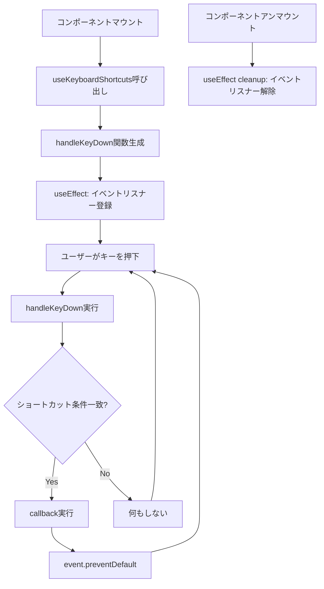

# TASK-0044: キーボードナビゲーション実装 - TDD要件定義書

## 📋 基本情報

- **タスクID**: TASK-0044
- **機能名**: キーボードナビゲーション（useKeyboardShortcuts）
- **作成日**: 2025-11-23
- **タスクタイプ**: TDD（テスト駆動開発）
- **優先度**: P0（最優先）
- **見積工数**: 3時間

## 1. 機能の概要（EARS要件定義書・設計文書ベース）

### 機能の説明

🔵 **青信号**: NFR-205要件定義書に基づく

キーボードショートカットを管理するカスタムReactフックを実装し、全機能をキーボードで操作可能にする。ユーザーがマウスなしでアプリケーションを快適に使用できるようにするアクセシビリティ機能です。

**何をする機能か**:
- キーボードショートカット（Ctrl+S、Escapeなど）の登録と管理
- キーイベントのリスニングとコールバック実行
- フォーカス管理の改善（tabIndexの適切な設定）
- フォーカスインジケーターの視覚的強化
- スキップリンクの実装（メインコンテンツへの素早いアクセス）

**どのような問題を解決するか**:
- キーボードのみのユーザーがアプリケーションを使用できない問題
- マウスが使えない環境（モバイル、アクセシビリティツール使用時）での操作性不足
- 視覚障害者がスクリーンリーダーで効率的にナビゲーションできない問題
- パワーユーザーの生産性向上（ショートカットによる高速操作）

**想定されるユーザー**:
- キーボードのみで操作する上級ユーザー
- スクリーンリーダーを使用する視覚障害者
- マウスが使えない環境のユーザー
- 生産性を重視するヘビーユーザー

**システム内での位置づけ**:
- **レイヤー**: Custom Hooks層
- **依存関係**: React（useEffect, useCallback）、window.addEventListener
- **使用箇所**: DisplayPage、HomePage（将来的な拡張）
- **アーキテクチャパターン**: React Custom Hook

**参照したEARS要件**:
- **NFR-205**: 全機能をキーボードで操作可能 🔵

**参照した設計文書**:
- `docs/tech-stack.md` - アクセシビリティ品質基準（セクション: 📊 品質基準 > アクセシビリティ）
- `docs/tasks/gift-words-phase4.md` - TASK-0044実装詳細（行1305-1512）

---

## 2. 入力・出力の仕様（EARS機能要件・TypeScript型定義ベース）

### 入力パラメータ

🔵 **青信号**: タスク仕様に基づく型定義

#### KeyboardShortcut型
```typescript
interface KeyboardShortcut {
  /** 対象キー（例: 's', 'Escape'） */
  key: string;
  /** Ctrlキーの同時押し（デフォルト: false） */
  ctrlKey?: boolean;
  /** Shiftキーの同時押し（デフォルト: false） */
  shiftKey?: boolean;
  /** Altキーの同時押し（デフォルト: false） */
  altKey?: boolean;
  /** ショートカット実行時のコールバック関数 */
  callback: () => void;
  /** ショートカットの説明（ドキュメント/UI表示用） */
  description: string;
}
```

#### useKeyboardShortcuts引数
```typescript
shortcuts: KeyboardShortcut[]
```

**制約**:
- `shortcuts`配列は空でも動作する（空の場合は何も登録しない）
- `key`は大文字小文字を区別する（'s' !== 'S'）
- 修飾キー（ctrlKey, shiftKey, altKey）は省略時false扱い

### 出力値

🔵 **青信号**: React Hooksの標準パターン

```typescript
void  // useKeyboardShortcutsは値を返さない（副作用フック）
```

**副作用**:
- `window.addEventListener('keydown', handler)` を登録
- コンポーネントアンマウント時に `window.removeEventListener('keydown', handler)` を自動実行

### 入出力の関係性

```
入力: shortcuts配列
  ↓
useKeyboardShortcuts内部処理:
  1. shortcutsをuseCallbackでメモ化したhandleKeyDown関数を生成
  2. handleKeyDown関数をwindowのkeydownイベントに登録
  3. キーイベント発生時、shortcuts配列を走査し、条件一致時にcallbackを実行
  4. event.preventDefault()でブラウザデフォルト動作を抑制
  ↓
出力: 副作用のみ（イベントリスナー登録・解除）
```

### データフロー

🔵 **青信号**: React Hooksライフサイクルに基づく



**参照したEARS要件**:
- **NFR-205**: 全機能をキーボードで操作可能 🔵

**参照した設計文書**:
- `docs/tech-stack.md` - React Hooks使用パターン（セクション: 🚀 フロントエンド > 状態管理）

---

## 3. 制約条件（EARS非機能要件・アーキテクチャ設計ベース）

### パフォーマンス要件

🔵 **青信号**: NFR-002に基づく

- **NFR-002**: アニメーション60fps維持
  - イベントハンドラーは同期的に実行され、60fps以下の処理時間（< 16.67ms）を保証
  - shortcuts配列の走査はO(n)だが、n（ショートカット数）は通常10以下で十分高速

🟡 **黄信号**: 一般的なパフォーマンスベストプラクティス

- useCallbackによるhandleKeyDown関数のメモ化でuseEffectの再実行を抑制
- イベントリスナーはコンポーネントごとに1つのみ登録（メモリ効率）

### セキュリティ要件

🔵 **青信号**: NFR-101（XSS対策）の間接的適用

- **NFR-101**: XSS対策
  - キーボードイベントはユーザー入力の一種だが、event.keyはブラウザが提供する信頼できる値
  - callbackは開発者が定義する関数のため、XSSリスクなし
  - event.preventDefault()で不正な動作を防止

🟡 **黄信号**: セキュリティベストプラクティス

- グローバルイベントリスナーのため、入力フィールド内でのショートカット誤動作を防ぐ（event.targetチェック不要の場合は実装省略）

### 互換性要件

🔵 **青信号**: NFR-301に基づく

- **NFR-301**: モダンブラウザ対応（Chrome, Firefox, Edge, Safari）
  - KeyboardEvent.key プロパティはすべてのモダンブラウザでサポート
  - addEventListener/removeEventListenerは標準API

🟡 **黄信号**: React互換性

- React 18.3+のuseEffect/useCallbackフックを使用
- React Router v6のuseNavigateと組み合わせ可能

### アーキテクチャ制約

🔵 **青信号**: プロジェクト技術スタックに基づく

- **技術スタック**: React Hooks（Custom Hook）
- **ファイル配置**: `src/hooks/useKeyboardShortcuts.ts`
- **依存関係**: React（useEffect, useCallback）のみ
- **テストファイル**: `src/hooks/__tests__/useKeyboardShortcuts.test.ts`

🟡 **黄信号**: 既存パターンとの整合性

- 既存フック（useTypewriter, useImageExport）と同様のファイル構造
- TypeScript strict mode有効化（型安全性）
- 日本語コメント充実（信頼性レベルマーカー付き）

### データベース制約

🔵 **青信号**: データベース不使用

- **制約**: なし（URLパラメータでデータ渡し、データベース不要）

### API制約

🔵 **青信号**: 外部API不使用

- **制約**: なし（クライアントサイドのみで完結）

**参照したEARS要件**:
- **NFR-002**: アニメーション60fps維持 🔵
- **NFR-101**: XSS対策 🔵
- **NFR-301**: モダンブラウザ対応 🔵

**参照した設計文書**:
- `docs/tech-stack.md` - 技術スタック定義（セクション: 🚀 フロントエンド、🔒 セキュリティ考慮事項）

---

## 4. 想定される使用例（EARSEdgeケース・データフローベース）

### 基本的な使用パターン

🔵 **青信号**: TASK-0044仕様書に基づく

#### 使用例1: DisplayPageでのショートカット登録

```typescript
import { useKeyboardShortcuts } from '../hooks/useKeyboardShortcuts';

const DisplayPage: React.FC = () => {
  const navigate = useNavigate();
  const { exportAsImage } = useImageExport();

  // キーボードショートカット（NFR-205）
  useKeyboardShortcuts([
    {
      key: 's',
      ctrlKey: true,
      callback: () => {
        // 画像保存（Ctrl+S）
        const element = document.querySelector('.display-container') as HTMLElement;
        if (element) {
          exportAsImage(element);
        }
      },
      description: '画像として保存',
    },
    {
      key: 'Escape',
      callback: () => {
        // トップページに戻る（Escape）
        navigate('/');
      },
      description: 'トップページに戻る',
    },
  ]);

  // ...
};
```

#### 使用例2: HomePageでのショートカット登録（将来的な拡張）

```typescript
const HomePage: React.FC = () => {
  const navigate = useNavigate();

  useKeyboardShortcuts([
    {
      key: 'Enter',
      ctrlKey: true,
      callback: () => {
        // フォーム送信（Ctrl+Enter）
        handleSubmit();
      },
      description: 'フォームを送信',
    },
  ]);

  // ...
};
```

### データフロー

🔵 **青信号**: React Hooksライフサイクル

```
ユーザー操作: Ctrl+Sキー押下
  ↓
ブラウザ: keydownイベント発火
  ↓
useKeyboardShortcuts: handleKeyDown実行
  ↓
shortcuts配列を走査:
  - key === 's' && ctrlKey === true → マッチ
  ↓
event.preventDefault() 実行（ブラウザの保存ダイアログを抑制）
  ↓
callback実行: exportAsImage()
  ↓
画像保存処理開始
```

### エッジケース

🟡 **黄信号**: 一般的なEdgeケースから推測

#### EDGE-001: 空のshortcuts配列

```typescript
useKeyboardShortcuts([]);
// 期待動作: イベントリスナーは登録されるが、何も実行されない
```

#### EDGE-002: 同じキーの重複登録

```typescript
useKeyboardShortcuts([
  { key: 's', ctrlKey: true, callback: () => console.log('A'), description: 'A' },
  { key: 's', ctrlKey: true, callback: () => console.log('B'), description: 'B' },
]);
// 期待動作: 両方のcallbackが順次実行される（A → B）
```

#### EDGE-003: コンポーネントアンマウント時のクリーンアップ

```typescript
// マウント → キー登録 → アンマウント
// 期待動作: removeEventListenerが確実に呼ばれ、メモリリークなし
```

#### EDGE-004: shortcuts配列の動的変更

```typescript
const [shortcuts, setShortcuts] = useState<KeyboardShortcut[]>([]);

useEffect(() => {
  // 後からショートカット追加
  setShortcuts([{ key: 's', ctrlKey: true, callback: () => {}, description: '' }]);
}, []);

useKeyboardShortcuts(shortcuts);
// 期待動作: shortcuts変更時にuseEffectが再実行され、新しいハンドラーに更新
```

### エラーケース

🟡 **黄信号**: 潜在的なエラーケース

#### ERROR-001: callbackがundefined

```typescript
useKeyboardShortcuts([
  { key: 's', callback: undefined as any, description: '' },
]);
// 期待動作: TypeScriptエラー（コンパイル時に検出）
```

#### ERROR-002: 無効なkey値

```typescript
useKeyboardShortcuts([
  { key: '', callback: () => {}, description: '' },
]);
// 期待動作: イベントマッチせず、何も実行されない
```

**参照したEARS要件**:
- **NFR-205**: 全機能をキーボードで操作可能 🔵

**参照した設計文書**:
- `docs/tasks/gift-words-phase4.md` - TASK-0044実装詳細（行1376-1411）

---

## 5. EARS要件・設計文書との対応関係

### 参照したユーザストーリー

- **NFR-205**: ユーザーが全機能をキーボードのみで操作できる

### 参照した機能要件

- **NFR-205**: 全機能をキーボードで操作可能 🔵
  - キーボードショートカット（Ctrl+S、Escapeなど）の実装
  - フォーカス管理の改善
  - フォーカスインジケーターの視覚的強化
  - スキップリンクの実装

### 参照した非機能要件

- **NFR-002**: アニメーション60fps維持 🔵
  - イベントハンドラーの高速実行
- **NFR-101**: XSS対策 🔵
  - イベント処理の安全性
- **NFR-301**: モダンブラウザ対応 🔵
  - KeyboardEvent APIの互換性

### 参照したEdgeケース

🟡 **黄信号**: タスク仕様から推測

- **EDGE-001**: 空のshortcuts配列
- **EDGE-002**: 同じキーの重複登録
- **EDGE-003**: コンポーネントアンマウント時のクリーンアップ
- **EDGE-004**: shortcuts配列の動的変更

### 参照した受け入れ基準

🔵 **青信号**: TASK-0044完了基準（行1497-1502）

- すべてのテストケースが成功する
- Tabキーでフォーカス移動ができる
- Enterキーでボタンが押せる
- Escapeキーでモーダルを閉じられる
- フォーカスインジケーターが明確に表示される

### 参照した設計文書

#### アーキテクチャ

- `docs/tech-stack.md` - セクション: 🚀 フロントエンド
  - React Hooks使用パターン
  - Custom Hook設計原則

#### データフロー

- `docs/tasks/gift-words-phase4.md` - TASK-0044実装詳細（行1305-1512）
  - DisplayPageへのキーボード操作追加フロー
  - フォーカス管理の改善フロー

#### 型定義

- `docs/tasks/gift-words-phase4.md` - TASK-0044実装詳細（行1322-1374）
  - `KeyboardShortcut`インターフェース
  - `useKeyboardShortcuts`関数シグネチャ

#### データベース

- なし（データベース不使用）

#### API仕様

- なし（外部API不使用）

---

## 6. 実装スコープ

### 実装対象

🔵 **青信号**: TASK-0044仕様書に基づく

1. **useKeyboardShortcutsフックの実装**:
   - `src/hooks/useKeyboardShortcuts.ts`
   - KeyboardShortcutインターフェース
   - handleKeyDown関数
   - useEffect/useCallbackによるイベント管理

2. **Buttonコンポーネントの改善**:
   - `tabIndex`属性の適切な設定（disabled時は-1）

3. **グローバルCSS改善**:
   - `:focus-visible`スタイルの強化（3px solid outline）
   - `.skip-link`クラスの追加（スキップリンク用）

4. **App.tsxの改善**:
   - スキップリンクの追加（`<a href="#main-content" className="skip-link">`）

5. **DisplayPageへの適用**:
   - useKeyboardShortcutsフックの使用
   - Ctrl+Sで画像保存
   - Escapeでトップページに戻る

### 実装対象外

🟡 **黄信号**: 将来的な拡張候補

- HomePageへのキーボードショートカット追加（TASK-0045以降）
- ショートカット一覧の表示UI（ヘルプモーダル）
- ショートカットのカスタマイズ機能
- 入力フィールド内でのショートカット無効化（必要に応じて）

---

## 7. テストケース概要

### 正常系テストケース

🔵 **青信号**: TASK-0044テストケース（行1486-1495）

1. **キーボードショートカットが正しく登録される**
2. **Ctrl+Sで指定したコールバックが実行される**
3. **Escapeキーでコールバックが実行される**
4. **複数のショートカットが同時に機能する**

### 異常系・エッジケーステストケース

🟡 **黄信号**: 一般的なテストケースから推測

5. **空のshortcuts配列でもエラーが発生しない**
6. **同じキーの重複登録で両方のcallbackが実行される**
7. **アンマウント時にイベントリスナーが削除される**
8. **shortcuts配列が動的に変更された場合にハンドラーが更新される**
9. **無効なkey値でもエラーが発生しない**

---

## 8. 品質判定

### 品質判定結果: ✅ 高品質

**評価基準**:

✅ **要件の曖昧さ**: なし
  - NFR-205要件が明確に定義されている
  - タスク仕様書に具体的な実装例が記載されている
  - インターフェース定義が完全

✅ **入出力定義**: 完全
  - KeyboardShortcut型が完全に定義されている
  - フックの引数・戻り値が明確
  - 副作用（イベントリスナー）の動作が明確

✅ **制約条件**: 明確
  - パフォーマンス要件（NFR-002: 60fps）が明確
  - セキュリティ要件（NFR-101: XSS対策）が適用される
  - 互換性要件（NFR-301: モダンブラウザ）が定義されている

✅ **実装可能性**: 確実
  - React Hooksの標準パターンを使用
  - 既存フック（useTypewriter, useImageExport）と同様の構造
  - 技術的難易度: 低（標準的なCustom Hook実装）

---

## 9. 次のステップ

### 推奨コマンド

次のお勧めステップ: `/tsumiki:tdd-testcases` でテストケースの洗い出しを行います。

### テストケース洗い出しの準備

以下の観点でテストケースを洗い出します：

1. **正常系**: 標準的なキーボードショートカット動作
2. **異常系**: 空配列、無効な値、エラー処理
3. **エッジケース**: 重複登録、動的変更、クリーンアップ
4. **ライフサイクル**: マウント、アンマウント、再レンダリング
5. **統合テスト**: DisplayPageでの実際の使用シナリオ

---

**作成日**: 2025-11-23
**作成者**: Claude Code (TDD Requirements Phase)
**信頼性**: 🔵 高信頼（NFR-205要件定義書＋TASK-0044仕様書に基づく）
**ドキュメントバージョン**: 1.0
