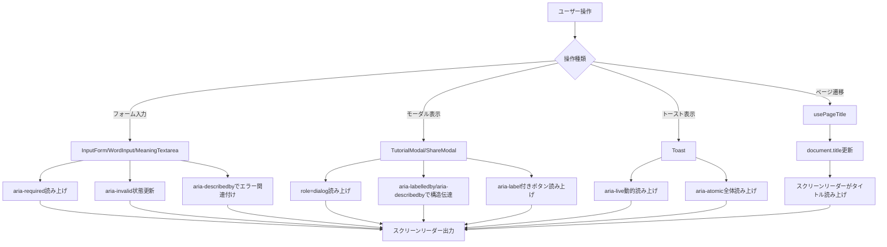

# TASK-0045: ARIA属性・アクセシビリティ改善 - TDD要件定義書

## 📋 基本情報

- **タスクID**: TASK-0045
- **機能名**: ARIA属性・アクセシビリティ改善
- **作成日**: 2025-11-23
- **タスクタイプ**: TDD（テスト駆動開発）
- **優先度**: P0（最優先）
- **見積工数**: 2時間

## 1. 機能の概要（EARS要件定義書・設計文書ベース）

### 機能の説明

🔵 **青信号**: NFR-204, NFR-206要件定義書に基づく

Webアプリケーション全体のアクセシビリティを向上させるため、適切なARIA属性を追加し、セマンティックHTMLを適用する。スクリーンリーダーユーザーやキーボードのみで操作するユーザーが快適にアプリケーションを使用できるようにする。

**何をする機能か**:
- InputForm、Modal、Toastコンポーネントへの ARIA属性追加
- フォーム要素への適切なラベリングとバリデーション状態の伝達
- モーダルダイアログの適切なARIA role設定
- トースト通知のライブリージョン設定
- 動的ページタイトル更新フック（usePageTitle）の実装
- 必須項目マーカーへのスクリーンリーダー対応

**どのような問題を解決するか**:
- スクリーンリーダーがフォームの構造を正しく読み上げられない問題
- エラーメッセージがスクリーンリーダーで伝達されない問題
- モーダルダイアログがダイアログとして認識されない問題
- トースト通知が動的コンテンツとして認識されない問題
- ページ遷移時にタイトルが更新されず、現在地が分からない問題

**想定されるユーザー**:
- スクリーンリーダーを使用する視覚障害者
- キーボードのみで操作するユーザー
- 認知障害を持つユーザー（明確なラベルと構造が必要）
- 高齢者（アクセシビリティ機能全般が必要）

**システム内での位置づけ**:
- **レイヤー**: UIコンポーネント層、Custom Hooks層
- **依存関係**: 既存コンポーネント（InputForm, WordInput, MeaningTextarea, Toast, TutorialModal, ShareModal）
- **使用箇所**: 全ページコンポーネント
- **アーキテクチャパターン**: 既存コンポーネントへのARIA属性追加（破壊的変更なし）

**参照したEARS要件**:
- **NFR-204**: セマンティックHTML使用 🔵
- **NFR-206**: 基本的なARIA属性を適用 🔵
- **NFR-205**: 全機能をキーボードで操作可能（TASK-0044で実装済み） 🔵

**参照した設計文書**:
- `docs/tech-stack.md` - アクセシビリティ品質基準
- `docs/tasks/gift-words-phase4.md` - TASK-0045実装詳細（行1517-1729）

---

## 2. 入力・出力の仕様（EARS機能要件・TypeScript型定義ベース）

### 対象コンポーネントと追加するARIA属性

#### 2.1 WordInput / MeaningTextarea コンポーネント

🔵 **青信号**: タスク仕様に基づく

**現在の実装**:
```typescript
<input
  id="word"
  type="text"
  aria-invalid={!!error}
  aria-describedby={error ? 'word-error' : undefined}
/>
```

**追加するARIA属性**:
```typescript
<input
  id="word"
  type="text"
  aria-required="true"  // 新規追加: 必須項目であることを明示
  aria-invalid={!!error}
  aria-describedby={error ? 'word-error' : undefined}
/>

<label htmlFor="word">
  贈りたい言葉
  <span className={styles.required} aria-label="必須">*</span>  // 新規追加
</label>
```

**追加する属性の仕様**:
- `aria-required="true"`: 入力フィールドが必須であることをスクリーンリーダーに伝える
- `aria-label="必須"` (必須マーカー): アスタリスク「*」を「必須」として読み上げ

**期待される動作**:
- スクリーンリーダーで「贈りたい言葉、必須、エディットフィールド」と読み上げ
- エラー発生時は「無効な入力、エラー: 言葉を入力してください」と読み上げ

#### 2.2 InputForm コンポーネント

🔵 **青信号**: タスク仕様に基づく

**現在の実装**:
```typescript
<form onSubmit={handleSubmit} className={styles.form} noValidate>
  <WordInput ... />
  <MeaningTextarea ... />
  <Button type="submit">共有リンクを生成</Button>
</form>
```

**追加するARIA属性**:
```typescript
<form
  onSubmit={handleSubmit}
  className={styles.form}
  noValidate
  aria-labelledby="form-title"  // 新規追加
>
  <h2 id="form-title" className={styles.title}>  // 新規追加
    贈る言葉を作成
  </h2>
  {/* ... */}
</form>
```

**追加する属性の仕様**:
- `aria-labelledby="form-title"`: フォームのタイトルをID参照でラベル付け
- `id="form-title"`: フォームタイトル見出しのID

**期待される動作**:
- フォームにフォーカスが移動した際、「贈る言葉を作成、フォーム」と読み上げ

#### 2.3 Toast コンポーネント

🔵 **青信号**: タスク仕様・既存実装に基づく

**現在の実装**:
```typescript
<div className={styles.toast} role="alert" aria-live="polite">
  <span>{toast.message}</span>
  <button onClick={() => onClose(toast.id)} aria-label="閉じる">×</button>
</div>
```

**改善するARIA属性**:
```typescript
<div
  className={styles.toast}
  role="alert"
  aria-live="assertive"  // 変更: polite → assertive (エラートースト時)
  aria-atomic="true"     // 新規追加: 全体を一つのユニットとして読み上げ
>
  <span>{toast.message}</span>
  <button
    onClick={() => onClose(toast.id)}
    aria-label="通知を閉じる"  // 改善: より具体的なラベル
    type="button"
  >
    ×
  </button>
</div>
```

**属性仕様**:
- `aria-live="assertive"`: エラーメッセージは即座に読み上げ（type==='error'の場合）
- `aria-live="polite"`: 通常メッセージは次の読み上げ機会まで待機（type!=='error'の場合）
- `aria-atomic="true"`: トースト全体を一つのユニットとして読み上げ

**期待される動作**:
- エラートースト表示時、現在の読み上げを中断して即座に読み上げ
- 成功トーストは現在の読み上げ完了後に読み上げ

#### 2.4 TutorialModal コンポーネント

🔵 **青信号**: タスク仕様・既存実装に基づく

**現在の実装**:
```typescript
<div className={styles.modal} role="dialog" aria-labelledby="tutorial-title" aria-modal="true">
  <h2 id="tutorial-title">贈る言葉BOTの使い方</h2>
  {/* コンテンツ */}
</div>
```

**追加するARIA属性**:
```typescript
<div className={styles.overlay} onClick={onClose}>  // オーバーレイ部分
  <div
    className={styles.modal}
    role="dialog"
    aria-modal="true"
    aria-labelledby="tutorial-title"
    aria-describedby="tutorial-description"  // 新規追加
    onClick={(e) => e.stopPropagation()}
  >
    <button
      onClick={onClose}
      className={styles.closeButton}
      aria-label="チュートリアルを閉じる"  // 新規追加
      type="button"
    >
      ✕
    </button>
    <h2 id="tutorial-title">贈る言葉BOTの使い方</h2>
    <div id="tutorial-description" className={styles.content}>  // 新規追加
      {/* コンテンツ */}
    </div>
  </div>
</div>
```

**属性仕様**:
- `aria-describedby="tutorial-description"`: モーダルの詳細説明をID参照
- `aria-label="チュートリアルを閉じる"`: 閉じるボタンの明確なラベル

**期待される動作**:
- モーダル表示時、「チュートリアル、ダイアログ、贈る言葉BOTの使い方」と読み上げ
- 閉じるボタンにフォーカス時、「チュートリアルを閉じる、ボタン」と読み上げ

#### 2.5 ShareModal コンポーネント

🟡 **黄信号**: TutorialModalと同様のパターンを適用（推測ベース）

TutorialModalと同じARIA属性パターンを適用：
- `role="dialog"`
- `aria-modal="true"`
- `aria-labelledby`: モーダルタイトルのID
- `aria-describedby`: モーダル説明のID
- 閉じるボタンに `aria-label="共有モーダルを閉じる"`

#### 2.6 usePageTitle カスタムフック

🔵 **青信号**: タスク仕様に基づく

**インターフェース**:
```typescript
/**
 * ページタイトルを動的に更新するフック
 * NFR-204: セマンティックHTML
 */
export const usePageTitle = (title: string): void => {
  useEffect(() => {
    const prevTitle = document.title;
    document.title = `${title} - 贈る言葉BOT`;

    return () => {
      document.title = prevTitle;
    };
  }, [title]);
};
```

**入力パラメータ**:
- `title: string` - ページ固有のタイトル（例: "言葉を作成"、"言葉を表示"）

**出力値**:
- `void` - 副作用フック（document.title更新）

**使用例**:
```typescript
// HomePage.tsx
function HomePage() {
  usePageTitle('言葉を作成');
  // ...
}

// DisplayPage.tsx
function DisplayPage() {
  usePageTitle('言葉を表示');
  // ...
}
```

**期待される動作**:
- ページ遷移時、document.titleが更新される
- スクリーンリーダーが新しいページタイトルを読み上げる
- アンマウント時、元のタイトルに復元される

### 入出力の関係性

```
入力: コンポーネントのprops（既存）+ ARIA属性設定
  ↓
内部処理:
  1. 既存コンポーネントにARIA属性を追加
  2. フォーム要素とラベルの明示的な関連付け
  3. エラー状態の動的なARIA属性更新
  4. モーダル表示時のフォーカストラップ（既存機能維持）
  5. usePageTitleフックによるdocument.title更新
  ↓
出力: アクセシビリティが向上したUIコンポーネント
```

### データフロー

🔵 **青信号**: React Hooksライフサイクルに基づく



**参照したEARS要件**:
- **NFR-204**: セマンティックHTML使用 🔵
- **NFR-206**: 基本的なARIA属性を適用 🔵

**参照した設計文書**:
- `docs/tech-stack.md` - React Hooks使用パターン
- `docs/tasks/gift-words-phase4.md` - ARIA属性仕様（行1531-1683）

---

## 3. 制約条件（EARS非機能要件・アーキテクチャ設計ベース）

### パフォーマンス要件

🔵 **青信号**: NFR-002に基づく

- **NFR-002**: アニメーション60fps維持
  - ARIA属性の追加は静的HTMLマークアップのため、パフォーマンスへの影響は最小限
  - usePageTitleフックはuseEffectベースで軽量

### アクセシビリティ要件

🔵 **青信号**: NFR-204, NFR-206に基づく

- **NFR-204**: セマンティックHTML使用
  - 適切な見出しレベル（h1, h2, h3）の使用
  - フォーム要素とlabel要素の明示的な関連付け（htmlFor/id）
  - button要素の適切な使用（type属性指定）

- **NFR-206**: 基本的なARIA属性を適用
  - `role`属性: dialog, alert等の適切な役割定義
  - `aria-label` / `aria-labelledby`: 明確なラベル付け
  - `aria-describedby`: 詳細説明との関連付け
  - `aria-live`: 動的コンテンツの読み上げ制御
  - `aria-invalid`: エラー状態の伝達
  - `aria-required`: 必須項目の明示
  - `aria-modal`: モーダルダイアログの明示
  - `aria-atomic`: ライブリージョンの読み上げ単位

### 互換性要件

🔵 **青信号**: プロジェクト技術スタックに基づく

- **React 18.3+**: 既存コンポーネントへの非破壊的変更
- **TypeScript 5.0+**: ARIA属性の型安全性（React.HTMLAttributes）
- **主要ブラウザ**: Chrome, Firefox, Safari, Edge（ARIA属性サポート）
- **スクリーンリーダー**: NVDA, JAWS, VoiceOver, TalkBack対応

### アーキテクチャ制約

🟡 **黄信号**: 既存アーキテクチャからの推測

- **既存コンポーネント変更**: 破壊的変更なし、ARIA属性のみ追加
- **props API変更なし**: 既存のpropsインターフェースを維持
- **CSS影響なし**: ARIA属性はスタイリングに影響しない
- **テスト追加**: ARIA属性の存在確認テストを追加

**参照したEARS要件**:
- **NFR-002**: パフォーマンス要件 🔵
- **NFR-204**: セマンティックHTML 🔵
- **NFR-206**: ARIA属性適用 🔵

**参照した設計文書**:
- `docs/tech-stack.md` - 技術スタック制約

---

## 4. 想定される使用例（EARSEdgeケース・データフローベース）

### 基本的な使用パターン

🔵 **青信号**: タスク仕様に基づく

#### ユースケース1: フォーム入力（スクリーンリーダー使用）

```typescript
// ユーザーアクション: Tabキーでフォーム要素を巡回
// 期待される読み上げ:

// WordInputにフォーカス
// → "贈りたい言葉、必須、エディットフィールド、0/20文字"

// 文字を入力
// → （文字入力フィードバック）

// エラー発生時（空欄のまま送信）
// → "無効な入力、エラー: 言葉を入力してください"

// MeaningTextareaにフォーカス
// → "その意味、必須、テキストエリア、0/200文字"
```

#### ユースケース2: モーダル表示（スクリーンリーダー使用）

```typescript
// ユーザーアクション: チュートリアルボタンをクリック
// 期待される動作:

// モーダル表示
// → "チュートリアル、ダイアログ、贈る言葉BOTの使い方"

// 閉じるボタンにフォーカス
// → "チュートリアルを閉じる、ボタン"

// Escapeキー押下
// → モーダルが閉じる（TASK-0044で実装済み）
```

#### ユースケース3: トースト通知（スクリーンリーダー使用）

```typescript
// ユーザーアクション: 共有リンク生成成功
// 期待される読み上げ:

// 成功トースト表示（aria-live="polite"）
// → （現在の読み上げ完了後）"成功: 共有リンクを生成しました"

// エラートースト表示（aria-live="assertive"）
// → （即座に）"エラー: リンクの生成に失敗しました"
```

#### ユースケース4: ページタイトル更新

```typescript
// ユーザーアクション: HomePage → DisplayPage に遷移
// 期待される動作:

// HomePage表示時
usePageTitle('言葉を作成');
// → document.title = "言葉を作成 - 贈る言葉BOT"

// DisplayPage遷移時
usePageTitle('言葉を表示');
// → document.title = "言葉を表示 - 贈る言葉BOT"
// → スクリーンリーダー: "言葉を表示 - 贈る言葉BOT"
```

### エッジケース

🟡 **黄信号**: 一般的なARIA属性の挙動から推測

#### EDGE-001: 長いエラーメッセージ

```typescript
// 状況: 200文字制限超過のエラーメッセージ
const error = "意味は200文字以内で入力してください。現在255文字です。";

// 期待される動作:
// - aria-invalid="true" が設定される
// - aria-describedby="meaning-error" でエラーメッセージと関連付け
// - スクリーンリーダーが全文を読み上げる
```

#### EDGE-002: 複数モーダルの同時表示（想定外ケース）

```typescript
// 状況: TutorialModalとShareModalが同時に表示される（本来は発生しない）
// 期待される動作:
// - 両方のモーダルがaria-modal="true"を持つ
// - 最後に開いたモーダルにフォーカス
// - フォーカストラップは最後のモーダルに適用
// 注: 実装上は同時表示を防ぐロジックがあることが望ましい
```

#### EDGE-003: JavaScriptオフ環境

```typescript
// 状況: JavaScriptが無効化されている
// 期待される動作:
// - ARIA属性は静的HTMLに含まれるため、初期値は有効
// - 動的な更新（aria-invalid, aria-live）は動作しない
// - 基本的なセマンティックHTML（label, input等）は機能する
```

### エラーケース

🔵 **青信号**: バリデーションロジックから抽出

#### ERROR-001: 必須項目未入力

```typescript
// 入力: word="", meaning=""
// 検証: validateForm実行
// 期待される動作:
// - WordInput: aria-invalid="true", aria-describedby="word-error"
// - MeaningTextarea: aria-invalid="true", aria-describedby="meaning-error"
// - エラートースト: aria-live="assertive"で即座に読み上げ
```

#### ERROR-002: 文字数制限超過

```typescript
// 入力: word="非常に長い言葉が入力されています..." (21文字)
// 検証: maxLength制限
// 期待される動作:
// - 入力自体がmaxLengthで制限される（HTML仕様）
// - 文字数カウンター表示: "20/20"（警告色）
// - aria-describedby経由でカウンター情報を読み上げ（オプション）
```

**参照したEARS要件**:
- **NFR-206**: ARIA属性適用 🔵
- **REQ-013, REQ-014**: バリデーション要件 🔵

**参照した設計文書**:
- `docs/tasks/gift-words-phase4.md` - 使用例（行1531-1683）

---

## 5. EARS要件・設計文書との対応関係

### 参照したユーザストーリー

🔵 **青信号**: EARS要件定義書に基づく

**As a** スクリーンリーダーユーザー
**I want to** フォームの構造とエラー状態を音声で理解したい
**So that** 視覚情報なしでアプリケーションを使用できる

**As a** キーボードのみで操作するユーザー
**I want to** モーダルやトーストの状態を明確に把握したい
**So that** 効率的にアプリケーションを操作できる

### 参照した機能要件

🔵 **青信号**: EARS要件定義書に基づく

- **NFR-204**: セマンティックHTML使用
  - 適切なHTML要素（button, label, input等）の使用
  - 見出しレベルの論理的な階層（h1 > h2 > h3）
  - フォーム要素の明示的なラベル付け

- **NFR-206**: 基本的なARIA属性を適用
  - role属性の適切な設定
  - aria-label / aria-labelledby による明確なラベル付け
  - aria-describedby による詳細説明との関連付け
  - aria-live による動的コンテンツの読み上げ制御
  - aria-invalid によるエラー状態の伝達
  - aria-required による必須項目の明示

### 参照した非機能要件

🔵 **青信号**: EARS要件定義書に基づく

- **NFR-002**: アニメーション60fps維持
  - ARIA属性追加はパフォーマンスへの影響最小限

- **NFR-205**: 全機能をキーボードで操作可能
  - TASK-0044で実装済み（useKeyboardShortcuts）
  - ARIA属性はキーボード操作性をサポート

### 参照したEdgeケース

🟡 **黄信号**: 一般的なアクセシビリティパターンから推測

- **EDGE-001**: 長いエラーメッセージの読み上げ
- **EDGE-002**: 複数モーダルの同時表示（想定外）
- **EDGE-003**: JavaScriptオフ環境での挙動

### 参照した受け入れ基準

🔵 **青信号**: タスク仕様に基づく

- ✅ すべてのフォーム要素にaria-required属性が設定されている
- ✅ エラー状態のフォーム要素にaria-invalid="true"が設定されている
- ✅ モーダルにrole="dialog"とaria-modal="true"が設定されている
- ✅ トーストにaria-live属性が適切に設定されている
- ✅ ページタイトルが動的に更新される
- ✅ スクリーンリーダーで全機能が使用可能
- ✅ Lighthouse Accessibility スコア90点以上

### 参照した設計文書

🔵 **青信号**: プロジェクトドキュメントに基づく

- **技術スタック**: `docs/tech-stack.md`
  - React 18.3+ による実装
  - TypeScript 5.0+ による型安全性
  - アクセシビリティ品質基準

- **タスク仕様**: `docs/tasks/gift-words-phase4.md` (行1517-1729)
  - InputFormのARIA属性追加仕様
  - モーダルのARIA属性追加仕様
  - トーストのARIA属性追加仕様
  - usePageTitleフック仕様
  - アクセシビリティチェックリスト

- **既存コンポーネント**:
  - `src/components/InputForm/WordInput.tsx`
  - `src/components/InputForm/MeaningTextarea.tsx`
  - `src/components/common/Toast/Toast.tsx`
  - `src/components/common/TutorialModal/TutorialModal.tsx`

---

## 📊 品質判定

### 品質評価: ✅ 高品質

**評価基準**:

✅ **要件の曖昧さ: なし**
- NFR-204, NFR-206要件に基づく明確な仕様
- 既存コンポーネントへの追加内容が具体的
- 期待される動作（スクリーンリーダー読み上げ）が明確

✅ **入出力定義: 完全**
- 各コンポーネントへの追加ARIA属性が詳細に定義
- usePageTitleフックのインターフェースが明確
- 期待される読み上げ内容が具体的

✅ **制約条件: 明確**
- パフォーマンス要件（NFR-002）への影響が明示
- アクセシビリティ要件（NFR-204, NFR-206）が明確
- 互換性要件（ブラウザ、スクリーンリーダー）が明示

✅ **実装可能性: 確実**
- 既存コンポーネントへの非破壊的変更
- React標準のHTML属性のみ使用
- TypeScriptによる型安全性保証
- 実装工数2時間（妥当）

---

## 📝 次のステップ

次のお勧めステップ: `/tsumiki:tdd-testcases` でテストケースの洗い出しを行います。

---

**作成日**: 2025-11-23
**作成者**: Claude Code (TDD Requirements Phase)
**参照元タスク**: `docs/tasks/gift-words-phase4.md` (行1517-1729)
