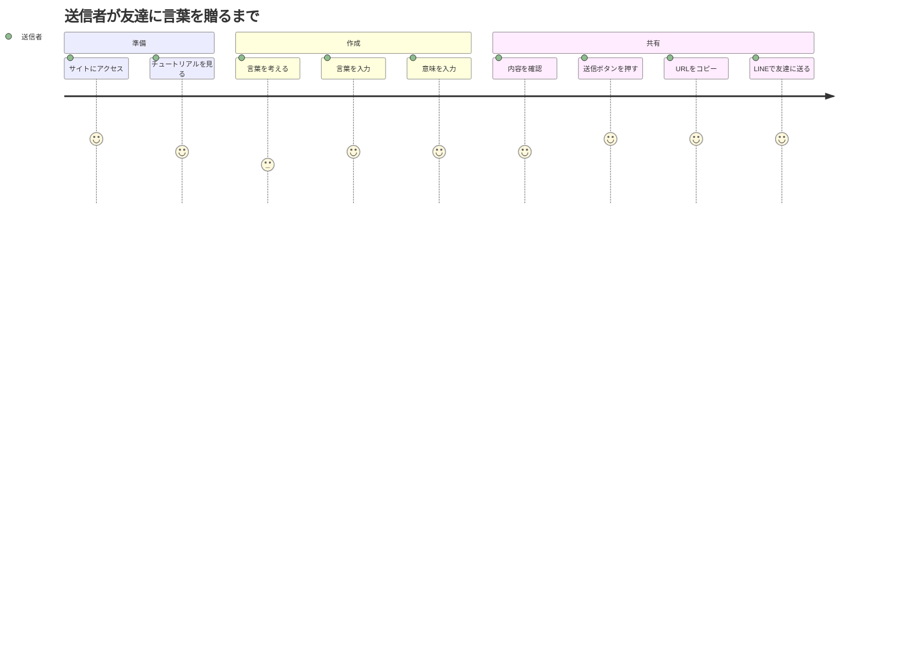
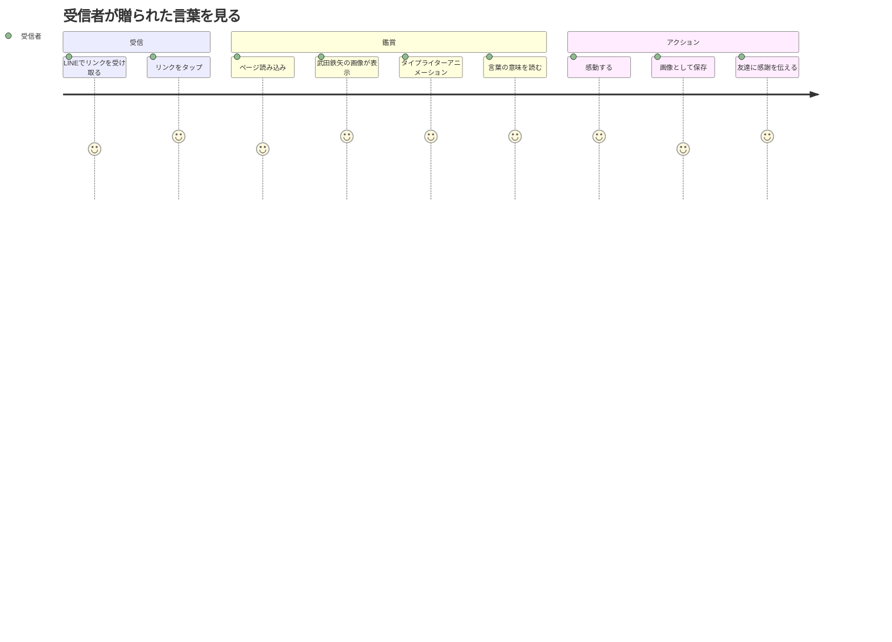

# 贈る言葉BOT ユーザストーリー

## 概要

このドキュメントは贈る言葉BOT機能の詳細なユーザストーリーを記載します。

## ユーザー種別の定義

### プライマリユーザー

- **言葉を贈る人（送信者）**: オリジナルの言葉とその意味を入力して、友達に贈りたい人
  - 年齢層: 10代〜60代
  - 技術レベル: スマートフォンやPCで基本的なWebサイトを使える程度
  - 利用デバイス: スマートフォン、タブレット、PC

- **言葉を受け取る人（受信者）**: 共有リンクにアクセスして贈られた言葉を見る人
  - 年齢層: 10代〜60代
  - 技術レベル: URLをクリックしてWebページを見られる程度
  - 利用デバイス: スマートフォン、タブレット、PC

## ユーザストーリー

**【信頼性レベル凡例】**:
- 🔵 **青信号**: EARS要件定義書・設計文書・ユーザヒアリングを参考にした確実なストーリー
- 🟡 **黄信号**: EARS要件定義書・設計文書・ユーザヒアリングから妥当な推測によるストーリー
- 🔴 **赤信号**: EARS要件定義書・設計文書・ユーザヒアリングにない推測によるストーリー

### 📚 エピック1: 言葉を作成して共有する 🔵 *requirements.md.pdf、ユーザヒアリングより*

#### ストーリー1.1: 初めてサイトを訪問する 🔵 *ユーザヒアリング2025-01-20より*

**ユーザストーリー**:
- **私は** 初めてこのサイトを訪れた送信者 **として**
- **トップページにアクセスした際に**
- **使い方を理解できるチュートリアルを見たい**
- **そうすることで** スムーズに言葉を作成できるようになる

**詳細説明**:
- **背景**: 初めての利用者が迷わず使えるようにする
- **前提条件**: サイトへの初回訪問（ブラウザCookieなどで判定）
- **利用シーン**: 友達から「このサイト面白いよ」と紹介されてアクセスした時
- **期待する体験**:
  - 簡潔で分かりやすい説明（3ステップ程度）
  - 「スキップ」ボタンで飛ばせる
  - 次回から表示しないオプション

**関連要件**: REQ-004

**優先度**: 高

**見積もり**: 3ストーリーポイント

#### ストーリー1.2: オリジナルの言葉を入力する 🔵 *requirements.md.pdf 第2.1章より*

**ユーザストーリー**:
- **私は** 友達に感謝を伝えたい送信者 **として**
- **特別な瞬間や感情を表現したい時に**
- **自分だけのオリジナルの言葉とその意味を入力したい**
- **そうすることで** 一般的な言葉では伝えられない特別な気持ちを表現できる

**詳細説明**:
- **背景**: 辞書にない造語や、友達同士だけの特別な言葉を作りたい
- **前提条件**: トップページの入力フォームが表示されている
- **利用シーン**:
  - 友達の誕生日にメッセージを贈りたい
  - 卒業・就職など節目のお祝い
  - 日頃の感謝を伝えたい
- **期待する体験**:
  - 入力欄が明確で分かりやすい
  - 文字数カウンターが表示される
  - リアルタイムでバリデーションエラーが表示される

**関連要件**: REQ-001, REQ-002, REQ-003, REQ-013, REQ-014

**優先度**: 最高

**見積もり**: 5ストーリーポイント

#### ストーリー1.3: 入力内容を確認して送信する 🟡 *requirements.md.pdf バリデーション要件から推測*

**ユーザストーリー**:
- **私は** 言葉を作成中の送信者 **として**
- **入力を完了した時に**
- **内容を確認してから送信ボタンを押したい**
- **そうすることで** 誤字脱字や不適切な内容を送信前に修正できる

**詳細説明**:
- **背景**: 入力ミスを防ぎ、満足のいく言葉を贈れるようにする
- **前提条件**: 両方の入力欄に文字が入力されている
- **利用シーン**: すべての入力を終えて、送信前に最終確認したい時
- **期待する体験**:
  - 入力内容がプレビューできる（オプション機能）
  - 送信ボタンが明確に表示される
  - バリデーションエラーがあれば送信できない

**関連要件**: REQ-011, REQ-012, REQ-015

**優先度**: 高

**見積もり**: 3ストーリーポイント

#### ストーリー1.4: 共有リンクを取得する 🔵 *requirements.md.pdf 第2.2章より*

**ユーザストーリー**:
- **私は** 言葉を作成完了した送信者 **として**
- **送信ボタンを押した後に**
- **友達に送れる共有リンクを簡単に取得したい**
- **そうすることで** すぐにLINEやメールで友達に送信できる

**詳細説明**:
- **背景**: 作成した言葉を友達に届けるための共有手段
- **前提条件**: バリデーションが成功し、URLが生成されている
- **利用シーン**:
  - LINEで友達に送りたい
  - メールで送りたい
  - SMS で送りたい
- **期待する体験**:
  - ワンクリックでURLをコピーできる
  - コピー成功が視覚的に分かる（トーストメッセージ）
  - URLが表示されているので手動でもコピーできる

**関連要件**: REQ-101, REQ-102, REQ-103, REQ-104, REQ-105

**優先度**: 最高

**見積もり**: 3ストーリーポイント

### 📚 エピック2: 贈られた言葉を見る 🔵 *requirements.md.pdf 第2.3章より*

#### ストーリー2.1: 共有リンクにアクセスする 🔵 *requirements.md.pdf 第2.3章より*

**ユーザストーリー**:
- **私は** 友達から共有リンクを受け取った受信者 **として**
- **LINEやメールのリンクをタップした時に**
- **武田鉄矢が黒板の前で言葉を贈ってくれるページを見たい**
- **そうすることで** 友達の気持ちを特別な形で受け取れる

**詳細説明**:
- **背景**: 受信者が感動的な体験をできるようにする
- **前提条件**: 有効な共有URLをクリックまたはタップした
- **利用シーン**:
  - スマートフォンでLINEのリンクをタップ
  - PCでメールのリンクをクリック
  - タブレットで表示
- **期待する体験**:
  - ページがスムーズに読み込まれる（3秒以内）
  - 武田鉄矢の画像が適切に表示される
  - すぐにアニメーションが始まる

**関連要件**: REQ-201, REQ-202, NFR-001

**優先度**: 最高

**見積もり**: 5ストーリーポイント

#### ストーリー2.2: タイプライターアニメーションを楽しむ 🔵 *requirements.md.pdf 第2.3章より*

**ユーザストーリー**:
- **私は** 言葉を受け取った受信者 **として**
- **ページが表示された時に**
- **1文字ずつ言葉が書かれていくアニメーションを見たい**
- **そうすることで** 特別な演出で感動を味わえる

**詳細説明**:
- **背景**: 静的な表示ではなく、動的な演出で印象に残す
- **前提条件**: 表示ページが正常に読み込まれた
- **利用シーン**: 共有リンクにアクセスして最初に見る瞬間
- **期待する体験**:
  - スムーズで自然な速度（100ms/文字）
  - 縦書きで辞書のような見た目
  - アニメーションがカクつかない（60fps）

**関連要件**: REQ-205, REQ-231, REQ-232, NFR-002

**優先度**: 高

**見積もり**: 8ストーリーポイント

#### ストーリー2.3: アニメーションをスキップする 🔵 *ユーザヒアリング2025-01-20より*

**ユーザストーリー**:
- **私は** 時間がない受信者 **として**
- **アニメーション表示中に**
- **クリックして全文をすぐに表示したい**
- **そうすることで** 急いでいる時でも内容を確認できる

**詳細説明**:
- **背景**: すべてのユーザーがアニメーションを最後まで見られるとは限らない
- **前提条件**: タイプライターアニメーション表示中
- **利用シーン**:
  - 通勤・通学中で時間がない
  - 2回目以降の閲覧
  - せっかちな性格
- **期待する体験**:
  - 画面のどこかをクリック/タップするだけでスキップ
  - 瞬時に全文が表示される
  - スキップ可能であることが直感的に分かる

**関連要件**: REQ-221

**優先度**: 中

**見積もり**: 2ストーリーポイント

### 📚 エピック3: 言葉を保存・共有する 🔵 *requirements.md.pdf 第2.4章より*

#### ストーリー3.1: 画像として保存する 🔵 *requirements.md.pdf 第2.4章より*

**ユーザストーリー**:
- **私は** 言葉を受け取った受信者 **として**
- **表示ページを見終わった後に**
- **画像として保存してSNSに投稿したい**
- **そうすることで** 他の友達にもこの言葉を見せられる

**詳細説明**:
- **背景**: 言葉を後から見返したり、他の場所で共有したい
- **前提条件**: 表示ページが正常に表示されている
- **利用シーン**:
  - Instagramのストーリーに投稿したい
  - スマートフォンのアルバムに保存したい
  - 印刷して部屋に飾りたい
- **期待する体験**:
  - ワンクリックで画像がダウンロードされる
  - 武田鉄矢の画像と言葉が一緒に保存される
  - 画質が良い（標準PNG）

**関連要件**: REQ-301, REQ-302, REQ-303, REQ-304, REQ-305

**優先度**: 高

**見積もり**: 5ストーリーポイント

#### ストーリー3.2: 自分も新しい言葉を作る 🔵 *ユーザヒアリング2025-01-20より*

**ユーザストーリー**:
- **私は** 言葉を受け取って感動した受信者 **として**
- **表示ページを見た後に**
- **自分も新しい言葉を作って友達に贈りたい**
- **そうすることで** お返しのメッセージや別の友達に言葉を贈れる

**詳細説明**:
- **背景**: 良い体験をしたユーザーが次のアクションを起こしやすくする
- **前提条件**: 表示ページを見終わった
- **利用シーン**:
  - 贈ってくれた友達にお返しの言葉を贈りたい
  - 別の友達にも言葉を贈りたい
  - 自分の言葉も作ってみたくなった
- **期待する体験**:
  - 「新しい言葉を贈る」ボタンが目立つ位置にある
  - ワンクリックでトップページに戻れる
  - 作成フローがスムーズ

**関連要件**: REQ-206

**優先度**: 中

**見積もり**: 2ストーリーポイント

### 📚 エピック4: エラーに対処する 🟡 *一般的なエラーハンドリング要件から推測*

#### ストーリー4.1: 入力エラーを理解する 🟡 *バリデーション要件から推測*

**ユーザストーリー**:
- **私は** 入力中の送信者 **として**
- **バリデーションエラーが発生した時に**
- **何が問題なのかを明確に理解したい**
- **そうすることで** すぐに修正して送信できる

**詳細説明**:
- **背景**: エラーメッセージが分かりにくいとユーザーは離脱する
- **前提条件**: バリデーションエラーが発生した
- **利用シーン**:
  - 文字数制限を超えた
  - 入力欄が空のまま送信しようとした
- **期待する体験**:
  - エラーメッセージが具体的（「50文字以内で入力してください」）
  - エラー箇所が視覚的に分かる（赤枠など）
  - エラーが解消されたら即座にメッセージが消える

**関連要件**: REQ-011, REQ-012, REQ-013, REQ-014

**優先度**: 高

**見積もり**: 3ストーリーポイント

#### ストーリー4.2: 不正なリンクを開いた時の対応 🟡 *エラーハンドリング要件から推測*

**ユーザストーリー**:
- **私は** 不正なURLを受け取った受信者 **として**
- **壊れたリンクや改ざんされたURLにアクセスした時に**
- **何が問題なのかを理解して対処したい**
- **そうすることで** 送信者に連絡して正しいリンクを送ってもらえる

**詳細説明**:
- **背景**: URLが途中で切れたり、改変されるケースがある
- **前提条件**: 不正なURLパラメータでアクセスした
- **利用シーン**:
  - メールクライアントがURLを途中で切断した
  - コピー&ペーストの際に一部が欠けた
  - 意図的に改ざんされた
- **期待する体験**:
  - 分かりやすいエラーメッセージ
  - トップページへ戻るリンク
  - 送信者に連絡を促すメッセージ

**関連要件**: REQ-211, REQ-212, REQ-213, EDGE-001

**優先度**: 中

**見積もり**: 3ストーリーポイント

## ユーザージャーニー

### ジャーニー1: 言葉を贈る（送信者の流れ）🔵 *requirements.md.pdf 全体フローより*

**詳細**:
1. **サイトにアクセス**: 友達から紹介されてトップページを開く
2. **チュートリアルを見る**: 初回訪問時、3ステップの使い方を確認
3. **言葉を考える**: 贈りたい特別な言葉を考える時間
4. **言葉を入力**: 「贈りたい言葉」欄に入力
5. **意味を入力**: 「その意味」欄に詳しい説明を入力
6. **内容を確認**: 入力した内容に誤りがないか確認
7. **送信ボタンを押す**: バリデーション成功後、送信
8. **URLをコピー**: コピーボタンでワンクリックコピー
9. **LINEで友達に送る**: LINEアプリに切り替えて送信

### ジャーニー2: 言葉を受け取る（受信者の流れ）🔵 *requirements.md.pdf 第2.3章より*

**詳細**:
1. **LINEでリンクを受け取る**: 友達からのメッセージを確認
2. **リンクをタップ**: URLをタップしてブラウザで開く
3. **ページ読み込み**: 3秒以内に表示完了
4. **武田鉄矢の画像が表示**: 黒板の前に立つ姿が表示
5. **タイプライターアニメーション**: 1文字ずつ言葉が表示される
6. **言葉の意味を読む**: アニメーション完了後、全文を読む
7. **感動する**: 友達の気持ちが伝わる瞬間
8. **画像として保存**: ボタンを押してスマホに保存
9. **友達に感謝を伝える**: LINEで返信したり、電話で感謝を伝える

## ペルソナ定義

### ペルソナ1: アヤカ（20代女性、大学生）🔵 *requirements.md.pdf 想定ユーザーより*

- **基本情報**:
  - 年齢: 22歳
  - 職業: 大学4年生（就職活動中）
  - 技術レベル: スマートフォンを日常的に使用、Instagram、Twitter/Xを利用
  - 利用デバイス: iPhone、ノートPC

- **ゴール**:
  - 卒業を控えた友達に感謝の気持ちを伝えたい
  - ありきたりなメッセージではなく、特別な言葉を贈りたい
  - SNSで共有できる形で残したい

- **課題**:
  - 普通のメッセージカードでは物足りない
  - 自分で画像を作るのは面倒
  - センスのあるデザインにしたい

- **行動パターン**:
  - LINEでのコミュニケーションが中心
  - Instagramストーリーをよく投稿
  - 可愛い・面白いWebサービスが好き

- **利用環境**: 主にスマートフォン（電車内、カフェ、自宅）

### ペルソナ2: タケシ（30代男性、会社員）🔵 *requirements.md.pdf 想定ユーザーより*

- **基本情報**:
  - 年齢: 35歳
  - 職業: IT企業のエンジニア
  - 技術レベル: 高い、新しいWebサービスを試すのが好き
  - 利用デバイス: Android、デスクトップPC

- **ゴール**:
  - 転職する同僚に応援のメッセージを贈りたい
  - シンプルで使いやすいサービスを探している
  - 面白い演出で印象に残したい

- **課題**:
  - 堅苦しいメッセージは避けたい
  - かといってカジュアルすぎるのも違う
  - 忙しいので手間をかけたくない

- **行動パターン**:
  - 効率重視、直感的に使えるサービスを好む
  - メールとSlackでコミュニケーション
  - 面白いサービスは同僚に共有する

- **利用環境**: 主にPCブラウザ（職場、自宅）、たまにスマートフォン

## 非機能的ユーザー要求

### ユーザビリティ要求

- **学習容易性**: 初回利用時に3分以内で使い方を理解できる 🔵 *requirements.md.pdf 3ステップ以内より*
- **効率性**: 熟練後は1分以内で言葉を作成・共有できる 🟡 *シンプル設計から推測*
- **記憶しやすさ**: 2回目の利用時には迷わず操作できる 🟡 *シンプル設計から推測*
- **エラー対応**: バリデーションエラーは即座に分かりやすく表示される 🔵 *ユーザヒアリング要件より*
- **満足度**: 感動的な体験で友達に紹介したくなる 🟡 *プロジェクト目的から推測*

### アクセシビリティ要求

- **視覚**: セマンティックHTMLで構造化、基本的なARIA属性を使用 🔵 *ユーザヒアリング基本対応より*
- **運動**: キーボードだけで全機能を操作可能 🔵 *tech-stack.md要件より*
- **認知**: シンプルで直感的なUI、複雑な操作を避ける 🔵 *requirements.md.pdf ユーザビリティより*

## 優先順位マトリクス

### MoSCoW分析

**Must Have（必須）:**
- 言葉入力フォーム
- バリデーション機能
- 共有リンク生成
- 表示ページ
- タイプライターアニメーション
- 画像ダウンロード

**Should Have（重要）:**
- チュートリアル
- URLコピーボタン
- トーストメッセージ
- 「新しい言葉を贈る」ボタン
- エラーハンドリング

**Could Have（あれば良い）:**
- アニメーションスキップ機能
- 文字数カウンター表示
- プレビュー機能

**Won't Have（今回はスコープ外）:**
- SNS直接共有ボタン
- QRコード生成
- ダークモード
- 多言語対応
- 履歴保存機能

## 更新履歴

- 2025-01-20: 初回作成（/tsumiki:kairo-requirementsにより生成）
