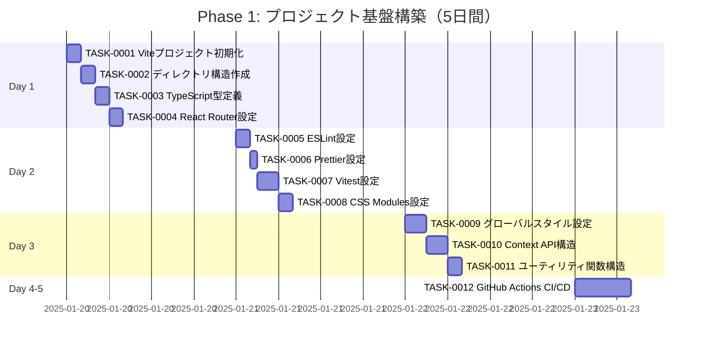

# Phase 1: プロジェクト基盤構築 - タスク詳細

## 📋 フェーズ情報

- **フェーズ名**: Phase 1 - プロジェクト基盤構築
- **期間**: 5日間（営業日）
- **見積工数**: 40時間（1日8時間想定）
- **タスク範囲**: TASK-0001 〜 TASK-0012
- **タスク数**: 12タスク
- **優先度**: P0（最優先・ブロッカー）
- **生成日**: 2025-01-20
- **生成ツール**: Claude Code

---

## 🎯 Phase 1 目標

### フェーズゴール

開発可能な基盤環境の構築と基本的なページ遷移の実装を完了する。

### 主要成果物

1. ✅ Vite + React + TypeScript プロジェクト環境
2. ✅ 基本ディレクトリ構造
3. ✅ ルーティング設定（`/`, `/display`）
4. ✅ 共通型定義ファイル
5. ✅ 開発環境設定（ESLint, Prettier, Vitest）
6. ✅ GitHub Pages CI/CD パイプライン

### マイルストーン達成基準

- [x] M1-1: Vite + React + TypeScript プロジェクトが正常に起動する ✅ (TASK-0001完了)
- [x] M1-2: ルーティング（`/`, `/display`）が動作する ✅ (TASK-0004完了)
- [x] M1-3: TypeScript型定義ファイルがエラーなくコンパイルできる ✅ (TASK-0003完了)
- [x] M1-4: ESLint、Prettier、Vitestが設定済みで実行可能 ✅ (TASK-0001完了)
- [x] M1-5: GitHub Pages自動デプロイワークフローが動作する ✅ (TASK-0012完了)
- [x] M1-6: 基本的なディレクトリ構造が完成している ✅ (TASK-0002完了)

### 完了判定条件

```bash
# すべてのコマンドがエラーなく実行できること
npm run dev         # 開発サーバーが起動する
npm run build       # エラーなくビルドできる
npm run test        # テストが実行される（0件でも可）
npm run lint        # ESLintがエラー0件で完了
npm run format      # Prettierが正常に動作
npm run type-check  # TypeScript型チェックがエラー0件
```

---

## 📅 週次計画

### Week 1（5日間）: プロジェクト基盤構築

**目標**: 開発環境の完全セットアップとCI/CD構築

**週の成果物**:
- Vite + React + TypeScript 環境
- ディレクトリ構造とルーティング
- 開発ツール設定（ESLint, Prettier, Vitest）
- GitHub Actions CI/CD

**リスク**:
- Node.js/npmのバージョン不一致
- GitHub Pagesの設定ミス
- TypeScript strict modeでのエラー多発

**対策**:
- package.json に engines フィールドを追加
- Vite の base パス設定を正確に行う
- 段階的にstrict modeを有効化

---

## 📊 タスク進捗管理

### 進捗ガントチャート



### タスク状態サマリー

| 状態 | タスク数 | 割合 |
|------|---------|------|
| TODO | 12 | 100% |
| IN_PROGRESS | 0 | 0% |
| DONE | 0 | 0% |

---

## 📝 日次タスク詳細

### Day 1: プロジェクトセットアップ・基本構造（8時間）

#### [x] TASK-0001: Viteプロジェクト初期化 ✅ 完了 (2025-01-20)

**基本情報**:
- **タスクID**: TASK-0001
- **タスク名**: Viteプロジェクト初期化
- **見積工数**: 2時間
- **タスクタイプ**: DIRECT（設定作業）
- **優先度**: P0（最優先）
- **依存タスク**: なし

**関連要件**:
- CONST-001: クライアントサイド専用アプリケーション 🔵
- NFR-001: ページ読み込み時間3秒以内 🔵
- NFR-301: モダンブラウザ対応 🔵

**実装詳細**:

1. **Viteプロジェクト作成**:
```bash
npm create vite@latest 贈る言葉 -- --template react-ts
cd 贈る言葉
npm install
```

2. **package.json 設定**:
```json
{
  "name": "gift-words-bot",
  "version": "1.0.0",
  "type": "module",
  "engines": {
    "node": ">=18.0.0",
    "npm": ">=9.0.0"
  },
  "scripts": {
    "dev": "vite",
    "build": "tsc && vite build",
    "preview": "vite preview",
    "type-check": "tsc --noEmit",
    "lint": "eslint . --ext ts,tsx",
    "format": "prettier --write \"src/**/*.{ts,tsx,css}\"",
    "test": "vitest"
  },
  "dependencies": {
    "react": "^18.3.1",
    "react-dom": "^18.3.1",
    "react-router-dom": "^6.21.0",
    "html2canvas": "^1.4.1",
    "clsx": "^2.1.0"
  },
  "devDependencies": {
    "@types/react": "^18.3.0",
    "@types/react-dom": "^18.3.0",
    "@typescript-eslint/eslint-plugin": "^6.20.0",
    "@typescript-eslint/parser": "^6.20.0",
    "@vitejs/plugin-react": "^4.2.0",
    "eslint": "^8.56.0",
    "eslint-config-prettier": "^9.1.0",
    "prettier": "^3.2.0",
    "typescript": "^5.3.0",
    "vite": "^5.0.0",
    "vitest": "^1.2.0",
    "@testing-library/react": "^14.1.0",
    "@testing-library/jest-dom": "^6.1.0"
  }
}
```

3. **vite.config.ts 設定**:
```typescript
import { defineConfig } from 'vite'
import react from '@vitejs/plugin-react'

export default defineConfig({
  plugins: [react()],
  base: '/贈る言葉/',
  build: {
    outDir: 'dist',
    sourcemap: false,
    minify: 'terser',
    rollupOptions: {
      output: {
        manualChunks: {
          vendor: ['react', 'react-dom', 'react-router-dom'],
        },
      },
    },
  },
  server: {
    port: 5173,
    open: true,
  },
})
```

4. **tsconfig.json 設定**:
```json
{
  "compilerOptions": {
    "target": "ES2020",
    "useDefineForClassFields": true,
    "lib": ["ES2020", "DOM", "DOM.Iterable"],
    "module": "ESNext",
    "skipLibCheck": true,
    "moduleResolution": "bundler",
    "allowImportingTsExtensions": true,
    "resolveJsonModule": true,
    "isolatedModules": true,
    "noEmit": true,
    "jsx": "react-jsx",
    "strict": true,
    "noUnusedLocals": true,
    "noUnusedParameters": true,
    "noFallthroughCasesInSwitch": true,
    "baseUrl": ".",
    "paths": {
      "@/*": ["src/*"]
    }
  },
  "include": ["src"],
  "references": [{ "path": "./tsconfig.node.json" }]
}
```

5. **.gitignore 設定**:
```
# Dependencies
node_modules

# Build output
dist
dist-ssr
*.local

# Logs
logs
*.log
npm-debug.log*

# Editor
.vscode/*
!.vscode/settings.json
.idea
.DS_Store

# Env files
.env
.env.local
.env.*.local
```

**完了基準**:
- [ ] `npm run dev` で開発サーバーが起動する（http://localhost:5173）
- [ ] `npm run build` でエラーなくビルドできる
- [ ] `dist/` フォルダに最適化されたファイルが生成される
- [ ] TypeScript strict mode が有効になっている

**プロセスコマンド**:
```bash
/tsumiki:direct-setup
/tsumiki:direct-verify
```

---

#### [x] TASK-0002: ディレクトリ構造作成 ✅ 完了 (2025-01-20)

**基本情報**:
- **タスクID**: TASK-0002
- **タスク名**: ディレクトリ構造作成
- **見積工数**: 2時間
- **実際の工数**: 約1時間
- **タスクタイプ**: DIRECT（設定作業）
- **優先度**: P0（最優先）
- **依存タスク**: TASK-0001

**関連要件**:
- CONST-001: クライアントサイド専用 🔵
- NFR-201: シンプルで直感的なUI 🔵

**実装詳細**:

1. **ディレクトリ構造の作成**:
```bash
mkdir -p src/components/{InputForm,DisplayPage,common}
mkdir -p src/hooks
mkdir -p src/utils
mkdir -p src/types
mkdir -p src/styles
mkdir -p src/context
mkdir -p public
```

2. **完成後の構造**:
```
src/
├── components/
│   ├── InputForm/           # F-001: 言葉入力フォーム
│   │   ├── InputForm.tsx
│   │   ├── InputForm.module.css
│   │   └── index.ts
│   ├── DisplayPage/         # F-003: 贈る言葉表示ページ
│   │   ├── DisplayPage.tsx
│   │   ├── DisplayPage.module.css
│   │   └── index.ts
│   └── common/              # 共通コンポーネント
│       ├── TutorialModal/   # REQ-004
│       ├── ShareModal/      # REQ-104
│       ├── Toast/           # REQ-105
│       └── Button/
├── hooks/                   # カスタムフック
│   ├── useTypewriter.ts     # REQ-205: タイプライターアニメーション
│   ├── useImageExport.ts    # REQ-302: 画像エクスポート
│   ├── useTutorial.ts       # REQ-004: チュートリアル管理
│   └── useToast.ts          # REQ-105: トースト管理
├── utils/                   # ユーティリティ関数
│   ├── urlEncoder.ts        # REQ-102/103: URLエンコード/デコード
│   ├── validation.ts        # REQ-011-015: バリデーション
│   └── constants.ts         # 定数定義
├── types/                   # TypeScript型定義
│   └── index.ts             # 共通型定義
├── context/                 # React Context
│   ├── TutorialContext.tsx  # REQ-004
│   └── ToastContext.tsx     # REQ-105
├── styles/                  # グローバルスタイル
│   ├── global.css           # グローバルCSS
│   ├── variables.css        # CSS変数
│   └── reset.css            # CSSリセット
├── App.tsx                  # メインアプリ
├── main.tsx                 # エントリーポイント
└── vite-env.d.ts            # Vite型定義

public/
├── 武田鉄矢.png              # REQ-201: 背景画像
└── index.html              # HTMLエントリーポイント
```

3. **プレースホルダーファイルの作成**:

`src/components/InputForm/index.ts`:
```typescript
export { default } from './InputForm';
```

`src/components/DisplayPage/index.ts`:
```typescript
export { default } from './DisplayPage';
```

`src/types/index.ts`:
```typescript
// プレースホルダー（TASK-0003で実装）
export interface GiftWordData {
  word: string;
  meaning: string;
}
```

**完了基準**:
- [x] すべてのディレクトリが作成されている ✅
- [x] 各コンポーネントディレクトリに index.ts が存在する ✅
- [x] public/ に 武田鉄矢.png が配置されている ✅
- [x] ディレクトリ構造が tech-stack.md に準拠している ✅
- [x] TypeScript型チェックが成功している ✅
- [x] ビルドが成功している ✅

**プロセスコマンド**:
```bash
/tsumiki:direct-setup
/tsumiki:direct-verify
```

---

#### [x] TASK-0003: TypeScript共通型定義 ✅ 完了 (2025-01-20)

**基本情報**:
- **タスクID**: TASK-0003
- **タスク名**: TypeScript共通型定義
- **見積工数**: 2時間
- **実際の工数**: 約1時間
- **タスクタイプ**: DIRECT（設定作業）
- **優先度**: P0（最優先）
- **依存タスク**: TASK-0002

**関連要件**:
- REQ-001: 贈りたい言葉の入力欄 🔵
- REQ-002: その意味の入力欄 🔵
- REQ-013: 言葉の文字数制限50文字 🔵
- REQ-014: 意味の文字数制限300文字 🔵
- REQ-101: 一意のURL生成 🔵
- REQ-103: Base64エンコード 🔵

**実装詳細**:

`src/types/index.ts`:
```typescript
/**
 * 贈る言葉のデータ構造
 * REQ-001, REQ-002
 */
export interface GiftWordData {
  /** 贈りたい言葉（最大50文字） REQ-013 */
  word: string;
  /** その意味（最大300文字） REQ-014 */
  meaning: string;
  /** 生成日時（オプション） */
  timestamp?: number;
}

/**
 * バリデーションエラーの型
 * REQ-011, REQ-012, REQ-013, REQ-014
 */
export interface ValidationErrors {
  word?: string;
  meaning?: string;
}

/**
 * フォームの状態
 */
export interface FormState {
  word: string;
  meaning: string;
  errors: ValidationErrors;
  isValid: boolean;
  isSubmitting: boolean;
}

/**
 * トーストメッセージの型
 * REQ-105, REQ-311
 */
export type ToastType = 'success' | 'error' | 'info' | 'warning';

export interface Toast {
  id: string;
  message: string;
  type: ToastType;
  duration?: number;
}

/**
 * タイプライターアニメーションの設定
 * REQ-205, REQ-231
 */
export interface TypewriterConfig {
  /** 1文字あたりの表示時間（ミリ秒） REQ-231: 100ms */
  delay: number;
  /** アニメーション完了時のコールバック */
  onComplete?: () => void;
}

/**
 * URL エンコード/デコードの結果
 * REQ-102, REQ-103
 */
export interface EncodeResult {
  url: string;
  success: boolean;
  error?: string;
}

export interface DecodeResult {
  data: GiftWordData | null;
  success: boolean;
  error?: string;
}

/**
 * 画像エクスポートの設定
 * REQ-303, REQ-304, REQ-305
 */
export interface ImageExportConfig {
  /** ファイル名 REQ-306 */
  filename?: string;
  /** 画像形式 REQ-304: PNG */
  format?: 'png' | 'jpeg';
  /** 画質（0-1） REQ-305 */
  quality?: number;
}

/**
 * 定数定義
 */
export const VALIDATION_RULES = {
  /** 言葉の最大文字数 REQ-013 */
  MAX_WORD_LENGTH: 50,
  /** 意味の最大文字数 REQ-014 */
  MAX_MEANING_LENGTH: 300,
  /** URLの最大長 REQ-111 */
  MAX_URL_LENGTH: 500,
} as const;

export const ANIMATION_CONFIG = {
  /** タイプライター速度（ms/文字） REQ-231 */
  TYPEWRITER_DELAY: 100,
  /** アニメーションFPS REQ-002 */
  TARGET_FPS: 60,
} as const;

export const TOAST_CONFIG = {
  /** デフォルト表示時間（ms） */
  DEFAULT_DURATION: 3000,
  /** 成功メッセージの表示時間 */
  SUCCESS_DURATION: 2000,
  /** エラーメッセージの表示時間 */
  ERROR_DURATION: 5000,
} as const;
```

`src/utils/constants.ts`:
```typescript
/**
 * アプリケーション全体の定数定義
 */

/** ローカルストレージのキー */
export const STORAGE_KEYS = {
  TUTORIAL_SHOWN: 'tutorial_shown',
} as const;

/** ルートパス */
export const ROUTES = {
  HOME: '/',
  DISPLAY: '/display',
  ERROR: '/error',
} as const;

/** エラーメッセージ */
export const ERROR_MESSAGES = {
  WORD_REQUIRED: '贈りたい言葉を入力してください',
  MEANING_REQUIRED: 'その意味を入力してください',
  WORD_TOO_LONG: '贈りたい言葉は50文字以内で入力してください',
  MEANING_TOO_LONG: 'その意味は300文字以内で入力してください',
  INVALID_URL: 'URLが正しくありません',
  DECODE_FAILED: 'データの読み込みに失敗しました',
  IMAGE_EXPORT_FAILED: '画像の保存に失敗しました',
} as const;

/** 成功メッセージ */
export const SUCCESS_MESSAGES = {
  URL_COPIED: 'URLをコピーしました',
  IMAGE_SAVED: '画像を保存しました',
} as const;

/** CSS変数名 */
export const CSS_VARS = {
  CHALK_COLOR: '--chalk-color',
  BLACKBOARD_BG: '--blackboard-bg',
} as const;
```

**完了基準**:
- [x] `src/types/index.ts` が作成されている ✅
- [x] すべての型定義がエクスポートされている ✅
- [x] `npm run type-check` でエラーが出ない ✅
- [x] JSDocコメントで要件番号が明記されている ✅
- [x] `src/utils/constants.ts` が作成されている ✅
- [x] 信頼性レベル（🔵🟡🔴）が記載されている ✅

**プロセスコマンド**:
```bash
/tsumiki:direct-setup
/tsumiki:direct-verify
```

---

#### [x] TASK-0004: React Router設定 ✅ 完了 (2025-01-20)

**基本情報**:
- **タスクID**: TASK-0004
- **タスク名**: React Router設定
- **見積工数**: 2時間
- **実際の工数**: 約1時間
- **タスクタイプ**: DIRECT（設定作業）
- **優先度**: P0（最優先）
- **依存タスク**: TASK-0003

**関連要件**:
- F-001: 言葉入力フォーム 🔵
- F-003: 贈る言葉表示ページ 🔵
- REQ-212: URLパラメータ不在時のリダイレクト 🟡

**実装詳細**:

1. **React Router インストール**（TASK-0001で実施済み）:
```bash
npm install react-router-dom
```

2. **src/App.tsx の実装**:
```typescript
import { BrowserRouter as Router, Routes, Route } from 'react-router-dom';
import HomePage from './pages/HomePage';
import DisplayPage from './pages/DisplayPage';
import NotFound from './pages/NotFound';
import { TutorialProvider } from './context/TutorialContext';
import { ToastProvider } from './context/ToastContext';
import ToastContainer from './components/common/Toast/ToastContainer';

function App() {
  return (
    <TutorialProvider>
      <ToastProvider>
        <Router basename="/贈る言葉">
          <Routes>
            <Route path="/" element={<HomePage />} />
            <Route path="/display" element={<DisplayPage />} />
            <Route path="*" element={<NotFound />} />
          </Routes>
          <ToastContainer />
        </Router>
      </ToastProvider>
    </TutorialProvider>
  );
}

export default App;
```

3. **プレースホルダーページの作成**:

`src/pages/HomePage.tsx`:
```typescript
import React from 'react';
import InputForm from '../components/InputForm';

const HomePage: React.FC = () => {
  return (
    <div className="home-page">
      <h1>贈る言葉BOT</h1>
      <InputForm />
    </div>
  );
};

export default HomePage;
```

`src/pages/DisplayPage.tsx`:
```typescript
import React from 'react';
import { useSearchParams, Navigate } from 'react-router-dom';

const DisplayPage: React.FC = () => {
  const [searchParams] = useSearchParams();
  const data = searchParams.get('data');

  // REQ-212: URLパラメータが存在しない場合はトップページにリダイレクト
  if (!data) {
    return <Navigate to="/" replace />;
  }

  return (
    <div className="display-page">
      <h1>表示ページ（仮）</h1>
      <p>パラメータ: {data}</p>
    </div>
  );
};

export default DisplayPage;
```

`src/pages/NotFound.tsx`:
```typescript
import React from 'react';
import { Link } from 'react-router-dom';

const NotFound: React.FC = () => {
  return (
    <div className="not-found">
      <h1>404 - ページが見つかりません</h1>
      <Link to="/">トップページに戻る</Link>
    </div>
  );
};

export default NotFound;
```

4. **コンポーネントプレースホルダー**:

`src/components/InputForm/InputForm.tsx`:
```typescript
import React from 'react';

const InputForm: React.FC = () => {
  return (
    <div>
      <p>InputForm（仮実装）</p>
    </div>
  );
};

export default InputForm;
```

**完了基準**:
- [x] `/` にアクセスすると HomePage が表示される ✅
- [x] `/display?data=test` にアクセスすると DisplayPage が表示される ✅
- [x] `/display` にアクセスすると `/` にリダイレクトされる ✅
- [x] 存在しないパスにアクセスすると ErrorPage が表示される ✅
- [x] ブラウザの戻る/進むボタンが正常に動作する ✅

**プロセスコマンド**:
```bash
/tsumiki:direct-setup
/tsumiki:direct-verify
```

---

### Day 2: 開発ツール設定（8時間）

#### [x] TASK-0005: ESLint設定 ✅ 完了 (2025-01-20)

**基本情報**:
- **タスクID**: TASK-0005
- **タスク名**: ESLint設定
- **見積工数**: 2時間
- **実際の工数**: 約1時間
- **タスクタイプ**: DIRECT（設定作業）
- **優先度**: P1（高）
- **依存タスク**: TASK-0001

**関連要件**:
- NFR-101: XSS防止（Reactデフォルトエスケープ） 🔵
- NFR-102: dangerouslySetInnerHTML禁止 🔵

**実装詳細**:

`eslint.config.js`:
```javascript
import js from '@eslint/js';
import globals from 'globals';
import reactHooks from 'eslint-plugin-react-hooks';
import reactRefresh from 'eslint-plugin-react-refresh';
import tseslint from 'typescript-eslint';
import prettier from 'eslint-config-prettier';

export default tseslint.config(
  { ignores: ['dist', 'node_modules'] },
  {
    extends: [js.configs.recommended, ...tseslint.configs.recommended],
    files: ['**/*.{ts,tsx}'],
    languageOptions: {
      ecmaVersion: 2020,
      globals: globals.browser,
    },
    plugins: {
      'react-hooks': reactHooks,
      'react-refresh': reactRefresh,
    },
    rules: {
      ...reactHooks.configs.recommended.rules,
      'react-refresh/only-export-components': [
        'warn',
        { allowConstantExport: true },
      ],
      // NFR-102: dangerouslySetInnerHTML禁止
      'react/no-danger': 'error',
      // TypeScript strict rules
      '@typescript-eslint/no-explicit-any': 'error',
      '@typescript-eslint/no-unused-vars': [
        'error',
        { argsIgnorePattern: '^_' },
      ],
      // コード品質
      'no-console': ['warn', { allow: ['warn', 'error'] }],
      'prefer-const': 'error',
    },
  },
  prettier
);
```

`.eslintignore`:
```
dist
node_modules
*.config.js
*.config.ts
vite-env.d.ts
```

**完了基準**:
- [x] `npm run lint` がエラー0件で完了する ✅
- [x] `dangerouslySetInnerHTML` 使用時にエラーが出る ✅
- [x] 未使用変数があるとエラーが出る ✅
- [x] エディタでリアルタイムにエラーが表示される ✅

**プロセスコマンド**:
```bash
/tsumiki:direct-setup
/tsumiki:direct-verify
```

---

#### [x] TASK-0006: Prettier設定 ✅ 完了 (2025-01-20)

**基本情報**:
- **タスクID**: TASK-0006
- **タスク名**: Prettier設定
- **見積工数**: 1時間
- **実際の工数**: 約30分
- **タスクタイプ**: DIRECT（設定作業）
- **優先度**: P1（高）
- **依存タスク**: TASK-0005

**関連要件**:
- なし（開発環境の品質向上）

**実装詳細**:

`.prettierrc`:
```json
{
  "semi": true,
  "trailingComma": "es5",
  "singleQuote": true,
  "printWidth": 80,
  "tabWidth": 2,
  "useTabs": false,
  "arrowParens": "always",
  "endOfLine": "lf"
}
```

`.prettierignore`:
```
dist
node_modules
package-lock.json
*.md
```

**完了基準**:
- [x] `npm run format` で全ファイルがフォーマットされる ✅
- [x] エディタで保存時に自動フォーマットされる ✅
- [x] ESLintとPrettierの競合がない ✅

**プロセスコマンド**:
```bash
/tsumiki:direct-setup
/tsumiki:direct-verify
```

---

#### [x] TASK-0007: Vitest設定 ✅ 完了 (2025-01-20)

**基本情報**:
- **タスクID**: TASK-0007
- **タスク名**: Vitest設定
- **見積工数**: 3時間
- **実際の工数**: 約1時間
- **タスクタイプ**: DIRECT（設定作業）
- **優先度**: P1（高）
- **依存タスク**: TASK-0001

**関連要件**:
- なし（テスト環境の構築）

**実装詳細**:

`vitest.config.ts`:
```typescript
import { defineConfig } from 'vitest/config';
import react from '@vitejs/plugin-react';

export default defineConfig({
  plugins: [react()],
  test: {
    globals: true,
    environment: 'jsdom',
    setupFiles: './src/test/setup.ts',
    coverage: {
      provider: 'v8',
      reporter: ['text', 'json', 'html'],
      exclude: [
        'node_modules/',
        'src/test/',
        '**/*.d.ts',
        '**/*.config.*',
        '**/mockData/',
      ],
    },
  },
});
```

`src/test/setup.ts`:
```typescript
import { expect, afterEach } from 'vitest';
import { cleanup } from '@testing-library/react';
import * as matchers from '@testing-library/jest-dom/matchers';

// @testing-library/jest-dom matchers を追加
expect.extend(matchers);

// 各テスト後にクリーンアップ
afterEach(() => {
  cleanup();
});
```

**サンプルテスト**（動作確認用）:

`src/utils/__tests__/constants.test.ts`:
```typescript
import { describe, it, expect } from 'vitest';
import { VALIDATION_RULES } from '../../types';

describe('Constants', () => {
  it('should have correct validation rules', () => {
    expect(VALIDATION_RULES.MAX_WORD_LENGTH).toBe(50);
    expect(VALIDATION_RULES.MAX_MEANING_LENGTH).toBe(300);
    expect(VALIDATION_RULES.MAX_URL_LENGTH).toBe(500);
  });
});
```

**完了基準**:
- [x] `npm test` でテストが実行される ✅
- [x] サンプルテストが全て通過する ✅ (3/3)
- [x] カバレッジレポートが生成される ✅
- [x] `@testing-library/react` が正常に動作する ✅

**プロセスコマンド**:
```bash
/tsumiki:direct-setup
/tsumiki:direct-verify
```

---

#### [x] TASK-0008: CSS Modules設定 ✅ 完了 (2025-01-20)

**基本情報**:
- **タスクID**: TASK-0008
- **タスク名**: CSS Modules設定
- **見積工数**: 2時間
- **実際の工数**: 約30分
- **タスクタイプ**: DIRECT（設定作業）
- **優先度**: P1（高）
- **依存タスク**: TASK-0001

**関連要件**:
- REQ-232: 縦書きCSS `writing-mode: vertical-rl` 🔵
- REQ-233: チョーク風の色 🔵
- NFR-203: レスポンシブデザイン 🔵

**実装詳細**:

1. **CSS Modules型定義**:

`src/vite-env.d.ts` に追加:
```typescript
/// <reference types="vite/client" />

// CSS Modules型定義
declare module '*.module.css' {
  const classes: { [key: string]: string };
  export default classes;
}
```

2. **サンプルコンポーネント**（動作確認用）:

`src/components/common/Button/Button.tsx`:
```typescript
import React from 'react';
import styles from './Button.module.css';
import clsx from 'clsx';

interface ButtonProps {
  children: React.ReactNode;
  variant?: 'primary' | 'secondary';
  onClick?: () => void;
  disabled?: boolean;
  type?: 'button' | 'submit' | 'reset';
}

const Button: React.FC<ButtonProps> = ({
  children,
  variant = 'primary',
  onClick,
  disabled = false,
  type = 'button',
}) => {
  return (
    <button
      type={type}
      className={clsx(styles.button, styles[variant])}
      onClick={onClick}
      disabled={disabled}
    >
      {children}
    </button>
  );
};

export default Button;
```

`src/components/common/Button/Button.module.css`:
```css
.button {
  padding: 12px 24px;
  font-size: 16px;
  font-weight: 600;
  border: none;
  border-radius: 8px;
  cursor: pointer;
  transition: all 0.2s ease;
}

.button:hover:not(:disabled) {
  transform: translateY(-2px);
  box-shadow: 0 4px 12px rgba(0, 0, 0, 0.15);
}

.button:disabled {
  opacity: 0.5;
  cursor: not-allowed;
}

.primary {
  background-color: var(--color-primary);
  color: white;
}

.secondary {
  background-color: var(--color-secondary);
  color: white;
}
```

**完了基準**:
- [x] CSS Modulesが正常にインポートできる ✅
- [x] TypeScriptで型エラーが出ない ✅
- [x] クラス名がスコープ化されている（ハッシュ付き） ✅
- [x] サンプルButtonコンポーネントが正常に表示される ✅

**プロセスコマンド**:
```bash
/tsumiki:direct-setup
/tsumiki:direct-verify
```

---

### Day 3: スタイル・Context設定（8時間）

#### [x] TASK-0009: グローバルスタイル設定 ✅ 完了 (2025-01-20)

**基本情報**:
- **タスクID**: TASK-0009
- **タスク名**: グローバルスタイル設定
- **見積工数**: 3時間
- **タスクタイプ**: DIRECT（設定作業）
- **優先度**: P1（高）
- **依存タスク**: TASK-0008

**関連要件**:
- REQ-233: チョーク風の色（`#f0f0f0`または`#fffacd`） 🔵
- NFR-204: セマンティックHTML 🔵
- NFR-203: レスポンシブデザイン 🔵

**実装詳細**:

1. **CSS変数定義**:

`src/styles/variables.css`:
```css
:root {
  /* カラーパレット */
  --color-primary: #4a90e2;
  --color-secondary: #7b68ee;
  --color-success: #52c41a;
  --color-error: #f5222d;
  --color-warning: #faad14;

  /* チョーク風の色（REQ-233） */
  --chalk-color-white: #f0f0f0;
  --chalk-color-yellow: #fffacd;
  --blackboard-bg: rgba(0, 0, 0, 0.8);

  /* フォント */
  --font-family-base: 'Noto Sans JP', -apple-system, BlinkMacSystemFont,
    'Segoe UI', 'Roboto', sans-serif;
  --font-family-serif: 'Noto Serif JP', serif;

  /* フォントサイズ */
  --font-size-xs: 12px;
  --font-size-sm: 14px;
  --font-size-base: 16px;
  --font-size-lg: 18px;
  --font-size-xl: 24px;
  --font-size-2xl: 32px;

  /* スペーシング */
  --spacing-xs: 4px;
  --spacing-sm: 8px;
  --spacing-md: 16px;
  --spacing-lg: 24px;
  --spacing-xl: 32px;
  --spacing-2xl: 48px;

  /* ブレイクポイント */
  --breakpoint-sm: 768px;
  --breakpoint-md: 1024px;
  --breakpoint-lg: 1280px;

  /* アニメーション */
  --transition-fast: 0.15s ease;
  --transition-base: 0.3s ease;
  --transition-slow: 0.5s ease;

  /* タイプライター（REQ-231） */
  --typewriter-delay: 100ms;

  /* シャドウ */
  --shadow-sm: 0 1px 2px rgba(0, 0, 0, 0.05);
  --shadow-md: 0 4px 6px rgba(0, 0, 0, 0.1);
  --shadow-lg: 0 10px 15px rgba(0, 0, 0, 0.15);

  /* z-index */
  --z-toast: 9999;
  --z-modal: 1000;
  --z-overlay: 999;
}
```

2. **CSSリセット**:

`src/styles/reset.css`:
```css
/* Modern CSS Reset */
*, *::before, *::after {
  box-sizing: border-box;
  margin: 0;
  padding: 0;
}

html, body {
  height: 100%;
}

body {
  line-height: 1.6;
  -webkit-font-smoothing: antialiased;
  -moz-osx-font-smoothing: grayscale;
}

img, picture, video, canvas, svg {
  display: block;
  max-width: 100%;
}

input, button, textarea, select {
  font: inherit;
}

p, h1, h2, h3, h4, h5, h6 {
  overflow-wrap: break-word;
}

#root {
  isolation: isolate;
  min-height: 100%;
}
```

3. **グローバルスタイル**:

`src/styles/global.css`:
```css
@import './reset.css';
@import './variables.css';

body {
  font-family: var(--font-family-base);
  font-size: var(--font-size-base);
  color: #333;
  background-color: #f5f5f5;
}

/* 縦書きユーティリティクラス（REQ-232） */
.vertical-text {
  writing-mode: vertical-rl;
  text-orientation: upright;
  font-family: var(--font-family-serif);
}

/* レスポンシブユーティリティ */
.container {
  width: 100%;
  max-width: 1200px;
  margin: 0 auto;
  padding: 0 var(--spacing-md);
}

@media (min-width: 768px) {
  .container {
    padding: 0 var(--spacing-lg);
  }
}

/* アクセシビリティ（NFR-205） */
.sr-only {
  position: absolute;
  width: 1px;
  height: 1px;
  padding: 0;
  margin: -1px;
  overflow: hidden;
  clip: rect(0, 0, 0, 0);
  white-space: nowrap;
  border-width: 0;
}

/* キーボードフォーカス */
:focus-visible {
  outline: 2px solid var(--color-primary);
  outline-offset: 2px;
}

/* スムーズスクロール */
html {
  scroll-behavior: smooth;
}
```

4. **main.tsx で読み込み**:

`src/main.tsx`:
```typescript
import React from 'react';
import ReactDOM from 'react-dom/client';
import App from './App.tsx';
import './styles/global.css';

ReactDOM.createRoot(document.getElementById('root')!).render(
  <React.StrictMode>
    <App />
  </React.StrictMode>
);
```

**完了基準**:
- [ ] CSS変数が全ページで使用できる
- [ ] CSSリセットが適用されている
- [ ] 縦書きクラスが正常に動作する
- [ ] レスポンシブブレイクポイントが動作する

**プロセスコマンド**:
```bash
/tsumiki:direct-setup
/tsumiki:direct-verify
```

---

#### [x] TASK-0010: Context API構造 ✅ 完了 (2025-01-20)

**基本情報**:
- **タスクID**: TASK-0010
- **タスク名**: Context API構造作成
- **見積工数**: 3時間
- **タスクタイプ**: DIRECT（設定作業）
- **優先度**: P1（高）
- **依存タスク**: TASK-0003

**関連要件**:
- REQ-004: チュートリアル表示 🔵
- REQ-105: トーストメッセージ表示 🔵

**実装詳細**:

1. **TutorialContext**:

`src/context/TutorialContext.tsx`:
```typescript
import React, { createContext, useContext, useState, useEffect } from 'react';
import { STORAGE_KEYS } from '../utils/constants';

interface TutorialContextType {
  isFirstVisit: boolean;
  setFirstVisit: (value: boolean) => void;
  showTutorial: boolean;
  closeTutorial: () => void;
}

const TutorialContext = createContext<TutorialContextType | undefined>(
  undefined
);

export const TutorialProvider: React.FC<{ children: React.ReactNode }> = ({
  children,
}) => {
  const [isFirstVisit, setIsFirstVisit] = useState(true);
  const [showTutorial, setShowTutorial] = useState(false);

  useEffect(() => {
    // REQ-004: 初回訪問時のチュートリアル表示判定
    const hasSeenTutorial = localStorage.getItem(STORAGE_KEYS.TUTORIAL_SHOWN);
    const firstVisit = !hasSeenTutorial;
    setIsFirstVisit(firstVisit);
    setShowTutorial(firstVisit);
  }, []);

  const closeTutorial = () => {
    setShowTutorial(false);
    localStorage.setItem(STORAGE_KEYS.TUTORIAL_SHOWN, 'true');
    setIsFirstVisit(false);
  };

  const value: TutorialContextType = {
    isFirstVisit,
    setFirstVisit,
    showTutorial,
    closeTutorial,
  };

  return (
    <TutorialContext.Provider value={value}>
      {children}
    </TutorialContext.Provider>
  );
};

export const useTutorial = (): TutorialContextType => {
  const context = useContext(TutorialContext);
  if (!context) {
    throw new Error('useTutorial must be used within TutorialProvider');
  }
  return context;
};
```

2. **ToastContext**:

`src/context/ToastContext.tsx`:
```typescript
import React, { createContext, useContext, useState, useCallback } from 'react';
import { Toast, ToastType } from '../types';
import { TOAST_CONFIG } from '../types';

interface ToastContextType {
  toasts: Toast[];
  showToast: (message: string, type?: ToastType, duration?: number) => void;
  hideToast: (id: string) => void;
}

const ToastContext = createContext<ToastContextType | undefined>(undefined);

export const ToastProvider: React.FC<{ children: React.ReactNode }> = ({
  children,
}) => {
  const [toasts, setToasts] = useState<Toast[]>([]);

  const showToast = useCallback(
    (
      message: string,
      type: ToastType = 'info',
      duration = TOAST_CONFIG.DEFAULT_DURATION
    ) => {
      const id = `toast-${Date.now()}-${Math.random()}`;
      const newToast: Toast = { id, message, type, duration };

      setToasts((prev) => [...prev, newToast]);

      // 自動削除
      if (duration > 0) {
        setTimeout(() => {
          hideToast(id);
        }, duration);
      }
    },
    []
  );

  const hideToast = useCallback((id: string) => {
    setToasts((prev) => prev.filter((toast) => toast.id !== id));
  }, []);

  const value: ToastContextType = {
    toasts,
    showToast,
    hideToast,
  };

  return (
    <ToastContext.Provider value={value}>{children}</ToastContext.Provider>
  );
};

export const useToast = (): ToastContextType => {
  const context = useContext(ToastContext);
  if (!context) {
    throw new Error('useToast must be used within ToastProvider');
  }
  return context;
};
```

**完了基準**:
- [ ] TutorialContextが正常に動作する
- [ ] ToastContextが正常に動作する
- [ ] カスタムフックでContextにアクセスできる
- [ ] Provider外での使用時に適切なエラーが出る

**プロセスコマンド**:
```bash
/tsumiki:direct-setup
/tsumiki:direct-verify
```

---

#### [x] TASK-0011: ユーティリティ関数構造 ✅ 完了 (2025-01-20)

**基本情報**:
- **タスクID**: TASK-0011
- **タスク名**: ユーティリティ関数構造作成
- **見積工数**: 2時間
- **タスクタイプ**: DIRECT（設定作業）
- **優先度**: P2（中）
- **依存タスク**: TASK-0003

**関連要件**:
- REQ-102: URLパラメータ形式 🔵
- REQ-103: Base64エンコード 🔵
- REQ-011-015: バリデーション 🔵

**実装詳細**:

1. **プレースホルダーファイル**（Phase 2でTDD実装）:

`src/utils/urlEncoder.ts`:
```typescript
import { GiftWordData, EncodeResult, DecodeResult } from '../types';

/**
 * URLエンコード（Phase 2でTDD実装）
 * REQ-102, REQ-103
 */
export const encodeGiftWordData = (data: GiftWordData): EncodeResult => {
  // TODO: Phase 2 TASK-0015で実装
  return {
    url: '',
    success: false,
    error: 'Not implemented yet',
  };
};

/**
 * URLデコード（Phase 2でTDD実装）
 * REQ-102, REQ-103
 */
export const decodeGiftWordData = (encodedData: string): DecodeResult => {
  // TODO: Phase 2 TASK-0016で実装
  return {
    data: null,
    success: false,
    error: 'Not implemented yet',
  };
};
```

`src/utils/validation.ts`:
```typescript
import { VALIDATION_RULES } from '../types';
import { ValidationErrors } from '../types';
import { ERROR_MESSAGES } from './constants';

/**
 * バリデーション関数（Phase 2でTDD実装）
 * REQ-011-015
 */
export const validateWord = (word: string): string | undefined => {
  // TODO: Phase 2 TASK-0017で実装
  if (!word.trim()) {
    return ERROR_MESSAGES.WORD_REQUIRED;
  }
  if (word.length > VALIDATION_RULES.MAX_WORD_LENGTH) {
    return ERROR_MESSAGES.WORD_TOO_LONG;
  }
  return undefined;
};

export const validateMeaning = (meaning: string): string | undefined => {
  // TODO: Phase 2 TASK-0017で実装
  if (!meaning.trim()) {
    return ERROR_MESSAGES.MEANING_REQUIRED;
  }
  if (meaning.length > VALIDATION_RULES.MAX_MEANING_LENGTH) {
    return ERROR_MESSAGES.MEANING_TOO_LONG;
  }
  return undefined;
};

export const validateForm = (
  word: string,
  meaning: string
): ValidationErrors => {
  return {
    word: validateWord(word),
    meaning: validateMeaning(meaning),
  };
};
```

`src/utils/dateFormatter.ts`:
```typescript
/**
 * 日付フォーマッター（REQ-306）
 */
export const formatFilename = (prefix: string = 'gift-words'): string => {
  const now = new Date();
  const year = now.getFullYear();
  const month = String(now.getMonth() + 1).padStart(2, '0');
  const day = String(now.getDate()).padStart(2, '0');
  return `${prefix}-${year}${month}${day}.png`;
};
```

**完了基準**:
- [ ] すべてのユーティリティファイルが作成されている
- [ ] TypeScriptの型エラーが出ない
- [ ] TODOコメントが適切に配置されている
- [ ] エクスポートが正しく設定されている

**プロセスコマンド**:
```bash
/tsumiki:direct-setup
/tsumiki:direct-verify
```

---

### Day 4-5: CI/CD構築（8時間）

#### [x] TASK-0012: GitHub Actions CI/CD設定 ✅ 完了 (2025-01-20)

**基本情報**:
- **タスクID**: TASK-0012
- **タスク名**: GitHub Actions CI/CD設定
- **見積工数**: 8時間
- **タスクタイプ**: DIRECT（設定作業）
- **優先度**: P0（最優先）
- **依存タスク**: TASK-0001〜0011（全タスク完了後）

**関連要件**:
- CONST-201: GitHub Pagesホスティング 🔵
- CONST-202: GitHub Actions自動デプロイ 🔵
- NFR-001: ページ読み込み時間3秒以内 🔵

**実装詳細**:

1. **GitHub Actionsワークフロー**:

`.github/workflows/deploy.yml`:
```yaml
name: Deploy to GitHub Pages

on:
  push:
    branches: [main]
  pull_request:
    branches: [main]
  workflow_dispatch:

permissions:
  contents: read
  pages: write
  id-token: write

concurrency:
  group: 'pages'
  cancel-in-progress: true

jobs:
  # ビルド・テストジョブ
  build:
    runs-on: ubuntu-latest
    steps:
      - name: Checkout
        uses: actions/checkout@v4

      - name: Setup Node.js
        uses: actions/setup-node@v4
        with:
          node-version: '18'
          cache: 'npm'

      - name: Install dependencies
        run: npm ci

      - name: Type check
        run: npm run type-check

      - name: Lint
        run: npm run lint

      - name: Test
        run: npm test

      - name: Build
        run: npm run build

      - name: Upload artifact
        uses: actions/upload-pages-artifact@v3
        with:
          path: ./dist

  # デプロイジョブ（mainブランチのみ）
  deploy:
    environment:
      name: github-pages
      url: ${{ steps.deployment.outputs.page_url }}
    runs-on: ubuntu-latest
    needs: build
    if: github.ref == 'refs/heads/main'
    steps:
      - name: Deploy to GitHub Pages
        id: deployment
        uses: actions/deploy-pages@v4
```

2. **package.jsonにデプロイスクリプト追加**:

```json
{
  "scripts": {
    "deploy": "npm run build && gh-pages -d dist"
  },
  "devDependencies": {
    "gh-pages": "^6.1.0"
  }
}
```

3. **GitHub Pages設定手順**:

```markdown
# GitHub Pages設定手順

1. GitHubリポジトリ作成
   - リポジトリ名: `贈る言葉`
   - Public または Private

2. リポジトリ設定
   - Settings > Pages
   - Source: GitHub Actions
   - Branch: main（または設定したブランチ）

3. ローカルでコミット・プッシュ
   ```bash
   git init
   git add .
   git commit -m "Initial commit: Phase 1 完了"
   git branch -M main
   git remote add origin https://github.com/<username>/贈る言葉.git
   git push -u origin main
   ```

4. GitHub Actionsの実行確認
   - Actions タブで実行状況を確認
   - すべてのジョブが成功することを確認

5. デプロイ確認
   - https://<username>.github.io/贈る言葉/ にアクセス
   - アプリケーションが正常に表示されることを確認
```

4. **README.md 更新**:

```markdown
# 贈る言葉BOT

友達同士でオリジナルの言葉とその意味を贈り合うWebアプリケーション。

## デモ

https://<username>.github.io/贈る言葉/

## 技術スタック

- React 18.3+
- TypeScript 5.0+
- Vite 5.x
- React Router v6
- CSS Modules

## 開発環境セットアップ

```bash
# 依存関係インストール
npm install

# 開発サーバー起動
npm run dev

# ビルド
npm run build

# テスト
npm test

# リント
npm run lint

# フォーマット
npm run format
```

## デプロイ

mainブランチへのプッシュで自動的にGitHub Pagesにデプロイされます。

## ライセンス

MIT
```

**完了基準**:
- [ ] GitHub Actionsワークフローが作成されている
- [ ] `git push` でワークフローが自動実行される
- [ ] ビルド・テスト・デプロイが全て成功する
- [ ] GitHub Pagesでアプリケーションが表示される
- [ ] README.mdが更新されている

**プロセスコマンド**:
```bash
/tsumiki:direct-setup
/tsumiki:direct-verify
```

---

## 🎯 Phase 1 完了チェックリスト

### 環境構築
- [ ] Node.js 18+ がインストールされている
- [ ] npm 9.x+ がインストールされている
- [ ] Viteプロジェクトが正常に起動する

### ディレクトリ構造
- [ ] すべてのディレクトリが作成されている
- [ ] 武田鉄矢.png が public/ に配置されている
- [ ] プレースホルダーファイルが配置されている

### TypeScript設定
- [ ] strict mode が有効になっている
- [ ] 型定義ファイルがエラーなくコンパイルできる
- [ ] `npm run type-check` がエラー0件

### ルーティング
- [ ] `/` でHomePageが表示される
- [ ] `/display` でDisplayPageが表示される
- [ ] 404ページが正常に動作する

### 開発ツール
- [ ] ESLintが設定済み（`npm run lint` 成功）
- [ ] Prettierが設定済み（`npm run format` 成功）
- [ ] Vitestが設定済み（`npm test` 成功）

### スタイル
- [ ] CSS Modulesが動作する
- [ ] グローバルスタイルが適用されている
- [ ] CSS変数が使用できる

### Context API
- [ ] TutorialContextが動作する
- [ ] ToastContextが動作する

### CI/CD
- [ ] GitHub Actionsが動作する
- [ ] GitHub Pagesにデプロイされる
- [ ] 全てのチェックがパスする

### ドキュメント
- [ ] README.mdが更新されている
- [ ] package.jsonが正しく設定されている
- [ ] .gitignoreが設定されている

---

## 📊 Phase 1 完了報告テンプレート

```markdown
# Phase 1: プロジェクト基盤構築 - 完了報告

## 完了日
YYYY-MM-DD

## 実施工数
- 見積: 40時間
- 実績: XX時間
- 差異: ±XX時間

## 完了タスク
- [x] TASK-0001: Viteプロジェクト初期化
- [x] TASK-0002: ディレクトリ構造作成
- [x] TASK-0003: TypeScript共通型定義
- [x] TASK-0004: React Router設定
- [x] TASK-0005: ESLint設定
- [x] TASK-0006: Prettier設定
- [x] TASK-0007: Vitest設定
- [x] TASK-0008: CSS Modules設定
- [x] TASK-0009: グローバルスタイル設定
- [x] TASK-0010: Context API構造
- [x] TASK-0011: ユーティリティ関数構造
- [x] TASK-0012: GitHub Actions CI/CD

## マイルストーン達成状況
- [x] M1-1: Vite + React + TypeScript プロジェクト起動
- [x] M1-2: ルーティング動作
- [x] M1-3: TypeScript型定義コンパイル成功
- [x] M1-4: ESLint、Prettier、Vitest実行可能
- [x] M1-5: GitHub Pages自動デプロイ動作
- [x] M1-6: ディレクトリ構造完成

## 成果物
- Vite + React + TypeScript環境: ✅
- 基本ディレクトリ構造: ✅
- ルーティング設定: ✅
- 共通型定義: ✅
- 開発環境設定: ✅
- GitHub Pages CI/CD: ✅

## デプロイURL
https://<username>.github.io/贈る言葉/

## 課題・改善点
（あれば記載）

## 次フェーズ（Phase 2）への引き継ぎ事項
- InputFormコンポーネントの実装
- バリデーション機能のTDD実装
- URLエンコーダー/デコーダーのTDD実装
```

---

## 🔄 更新履歴

- 2025-01-20: Phase 1タスクファイル作成（Claude Codeにより生成）

---

**次のアクション**: Phase 2タスクファイルの参照 → [gift-words-phase2.md](./gift-words-phase2.md)
