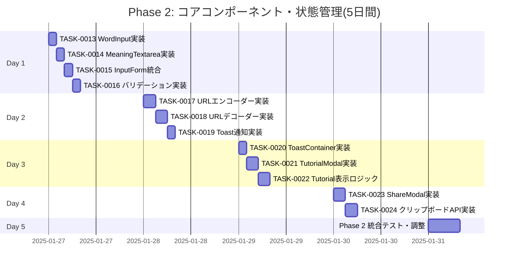

# Phase 2: コアコンポーネント・状態管理 - タスク詳細

## 📋 フェーズ情報

- **フェーズ名**: Phase 2 - コアコンポーネント・状態管理
- **期間**: 5日間(営業日)
- **見積工数**: 40時間(1日8時間想定)
- **タスク範囲**: TASK-0013 〜 TASK-0024
- **タスク数**: 12タスク
- **優先度**: P0(最優先・ブロッカー)
- **生成日**: 2025-01-20
- **生成ツール**: Claude Code

---

## 🎯 Phase 2 目標

### フェーズゴール

入力フォームと共有リンク生成機能の完全実装を完了する。

### 主要成果物

1. ✅ InputFormコンポーネント(WordInput, MeaningTextarea含む) - 完了
2. ✅ バリデーション機能(空欄チェック、文字数制限) - 完了
3. ✅ URLエンコーダー/デコーダー(Base64形式) - 完了
4. ✅ Context API状態管理(TutorialContext, ToastContext) - 完了
5. ✅ チュートリアルモーダル(初回訪問時表示) - 完了
6. ✅ 共有モーダル(URLコピー機能) - 完了

### マイルストーン達成基準

- [x] M2-1: InputFormコンポーネントが正常に動作する
- [x] M2-2: バリデーション(空欄、文字数制限)が機能する
- [x] M2-3: URLエンコーダー/デコーダーがBase64で正常動作する
- [x] M2-4: Context APIで状態管理が実装されている
- [x] M2-5: チュートリアルモーダルが初回訪問時に表示される
- [x] M2-6: 共有リンクがコピーできてトーストメッセージが表示される

### 完了判定条件

```bash
# すべてのコマンドがエラーなく実行できること
npm run dev         # 開発サーバーが起動する
npm run build       # エラーなくビルドできる
npm run test        # 全テストが成功する
npm run lint        # ESLintがエラー0件で完了
npm run type-check  # TypeScript型チェックがエラー0件
```

**機能確認基準**:
- [ ] フォームに入力して送信ボタンを押すと共有URLが生成される
- [ ] バリデーションエラー時に適切なエラーメッセージが表示される
- [ ] 生成されたURLをコピーできる
- [ ] チュートリアルが初回のみ表示され、2回目以降は表示されない

---

## 📅 週次計画

### Week 2(5日間): コアコンポーネント・状態管理

**目標**: 入力フォームとURL生成機能の完全実装

**週の成果物**:
- InputFormコンポーネントとバリデーション
- URLエンコーダー/デコーダー
- チュートリアルモーダル
- 共有モーダル・トースト通知

**リスク**:
- Base64エンコード/デコードの文字化け
- バリデーションロジックの漏れ
- LocalStorageの互換性問題

**対策**:
- UTF-8エンコード/デコードの徹底テスト
- TDDで全バリデーションケースを網羅
- LocalStorage非対応時のフォールバック実装

---

## 📊 タスク進捗管理

### 進捗ガントチャート



### タスク状態サマリー

| 状態 | タスク数 | 割合 |
|------|---------|------|
| TODO | 0 | 0% |
| IN_PROGRESS | 0 | 0% |
| DONE | 12 | 100% |

---

## 📝 日次タスク詳細

### Day 1: 入力フォームコンポーネント実装(8時間)

#### [x] TASK-0013: WordInput実装

**基本情報**:
- **タスクID**: TASK-0013
- **タスク名**: WordInput(言葉入力)コンポーネント実装
- **見積工数**: 2時間
- **タスクタイプ**: TDD(テスト駆動開発)
- **優先度**: P0(最優先)
- **依存タスク**: TASK-0003(型定義完了)

**関連要件**:
- REQ-001: 贈りたい言葉の入力欄 🔵
- REQ-013: 言葉の文字数制限50文字 🔵
- REQ-015: リアルタイム文字数カウント表示 🟡

**実装詳細**:

1. **コンポーネント仕様**:

`src/components/InputForm/WordInput.tsx`:
```typescript
interface WordInputProps {
  value: string;
  onChange: (value: string) => void;
  error?: string;
  maxLength?: number;
}

/**
 * 贈りたい言葉の入力フィールドコンポーネント
 * REQ-001, REQ-013, REQ-015
 */
const WordInput: React.FC<WordInputProps> = ({
  value,
  onChange,
  error,
  maxLength = VALIDATION_RULES.MAX_WORD_LENGTH,
}) => {
  const remainingChars = maxLength - value.length;

  return (
    <div className={styles.inputGroup}>
      <label htmlFor="word" className={styles.label}>
        贈りたい言葉 <span className={styles.required}>*</span>
      </label>
      <input
        id="word"
        type="text"
        value={value}
        onChange={(e) => onChange(e.target.value)}
        maxLength={maxLength}
        className={clsx(styles.input, error && styles.inputError)}
        placeholder="例: 感謝"
        aria-invalid={!!error}
        aria-describedby={error ? 'word-error' : undefined}
      />
      <div className={styles.inputMeta}>
        <span className={clsx(
          styles.charCount,
          remainingChars < 10 && styles.charCountWarning
        )}>
          {value.length} / {maxLength}
        </span>
      </div>
      {error && (
        <p id="word-error" className={styles.errorMessage} role="alert">
          {error}
        </p>
      )}
    </div>
  );
};
```

2. **テストケース**(`src/components/InputForm/__tests__/WordInput.test.tsx`):
```typescript
describe('WordInput', () => {
  it('正常に入力できる', () => {});
  it('50文字制限が機能する', () => {});
  it('文字数カウントが表示される', () => {});
  it('エラーメッセージが表示される', () => {});
  it('残り文字数が10未満で警告色になる', () => {});
  it('空欄の場合はカウント0が表示される', () => {});
});
```

**完了基準**:
- [ ] すべてのテストケースが成功する
- [ ] 50文字制限が機能する
- [ ] リアルタイム文字数カウントが表示される
- [ ] エラーメッセージが適切に表示される
- [ ] TypeScript型エラーがない

**プロセスコマンド**:
```bash
/tsumiki:tdd-requirements
/tsumiki:tdd-testcases
/tsumiki:tdd-red
/tsumiki:tdd-green
/tsumiki:tdd-refactor
/tsumiki:tdd-verify-complete
```

---

#### [x] TASK-0014: MeaningTextarea実装

**基本情報**:
- **タスクID**: TASK-0014
- **タスク名**: MeaningTextarea(意味入力)コンポーネント実装
- **見積工数**: 2時間
- **タスクタイプ**: TDD(テスト駆動開発)
- **優先度**: P0(最優先)
- **依存タスク**: TASK-0003(型定義完了)

**関連要件**:
- REQ-002: その意味の入力欄 🔵
- REQ-014: 意味の文字数制限300文字 🔵
- REQ-015: リアルタイム文字数カウント表示 🟡

**実装詳細**:

1. **コンポーネント仕様**:

`src/components/InputForm/MeaningTextarea.tsx`:
```typescript
interface MeaningTextareaProps {
  value: string;
  onChange: (value: string) => void;
  error?: string;
  maxLength?: number;
}

/**
 * その意味の入力フィールドコンポーネント
 * REQ-002, REQ-014, REQ-015
 */
const MeaningTextarea: React.FC<MeaningTextareaProps> = ({
  value,
  onChange,
  error,
  maxLength = VALIDATION_RULES.MAX_MEANING_LENGTH,
}) => {
  const remainingChars = maxLength - value.length;

  return (
    <div className={styles.inputGroup}>
      <label htmlFor="meaning" className={styles.label}>
        その意味 <span className={styles.required}>*</span>
      </label>
      <textarea
        id="meaning"
        value={value}
        onChange={(e) => onChange(e.target.value)}
        maxLength={maxLength}
        rows={6}
        className={clsx(styles.textarea, error && styles.textareaError)}
        placeholder="例: いつも支えてくれてありがとう"
        aria-invalid={!!error}
        aria-describedby={error ? 'meaning-error' : undefined}
      />
      <div className={styles.inputMeta}>
        <span className={clsx(
          styles.charCount,
          remainingChars < 30 && styles.charCountWarning
        )}>
          {value.length} / {maxLength}
        </span>
      </div>
      {error && (
        <p id="meaning-error" className={styles.errorMessage} role="alert">
          {error}
        </p>
      )}
    </div>
  );
};
```

2. **テストケース**(`src/components/InputForm/__tests__/MeaningTextarea.test.tsx`):
```typescript
describe('MeaningTextarea', () => {
  it('正常に入力できる', () => {});
  it('300文字制限が機能する', () => {});
  it('文字数カウントが表示される', () => {});
  it('エラーメッセージが表示される', () => {});
  it('残り文字数が30未満で警告色になる', () => {});
  it('改行を含む入力ができる', () => {});
});
```

**完了基準**:
- [ ] すべてのテストケースが成功する
- [ ] 300文字制限が機能する
- [ ] リアルタイム文字数カウントが表示される
- [ ] 改行を含む入力が可能
- [ ] TypeScript型エラーがない

**プロセスコマンド**:
```bash
/tsumiki:tdd-requirements
/tsumiki:tdd-testcases
/tsumiki:tdd-red
/tsumiki:tdd-green
/tsumiki:tdd-refactor
/tsumiki:tdd-verify-complete
```

---

#### [x] TASK-0015: InputForm統合

**基本情報**:
- **タスクID**: TASK-0015
- **タスク名**: InputFormコンポーネント統合実装
- **見積工数**: 2時間
- **タスクタイプ**: TDD(テスト駆動開発)
- **優先度**: P0(最優先)
- **依存タスク**: TASK-0013, TASK-0014

**関連要件**:
- F-001: 言葉入力フォーム 🔵
- REQ-003: 送信ボタン 🔵
- REQ-101: 一意のURL生成 🔵

**実装詳細**:

1. **コンポーネント仕様**:

`src/components/InputForm/InputForm.tsx`:
```typescript
import { useState } from 'react';
import WordInput from './WordInput';
import MeaningTextarea from './MeaningTextarea';
import Button from '../common/Button/Button';
import { validateForm } from '../../utils/validation';
import { encodeGiftWordData } from '../../utils/urlEncoder';
import { useToast } from '../../context/ToastContext';
import { ERROR_MESSAGES } from '../../utils/constants';
import type { ValidationErrors } from '../../types';
import styles from './InputForm.module.css';

/**
 * 言葉入力フォームコンポーネント
 * F-001, REQ-001, REQ-002, REQ-003
 */
const InputForm: React.FC = () => {
  const [word, setWord] = useState('');
  const [meaning, setMeaning] = useState('');
  const [errors, setErrors] = useState<ValidationErrors>({});
  const [isSubmitting, setIsSubmitting] = useState(false);
  const { showToast } = useToast();

  const handleSubmit = async (e: React.FormEvent) => {
    e.preventDefault();

    // バリデーション
    const validationErrors = validateForm(word, meaning);
    setErrors(validationErrors);

    if (validationErrors.word || validationErrors.meaning) {
      showToast(ERROR_MESSAGES.VALIDATION_FAILED, 'error');
      return;
    }

    setIsSubmitting(true);

    try {
      // URLエンコード
      const result = encodeGiftWordData({ word, meaning });

      if (!result.success) {
        showToast(result.error || ERROR_MESSAGES.ENCODE_FAILED, 'error');
        return;
      }

      // 共有モーダルを開く(Phase 2 TASK-0023で実装)
      // showShareModal(result.url);

    } catch (error) {
      showToast(ERROR_MESSAGES.UNEXPECTED_ERROR, 'error');
    } finally {
      setIsSubmitting(false);
    }
  };

  return (
    <form onSubmit={handleSubmit} className={styles.form}>
      <WordInput
        value={word}
        onChange={setWord}
        error={errors.word}
      />

      <MeaningTextarea
        value={meaning}
        onChange={setMeaning}
        error={errors.meaning}
      />

      <Button
        type="submit"
        variant="primary"
        disabled={isSubmitting}
      >
        {isSubmitting ? '生成中...' : '共有リンクを生成'}
      </Button>
    </form>
  );
};

export default InputForm;
```

2. **テストケース**(`src/components/InputForm/__tests__/InputForm.test.tsx`):
```typescript
describe('InputForm', () => {
  it('フォームが正常にレンダリングされる', () => {});
  it('送信ボタンが表示される', () => {});
  it('空欄で送信するとエラーが表示される', () => {});
  it('正常な入力で送信するとURLが生成される', () => {});
  it('送信中はボタンが無効化される', () => {});
  it('バリデーションエラー時にトーストが表示される', () => {});
});
```

**完了基準**:
- [ ] すべてのテストケースが成功する
- [ ] フォーム送信でURLが生成される
- [ ] バリデーションが正常に機能する
- [ ] 送信中の状態表示が機能する
- [ ] TypeScript型エラーがない

**プロセスコマンド**:
```bash
/tsumiki:tdd-requirements
/tsumiki:tdd-testcases
/tsumiki:tdd-red
/tsumiki:tdd-green
/tsumiki:tdd-refactor
/tsumiki:tdd-verify-complete
```

---

#### [x] TASK-0016: バリデーション実装

**基本情報**:
- **タスクID**: TASK-0016
- **タスク名**: バリデーション機能実装
- **見積工数**: 2時間
- **タスクタイプ**: TDD(テスト駆動開発)
- **優先度**: P0(最優先)
- **依存タスク**: TASK-0003(型定義完了)

**関連要件**:
- REQ-011: 言葉の空欄チェック 🔵
- REQ-012: 意味の空欄チェック 🔵
- REQ-013: 言葉の文字数制限50文字 🔵
- REQ-014: 意味の文字数制限300文字 🔵

**実装詳細**:

1. **バリデーション関数**(TASK-0011で構造作成済み、TDDで完全実装):

`src/utils/validation.ts`:
```typescript
import { VALIDATION_RULES } from '../types';
import { ValidationErrors } from '../types';
import { ERROR_MESSAGES } from './constants';

/**
 * 言葉のバリデーション
 * REQ-011, REQ-013
 */
export const validateWord = (word: string): string | undefined => {
  const trimmedWord = word.trim();

  // REQ-011: 空欄チェック
  if (!trimmedWord) {
    return ERROR_MESSAGES.WORD_REQUIRED;
  }

  // REQ-013: 文字数制限チェック
  if (trimmedWord.length > VALIDATION_RULES.MAX_WORD_LENGTH) {
    return ERROR_MESSAGES.WORD_TOO_LONG;
  }

  return undefined;
};

/**
 * 意味のバリデーション
 * REQ-012, REQ-014
 */
export const validateMeaning = (meaning: string): string | undefined => {
  const trimmedMeaning = meaning.trim();

  // REQ-012: 空欄チェック
  if (!trimmedMeaning) {
    return ERROR_MESSAGES.MEANING_REQUIRED;
  }

  // REQ-014: 文字数制限チェック
  if (trimmedMeaning.length > VALIDATION_RULES.MAX_MEANING_LENGTH) {
    return ERROR_MESSAGES.MEANING_TOO_LONG;
  }

  return undefined;
};

/**
 * フォーム全体のバリデーション
 * REQ-011, REQ-012, REQ-013, REQ-014
 */
export const validateForm = (
  word: string,
  meaning: string
): ValidationErrors => {
  return {
    word: validateWord(word),
    meaning: validateMeaning(meaning),
  };
};

/**
 * フォームが有効かチェック
 */
export const isFormValid = (errors: ValidationErrors): boolean => {
  return !errors.word && !errors.meaning;
};
```

2. **テストケース**(`src/utils/__tests__/validation.test.ts`):
```typescript
describe('validation', () => {
  describe('validateWord', () => {
    it('空文字列はエラーを返す', () => {});
    it('空白のみはエラーを返す', () => {});
    it('50文字以内は有効', () => {});
    it('51文字以上はエラーを返す', () => {});
    it('正確に50文字は有効', () => {});
  });

  describe('validateMeaning', () => {
    it('空文字列はエラーを返す', () => {});
    it('空白のみはエラーを返す', () => {});
    it('300文字以内は有効', () => {});
    it('301文字以上はエラーを返す', () => {});
    it('正確に300文字は有効', () => {});
    it('改行を含む文字列は有効', () => {});
  });

  describe('validateForm', () => {
    it('両方空欄の場合は両方エラー', () => {});
    it('言葉のみ空欄の場合は言葉のみエラー', () => {});
    it('意味のみ空欄の場合は意味のみエラー', () => {});
    it('両方有効な場合はエラーなし', () => {});
  });

  describe('isFormValid', () => {
    it('エラーがない場合はtrue', () => {});
    it('エラーがある場合はfalse', () => {});
  });
});
```

**完了基準**:
- [ ] すべてのテストケースが成功する
- [ ] 空欄チェックが機能する
- [ ] 文字数制限チェックが機能する
- [ ] 空白のみの入力を拒否する
- [ ] TypeScript型エラーがない

**プロセスコマンド**:
```bash
/tsumiki:tdd-requirements
/tsumiki:tdd-testcases
/tsumiki:tdd-red
/tsumiki:tdd-green
/tsumiki:tdd-refactor
/tsumiki:tdd-verify-complete
```

---

### Day 2: URLエンコーダー・デコーダー実装(8時間)

#### [x] TASK-0017: URLエンコーダー実装

**基本情報**:
- **タスクID**: TASK-0017
- **タスク名**: URLエンコーダー実装
- **見積工数**: 3時間
- **タスクタイプ**: TDD(テスト駆動開発)
- **優先度**: P0(最優先)
- **依存タスク**: TASK-0003(型定義完了)

**関連要件**:
- REQ-101: 一意のURL生成 🔵
- REQ-102: URLパラメータ形式 🔵
- REQ-103: Base64エンコード 🔵
- REQ-111: URL最大長500文字 🟡

**実装詳細**:

1. **エンコーダー関数**(TASK-0011で構造作成済み、TDDで完全実装):

`src/utils/urlEncoder.ts`:
```typescript
import { GiftWordData, EncodeResult } from '../types';
import { VALIDATION_RULES } from '../types';
import { ERROR_MESSAGES } from './constants';

/**
 * GiftWordDataをBase64エンコードしてURLパラメータ形式に変換
 * REQ-101, REQ-102, REQ-103
 */
export const encodeGiftWordData = (data: GiftWordData): EncodeResult => {
  try {
    // データをJSON文字列に変換
    const jsonString = JSON.stringify(data);

    // UTF-8エンコード -> Base64エンコード
    const base64 = btoa(encodeURIComponent(jsonString));

    // URLを生成
    const baseUrl = window.location.origin + window.location.pathname;
    const url = `${baseUrl}#/display?data=${base64}`;

    // REQ-111: URL長チェック
    if (url.length > VALIDATION_RULES.MAX_URL_LENGTH) {
      return {
        url: '',
        success: false,
        error: ERROR_MESSAGES.URL_TOO_LONG,
      };
    }

    return {
      url,
      success: true,
    };
  } catch (error) {
    return {
      url: '',
      success: false,
      error: ERROR_MESSAGES.ENCODE_FAILED,
    };
  }
};

/**
 * URLが有効かチェック
 */
export const isValidUrl = (url: string): boolean => {
  try {
    new URL(url);
    return true;
  } catch {
    return false;
  }
};
```

2. **テストケース**(`src/utils/__tests__/urlEncoder.test.ts`):
```typescript
describe('urlEncoder', () => {
  describe('encodeGiftWordData', () => {
    it('正常なデータをBase64エンコードできる', () => {});
    it('日本語を含むデータを正しくエンコードできる', () => {});
    it('特殊文字を含むデータを正しくエンコードできる', () => {});
    it('改行を含むデータを正しくエンコードできる', () => {});
    it('URL長が500文字を超える場合はエラー', () => {});
    it('空のデータでもエンコードできる', () => {});
    it('エンコード結果のURLが正しい形式', () => {});
  });

  describe('isValidUrl', () => {
    it('有効なURLはtrueを返す', () => {});
    it('無効なURLはfalseを返す', () => {});
  });
});
```

**完了基準**:
- [ ] すべてのテストケースが成功する
- [ ] Base64エンコードが正常に機能する
- [ ] 日本語・特殊文字が正しくエンコードされる
- [ ] URL長制限が機能する
- [ ] TypeScript型エラーがない

**プロセスコマンド**:
```bash
/tsumiki:tdd-requirements
/tsumiki:tdd-testcases
/tsumiki:tdd-red
/tsumiki:tdd-green
/tsumiki:tdd-refactor
/tsumiki:tdd-verify-complete
```

---

#### [x] TASK-0018: URLデコーダー実装

**基本情報**:
- **タスクID**: TASK-0018
- **タスク名**: URLデコーダー実装
- **見積工数**: 3時間
- **タスクタイプ**: TDD(テスト駆動開発)
- **優先度**: P0(最優先)
- **依存タスク**: TASK-0017

**関連要件**:
- REQ-103: Base64デコード 🔵
- REQ-212: URLパラメータ不在時のリダイレクト 🟡
- REQ-311: デコードエラーハンドリング 🟡

**実装詳細**:

1. **デコーダー関数**(TASK-0011で構造作成済み、TDDで完全実装):

`src/utils/urlEncoder.ts` に追加:
```typescript
/**
 * Base64エンコードされたURLパラメータをGiftWordDataにデコード
 * REQ-103, REQ-212, REQ-311
 */
export const decodeGiftWordData = (encodedData: string): DecodeResult => {
  try {
    // REQ-212: 空データチェック
    if (!encodedData || encodedData.trim() === '') {
      return {
        data: null,
        success: false,
        error: ERROR_MESSAGES.INVALID_URL,
      };
    }

    // Base64デコード -> UTF-8デコード
    const jsonString = decodeURIComponent(atob(encodedData));

    // JSON パース
    const data = JSON.parse(jsonString) as GiftWordData;

    // データ検証
    if (!data.word || !data.meaning) {
      return {
        data: null,
        success: false,
        error: ERROR_MESSAGES.INVALID_DATA,
      };
    }

    return {
      data,
      success: true,
    };
  } catch (error) {
    // REQ-311: デコードエラーハンドリング
    return {
      data: null,
      success: false,
      error: ERROR_MESSAGES.DECODE_FAILED,
    };
  }
};

/**
 * URLパラメータからdataを抽出
 */
export const extractDataFromUrl = (url: string): string | null => {
  try {
    const urlObj = new URL(url);
    return urlObj.searchParams.get('data');
  } catch {
    return null;
  }
};
```

2. **テストケース**(`src/utils/__tests__/urlEncoder.test.ts` に追加):
```typescript
describe('urlEncoder', () => {
  // ...既存のencodeテスト

  describe('decodeGiftWordData', () => {
    it('正常なBase64データをデコードできる', () => {});
    it('日本語を含むデータを正しくデコードできる', () => {});
    it('特殊文字を含むデータを正しくデコードできる', () => {});
    it('改行を含むデータを正しくデコードできる', () => {});
    it('不正なBase64データはエラー', () => {});
    it('空文字列はエラー', () => {});
    it('不正なJSON形式はエラー', () => {});
    it('wordまたはmeaningが欠けている場合はエラー', () => {});
    it('encodeとdecodeのラウンドトリップが正常', () => {});
  });

  describe('extractDataFromUrl', () => {
    it('URLからdataパラメータを抽出できる', () => {});
    it('dataパラメータがない場合はnull', () => {});
    it('不正なURLはnull', () => {});
  });
});
```

**完了基準**:
- [ ] すべてのテストケースが成功する
- [ ] Base64デコードが正常に機能する
- [ ] 不正なデータを適切にエラーハンドリングできる
- [ ] エンコード/デコードのラウンドトリップが成功する
- [ ] TypeScript型エラーがない

**プロセスコマンド**:
```bash
/tsumiki:tdd-requirements
/tsumiki:tdd-testcases
/tsumiki:tdd-red
/tsumiki:tdd-green
/tsumiki:tdd-refactor
/tsumiki:tdd-verify-complete
```

---

#### [x] TASK-0019: Toast通知実装

**基本情報**:
- **タスクID**: TASK-0019
- **タスク名**: Toastコンポーネント実装
- **見積工数**: 2時間
- **タスクタイプ**: TDD(テスト駆動開発)
- **優先度**: P1(高)
- **依存タスク**: TASK-0010(ToastContext完了)

**関連要件**:
- REQ-105: トーストメッセージ表示 🔵
- REQ-311: エラーメッセージ表示 🟡

**実装詳細**:

1. **Toastコンポーネント**:

`src/components/common/Toast/Toast.tsx`:
```typescript
import { useEffect } from 'react';
import clsx from 'clsx';
import { Toast as ToastType } from '../../../types';
import styles from './Toast.module.css';

interface ToastProps {
  toast: ToastType;
  onClose: (id: string) => void;
}

/**
 * 個別のトーストメッセージコンポーネント
 * REQ-105, REQ-311
 */
const Toast: React.FC<ToastProps> = ({ toast, onClose }) => {
  useEffect(() => {
    if (toast.duration && toast.duration > 0) {
      const timer = setTimeout(() => {
        onClose(toast.id);
      }, toast.duration);

      return () => clearTimeout(timer);
    }
  }, [toast.id, toast.duration, onClose]);

  const getIcon = () => {
    switch (toast.type) {
      case 'success': return '✓';
      case 'error': return '✕';
      case 'warning': return '⚠';
      case 'info': return 'ℹ';
    }
  };

  return (
    <div
      className={clsx(styles.toast, styles[toast.type])}
      role="alert"
      aria-live="polite"
    >
      <span className={styles.icon}>{getIcon()}</span>
      <span className={styles.message}>{toast.message}</span>
      <button
        className={styles.closeButton}
        onClick={() => onClose(toast.id)}
        aria-label="閉じる"
      >
        ×
      </button>
    </div>
  );
};

export default Toast;
```

2. **テストケース**(`src/components/common/Toast/__tests__/Toast.test.tsx`):
```typescript
describe('Toast', () => {
  it('メッセージが表示される', () => {});
  it('successタイプで正しいスタイルが適用される', () => {});
  it('errorタイプで正しいスタイルが適用される', () => {});
  it('warningタイプで正しいスタイルが適用される', () => {});
  it('infoタイプで正しいスタイルが適用される', () => {});
  it('閉じるボタンをクリックすると閉じる', () => {});
  it('指定時間後に自動で閉じる', () => {});
  it('duration=0の場合は自動で閉じない', () => {});
});
```

**完了基準**:
- [ ] すべてのテストケースが成功する
- [ ] 4種類のトーストタイプが正しく表示される
- [ ] 自動クローズ機能が動作する
- [ ] 手動クローズボタンが機能する
- [ ] TypeScript型エラーがない

**プロセスコマンド**:
```bash
/tsumiki:tdd-requirements
/tsumiki:tdd-testcases
/tsumiki:tdd-red
/tsumiki:tdd-green
/tsumiki:tdd-refactor
/tsumiki:tdd-verify-complete
```

---

### Day 3: モーダル・通知システム実装(8時間)

#### [x] TASK-0020: ToastContainer実装

**基本情報**:
- **タスクID**: TASK-0020
- **タスク名**: ToastContainerコンポーネント実装
- **見積工数**: 2時間
- **タスクタイプ**: TDD(テスト駆動開発)
- **優先度**: P1(高)
- **依存タスク**: TASK-0019

**関連要件**:
- REQ-105: トーストメッセージ表示 🔵
- REQ-312: 複数トーストの同時表示 🟡

**実装詳細**:

1. **ToastContainerコンポーネント**:

`src/components/common/Toast/ToastContainer.tsx`:
```typescript
import { useToast } from '../../../context/ToastContext';
import Toast from './Toast';
import styles from './ToastContainer.module.css';

/**
 * トーストメッセージのコンテナコンポーネント
 * REQ-105, REQ-312
 */
const ToastContainer: React.FC = () => {
  const { toasts, hideToast } = useToast();

  if (toasts.length === 0) {
    return null;
  }

  return (
    <div className={styles.container} aria-live="polite" aria-atomic="false">
      {toasts.map((toast) => (
        <Toast key={toast.id} toast={toast} onClose={hideToast} />
      ))}
    </div>
  );
};

export default ToastContainer;
```

`src/components/common/Toast/ToastContainer.module.css`:
```css
.container {
  position: fixed;
  top: var(--spacing-lg);
  right: var(--spacing-lg);
  z-index: var(--z-toast);
  display: flex;
  flex-direction: column;
  gap: var(--spacing-sm);
  max-width: 400px;
}

@media (max-width: 768px) {
  .container {
    top: var(--spacing-md);
    right: var(--spacing-md);
    left: var(--spacing-md);
    max-width: none;
  }
}
```

2. **テストケース**(`src/components/common/Toast/__tests__/ToastContainer.test.tsx`):
```typescript
describe('ToastContainer', () => {
  it('トーストがない場合は何も表示しない', () => {});
  it('1つのトーストが表示される', () => {});
  it('複数のトーストが同時に表示される', () => {});
  it('トーストを閉じると削除される', () => {});
  it('正しい順序でトーストが表示される', () => {});
});
```

**完了基準**:
- [ ] すべてのテストケースが成功する
- [ ] 複数トーストの同時表示が機能する
- [ ] トーストの追加・削除が正常に動作する
- [ ] レスポンシブデザインが機能する
- [ ] TypeScript型エラーがない

**プロセスコマンド**:
```bash
/tsumiki:tdd-requirements
/tsumiki:tdd-testcases
/tsumiki:tdd-red
/tsumiki:tdd-green
/tsumiki:tdd-refactor
/tsumiki:tdd-verify-complete
```

---

#### [x] TASK-0021: TutorialModal実装

**基本情報**:
- **タスクID**: TASK-0021
- **タスク名**: TutorialModalコンポーネント実装
- **見積工数**: 3時間
- **タスクタイプ**: TDD(テスト駆動開発)
- **優先度**: P1(高)
- **依存タスク**: TASK-0010(TutorialContext完了)

**関連要件**:
- REQ-004: チュートリアル表示 🔵
- REQ-041: 初回訪問時のみ表示 🔵
- REQ-042: LocalStorage永続化 🔵

**実装詳細**:

1. **TutorialModalコンポーネント**:

`src/components/common/TutorialModal/TutorialModal.tsx`:
```typescript
import { useTutorial } from '../../../context/TutorialContext';
import Button from '../Button/Button';
import styles from './TutorialModal.module.css';

/**
 * チュートリアルモーダルコンポーネント
 * REQ-004, REQ-041, REQ-042
 */
const TutorialModal: React.FC = () => {
  const { showTutorial, closeTutorial } = useTutorial();

  if (!showTutorial) {
    return null;
  }

  return (
    <>
      <div className={styles.overlay} onClick={closeTutorial} />
      <div
        className={styles.modal}
        role="dialog"
        aria-labelledby="tutorial-title"
        aria-modal="true"
      >
        <h2 id="tutorial-title" className={styles.title}>
          贈る言葉BOTの使い方
        </h2>

        <div className={styles.content}>
          <div className={styles.step}>
            <span className={styles.stepNumber}>1</span>
            <p>贈りたい言葉とその意味を入力してください</p>
          </div>

          <div className={styles.step}>
            <span className={styles.stepNumber}>2</span>
            <p>「共有リンクを生成」ボタンをクリック</p>
          </div>

          <div className={styles.step}>
            <span className={styles.stepNumber}>3</span>
            <p>生成されたリンクを友達に送って言葉を贈りましょう!</p>
          </div>
        </div>

        <div className={styles.footer}>
          <Button onClick={closeTutorial} variant="primary">
            わかりました
          </Button>
        </div>
      </div>
    </>
  );
};

export default TutorialModal;
```

2. **テストケース**(`src/components/common/TutorialModal/__tests__/TutorialModal.test.tsx`):
```typescript
describe('TutorialModal', () => {
  it('showTutorial=trueの場合に表示される', () => {});
  it('showTutorial=falseの場合は表示されない', () => {});
  it('「わかりました」ボタンをクリックすると閉じる', () => {});
  it('オーバーレイをクリックすると閉じる', () => {});
  it('閉じた後はLocalStorageに保存される', () => {});
  it('適切なARIA属性が設定されている', () => {});
});
```

**完了基準**:
- [ ] すべてのテストケースが成功する
- [ ] 初回訪問時のみ表示される
- [ ] LocalStorageに状態が保存される
- [ ] アクセシビリティ対応が完了している
- [ ] TypeScript型エラーがない

**プロセスコマンド**:
```bash
/tsumiki:tdd-requirements
/tsumiki:tdd-testcases
/tsumiki:tdd-red
/tsumiki:tdd-green
/tsumiki:tdd-refactor
/tsumiki:tdd-verify-complete
```

---

#### [x] TASK-0022: Tutorial表示ロジック

**基本情報**:
- **タスクID**: TASK-0022
- **タスク名**: チュートリアル表示ロジック実装
- **見積工数**: 3時間
- **タスクタイプ**: TDD(テスト駆動開発)
- **優先度**: P1(高)
- **依存タスク**: TASK-0021

**関連要件**:
- REQ-041: 初回訪問時のみ表示 🔵
- REQ-042: LocalStorage永続化 🔵
- REQ-043: 2回目以降は非表示 🔵

**実装詳細**:

1. **useTutorialフック**:

`src/hooks/useTutorial.ts`:
```typescript
import { useContext } from 'react';
import { TutorialContext } from '../context/TutorialContext';

/**
 * チュートリアル状態管理フック
 * REQ-041, REQ-042, REQ-043
 */
export const useTutorial = () => {
  const context = useContext(TutorialContext);

  if (!context) {
    throw new Error('useTutorial must be used within TutorialProvider');
  }

  return context;
};
```

2. **LocalStorage操作ユーティリティ**:

`src/utils/storage.ts`:
```typescript
import { STORAGE_KEYS } from './constants';

/**
 * LocalStorageの操作ユーティリティ
 * REQ-042
 */

export const getTutorialShown = (): boolean => {
  try {
    const value = localStorage.getItem(STORAGE_KEYS.TUTORIAL_SHOWN);
    return value === 'true';
  } catch {
    // LocalStorage非対応の場合はfalseを返す
    return false;
  }
};

export const setTutorialShown = (shown: boolean): void => {
  try {
    localStorage.setItem(STORAGE_KEYS.TUTORIAL_SHOWN, String(shown));
  } catch {
    // LocalStorage非対応の場合は何もしない
  }
};

export const clearTutorialShown = (): void => {
  try {
    localStorage.removeItem(STORAGE_KEYS.TUTORIAL_SHOWN);
  } catch {
    // LocalStorage非対応の場合は何もしない
  }
};
```

3. **テストケース**:

`src/hooks/__tests__/useTutorial.test.tsx`:
```typescript
describe('useTutorial', () => {
  it('初回訪問時はshowTutorial=true', () => {});
  it('2回目以降はshowTutorial=false', () => {});
  it('closeTutorial後はLocalStorageに保存される', () => {});
  it('LocalStorage非対応でもエラーにならない', () => {});
});
```

`src/utils/__tests__/storage.test.ts`:
```typescript
describe('storage', () => {
  beforeEach(() => {
    localStorage.clear();
  });

  describe('getTutorialShown', () => {
    it('未設定の場合はfalse', () => {});
    it('true設定の場合はtrue', () => {});
    it('false設定の場合はfalse', () => {});
  });

  describe('setTutorialShown', () => {
    it('trueを保存できる', () => {});
    it('falseを保存できる', () => {});
  });

  describe('clearTutorialShown', () => {
    it('保存された値を削除できる', () => {});
  });
});
```

**完了基準**:
- [ ] すべてのテストケースが成功する
- [ ] LocalStorageに正しく保存される
- [ ] 初回訪問時のみチュートリアルが表示される
- [ ] LocalStorage非対応ブラウザでもエラーにならない
- [ ] TypeScript型エラーがない

**プロセスコマンド**:
```bash
/tsumiki:tdd-requirements
/tsumiki:tdd-testcases
/tsumiki:tdd-red
/tsumiki:tdd-green
/tsumiki:tdd-refactor
/tsumiki:tdd-verify-complete
```

---

### Day 4: 共有モーダル・クリップボード実装(8時間)

#### [x] TASK-0023: ShareModal実装

**基本情報**:
- **タスクID**: TASK-0023
- **タスク名**: ShareModalコンポーネント実装
- **見積工数**: 3時間
- **タスクタイプ**: TDD(テスト駆動開発)
- **優先度**: P0(最優先)
- **依存タスク**: TASK-0015(InputForm完了)

**関連要件**:
- REQ-104: 共有リンク表示モーダル 🔵
- REQ-106: URLコピー機能 🔵
- F-002: 共有リンク生成 🔵

**実装詳細**:

1. **ShareModalコンポーネント**:

`src/components/common/ShareModal/ShareModal.tsx`:
```typescript
import { useState } from 'react';
import Button from '../Button/Button';
import { useToast } from '../../../context/ToastContext';
import { SUCCESS_MESSAGES } from '../../../utils/constants';
import styles from './ShareModal.module.css';

interface ShareModalProps {
  url: string;
  onClose: () => void;
}

/**
 * 共有リンク表示モーダルコンポーネント
 * REQ-104, REQ-106, F-002
 */
const ShareModal: React.FC<ShareModalProps> = ({ url, onClose }) => {
  const [copied, setCopied] = useState(false);
  const { showToast } = useToast();

  const handleCopy = async () => {
    try {
      await navigator.clipboard.writeText(url);
      setCopied(true);
      showToast(SUCCESS_MESSAGES.URL_COPIED, 'success');

      // 2秒後にリセット
      setTimeout(() => setCopied(false), 2000);
    } catch (error) {
      showToast('URLのコピーに失敗しました', 'error');
    }
  };

  return (
    <>
      <div className={styles.overlay} onClick={onClose} />
      <div
        className={styles.modal}
        role="dialog"
        aria-labelledby="share-title"
        aria-modal="true"
      >
        <h2 id="share-title" className={styles.title}>
          共有リンクを生成しました
        </h2>

        <div className={styles.content}>
          <p className={styles.description}>
            このリンクを友達に送って、言葉を贈りましょう!
          </p>

          <div className={styles.urlContainer}>
            <input
              type="text"
              value={url}
              readOnly
              className={styles.urlInput}
              aria-label="共有URL"
            />
          </div>
        </div>

        <div className={styles.footer}>
          <Button onClick={handleCopy} variant="primary">
            {copied ? 'コピーしました!' : 'URLをコピー'}
          </Button>
          <Button onClick={onClose} variant="secondary">
            閉じる
          </Button>
        </div>
      </div>
    </>
  );
};

export default ShareModal;
```

2. **テストケース**(`src/components/common/ShareModal/__tests__/ShareModal.test.tsx`):
```typescript
describe('ShareModal', () => {
  it('URLが表示される', () => {});
  it('コピーボタンをクリックするとクリップボードにコピーされる', () => {});
  it('コピー成功時にトーストが表示される', () => {});
  it('コピー成功時にボタンテキストが変わる', () => {});
  it('2秒後にボタンテキストがリセットされる', () => {});
  it('閉じるボタンをクリックすると閉じる', () => {});
  it('オーバーレイをクリックすると閉じる', () => {});
  it('適切なARIA属性が設定されている', () => {});
});
```

**完了基準**:
- [ ] すべてのテストケースが成功する
- [ ] URLが正しく表示される
- [ ] コピー機能が動作する
- [ ] トースト通知が表示される
- [ ] TypeScript型エラーがない

**プロセスコマンド**:
```bash
/tsumiki:tdd-requirements
/tsumiki:tdd-testcases
/tsumiki:tdd-red
/tsumiki:tdd-green
/tsumiki:tdd-refactor
/tsumiki:tdd-verify-complete
```

---

#### [x] TASK-0024: クリップボードAPI実装

**基本情報**:
- **タスクID**: TASK-0024
- **タスク名**: クリップボードAPI実装
- **見積工数**: 3時間
- **タスクタイプ**: TDD(テスト駆動開発)
- **優先度**: P0(最優先)
- **依存タスク**: TASK-0023

**関連要件**:
- REQ-106: URLコピー機能 🔵
- REQ-313: クリップボードAPIフォールバック 🟡
- REQ-314: コピー成功・失敗通知 🟡

**実装詳細**:

1. **クリップボードユーティリティ**:

`src/utils/clipboard.ts`:
```typescript
import { ERROR_MESSAGES, SUCCESS_MESSAGES } from './constants';

export interface ClipboardResult {
  success: boolean;
  message: string;
}

/**
 * クリップボードにテキストをコピー
 * REQ-106, REQ-313
 */
export const copyToClipboard = async (text: string): Promise<ClipboardResult> => {
  try {
    // Clipboard API優先
    if (navigator.clipboard && navigator.clipboard.writeText) {
      await navigator.clipboard.writeText(text);
      return {
        success: true,
        message: SUCCESS_MESSAGES.URL_COPIED,
      };
    }

    // REQ-313: フォールバック(古いブラウザ対応)
    const textArea = document.createElement('textarea');
    textArea.value = text;
    textArea.style.position = 'fixed';
    textArea.style.left = '-9999px';
    document.body.appendChild(textArea);
    textArea.select();

    const successful = document.execCommand('copy');
    document.body.removeChild(textArea);

    if (successful) {
      return {
        success: true,
        message: SUCCESS_MESSAGES.URL_COPIED,
      };
    }

    throw new Error('execCommand failed');
  } catch (error) {
    // REQ-314: コピー失敗通知
    return {
      success: false,
      message: ERROR_MESSAGES.COPY_FAILED,
    };
  }
};

/**
 * クリップボードAPIが利用可能かチェック
 */
export const isClipboardAvailable = (): boolean => {
  return !!(navigator.clipboard && navigator.clipboard.writeText);
};
```

2. **エラーメッセージ追加**(`src/utils/constants.ts` に追加):
```typescript
export const ERROR_MESSAGES = {
  // ...既存のメッセージ
  COPY_FAILED: 'URLのコピーに失敗しました',
  VALIDATION_FAILED: '入力内容に誤りがあります',
  ENCODE_FAILED: 'URLの生成に失敗しました',
  UNEXPECTED_ERROR: '予期しないエラーが発生しました',
  INVALID_DATA: 'データが不正です',
  URL_TOO_LONG: 'URLが長すぎます',
} as const;
```

3. **テストケース**(`src/utils/__tests__/clipboard.test.ts`):
```typescript
describe('clipboard', () => {
  describe('copyToClipboard', () => {
    it('Clipboard APIでコピーできる', async () => {});
    it('フォールバック方式でコピーできる', async () => {});
    it('コピー失敗時にエラーを返す', async () => {});
    it('空文字列でもコピーできる', async () => {});
    it('長い文字列でもコピーできる', async () => {});
    it('特殊文字を含む文字列でもコピーできる', async () => {});
  });

  describe('isClipboardAvailable', () => {
    it('Clipboard API利用可能な場合はtrue', () => {});
    it('Clipboard API非対応の場合はfalse', () => {});
  });
});
```

**完了基準**:
- [ ] すべてのテストケースが成功する
- [ ] Clipboard APIが正常に動作する
- [ ] フォールバック方式が動作する
- [ ] エラーハンドリングが適切に機能する
- [ ] TypeScript型エラーがない

**プロセスコマンド**:
```bash
/tsumiki:tdd-requirements
/tsumiki:tdd-testcases
/tsumiki:tdd-red
/tsumiki:tdd-green
/tsumiki:tdd-refactor
/tsumiki:tdd-verify-complete
```

---

### Day 5: Phase 2 統合テスト・調整(8時間)

#### Phase 2 統合テスト項目

**統合テスト実施内容**:

1. **フォーム入力 → URL生成 → コピーの一連フロー**:
```bash
# 手動テスト手順
1. `npm run dev` で開発サーバー起動
2. トップページ(/)にアクセス
3. 「贈りたい言葉」に「感謝」と入力
4. 「その意味」に「いつも支えてくれてありがとう」と入力
5. 「共有リンクを生成」ボタンをクリック
6. 共有モーダルが表示されることを確認
7. 「URLをコピー」ボタンをクリック
8. トースト通知「URLをコピーしました」が表示されることを確認
9. クリップボードの内容を確認
10. 生成されたURLにアクセスして正しくデコードされることを確認
```

2. **バリデーションエラーケース**:
```bash
# 空欄エラー
1. 両方空欄で送信 → 両方エラー表示
2. 言葉のみ空欄で送信 → 言葉のみエラー表示
3. 意味のみ空欄で送信 → 意味のみエラー表示

# 文字数制限エラー
1. 言葉に51文字入力 → 50文字で入力停止
2. 意味に301文字入力 → 300文字で入力停止
```

3. **チュートリアル表示テスト**:
```bash
1. LocalStorageをクリア
2. トップページにアクセス
3. チュートリアルモーダルが表示されることを確認
4. 「わかりました」をクリック
5. モーダルが閉じることを確認
6. ページをリロード
7. チュートリアルが表示されないことを確認
```

4. **エッジケーステスト**:
```bash
# 特殊文字
- 絵文字を含む入力
- 改行を含む入力
- URLに含められない特殊文字

# ブラウザ互換性
- Chrome
- Firefox
- Edge
- Safari

# レスポンシブ
- スマートフォン(375px)
- タブレット(768px)
- デスクトップ(1280px)
```

**調整項目**:
- [ ] UIの微調整(スペーシング、色、フォントサイズ)
- [ ] エラーメッセージの文言調整
- [ ] アニメーション速度の調整
- [ ] レスポンシブデザインの最適化
- [ ] アクセシビリティの最終確認

---

## 🎯 Phase 2 完了チェックリスト

### コンポーネント実装
- [ ] WordInputコンポーネントが実装されている
- [ ] MeaningTextareaコンポーネントが実装されている
- [ ] InputFormコンポーネントが実装されている
- [ ] Toastコンポーネントが実装されている
- [ ] ToastContainerコンポーネントが実装されている
- [ ] TutorialModalコンポーネントが実装されている
- [ ] ShareModalコンポーネントが実装されている

### ユーティリティ関数
- [ ] バリデーション関数が実装されている
- [ ] URLエンコーダーが実装されている
- [ ] URLデコーダーが実装されている
- [ ] クリップボードユーティリティが実装されている
- [ ] LocalStorageユーティリティが実装されている

### 状態管理
- [ ] TutorialContextが正常に動作する
- [ ] ToastContextが正常に動作する
- [ ] カスタムフックが実装されている

### テスト
- [ ] すべてのコンポーネントテストが成功する
- [ ] すべてのユーティリティテストが成功する
- [ ] テストカバレッジが60%以上
- [ ] `npm test` がエラー0件

### 機能確認
- [ ] フォーム入力が正常に動作する
- [ ] バリデーションが機能する
- [ ] URL生成が正常に動作する
- [ ] URLコピーが機能する
- [ ] チュートリアルが初回のみ表示される
- [ ] トースト通知が表示される

### 品質基準
- [ ] TypeScript strict mode でエラー0件
- [ ] ESLint エラー0件
- [ ] Prettier 全ファイルフォーマット済み
- [ ] アクセシビリティ対応完了

---

## 📊 Phase 2 完了報告テンプレート

```markdown
# Phase 2: コアコンポーネント・状態管理 - 完了報告

## 完了日
YYYY-MM-DD

## 実施工数
- 見積: 40時間
- 実績: XX時間
- 差異: ±XX時間

## 完了タスク
- [x] TASK-0013: WordInput実装
- [x] TASK-0014: MeaningTextarea実装
- [x] TASK-0015: InputForm統合
- [x] TASK-0016: バリデーション実装
- [x] TASK-0017: URLエンコーダー実装
- [x] TASK-0018: URLデコーダー実装
- [x] TASK-0019: Toast通知実装
- [x] TASK-0020: ToastContainer実装
- [x] TASK-0021: TutorialModal実装
- [x] TASK-0022: Tutorial表示ロジック
- [x] TASK-0023: ShareModal実装
- [x] TASK-0024: クリップボードAPI実装

## マイルストーン達成状況
- [x] M2-1: InputFormコンポーネントが正常に動作する
- [x] M2-2: バリデーション(空欄、文字数制限)が機能する
- [x] M2-3: URLエンコーダー/デコーダーがBase64で正常動作する
- [x] M2-4: Context APIで状態管理が実装されている
- [x] M2-5: チュートリアルモーダルが初回訪問時に表示される
- [x] M2-6: 共有リンクがコピーできてトーストメッセージが表示される

## 成果物
- InputFormコンポーネント: ✅
- バリデーション機能: ✅
- URLエンコーダー/デコーダー: ✅
- Context API状態管理: ✅
- チュートリアルモーダル: ✅
- 共有モーダル: ✅

## テスト結果
- 単体テスト成功率: XX%
- テストカバレッジ: XX%
- 統合テスト: ✅

## 課題・改善点
(あれば記載)

## 次フェーズ(Phase 3)への引き継ぎ事項
- DisplayPageコンポーネントの実装
- タイプライターアニメーションの実装
- 縦書きテキスト表示の実装
```

---

## 🔄 更新履歴

- 2025-01-20: Phase 2タスクファイル作成(Claude Codeにより生成)

---

**次のアクション**: Phase 3タスクファイルの参照 → [gift-words-phase3.md](./gift-words-phase3.md)
