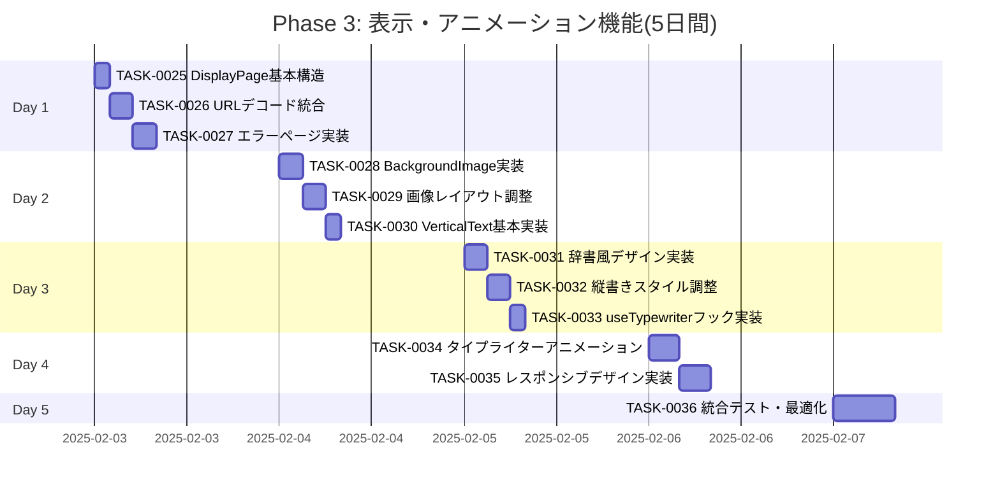

# Phase 3: 表示・アニメーション機能 - タスク詳細

## 📋 フェーズ情報

- **フェーズ名**: Phase 3 - 表示・アニメーション機能
- **期間**: 5日間(営業日)
- **見積工数**: 40時間(1日8時間想定)
- **タスク範囲**: TASK-0025 〜 TASK-0036
- **タスク数**: 12タスク
- **優先度**: P0(最優先・ブロッカー)
- **生成日**: 2025-01-20
- **生成ツール**: Claude Code

---

## 🎯 Phase 3 目標

### フェーズゴール

言葉表示ページとタイプライターアニメーション機能の完全実装を完了する。

### 主要成果物

1. ✅ DisplayPageコンポーネント(URLパラメータデコード統合)
2. ✅ BackgroundImage コンポーネント(武田鉄矢画像レイアウト)
3. ✅ VerticalTextDisplay コンポーネント(縦書き表示)
4. ✅ useTypewriter カスタムフック(タイプライターアニメーション)
5. ✅ 辞書風デザイン(見出し語、意味の表示形式)
6. ✅ レスポンシブデザイン(スマホ、タブレット、PC対応)

### マイルストーン達成基準

- [ ] M3-1: DisplayPageコンポーネントが正常にレンダリングされる
- [ ] M3-2: 武田鉄矢の画像が右側〜中央に正しく配置される
- [ ] M3-3: 縦書きテキスト(CSS `writing-mode: vertical-rl`)が正しく表示される
- [ ] M3-4: タイプライターアニメーション(100ms/文字)が動作する
- [ ] M3-5: 辞書風デザイン(見出し語、意味)が実装される
- [ ] M3-6: レスポンシブデザイン(スマホ、タブレット、PC)が動作する

### 完了判定条件

```bash
# すべてのコマンドがエラーなく実行できること
npm run dev         # 開発サーバーが起動する
npm run build       # エラーなくビルドできる
npm run test        # 全テストが成功する
npm run lint        # ESLintがエラー0件で完了
npm run type-check  # TypeScript型チェックがエラー0件
```

**機能確認基準**:
- [ ] 共有URLにアクセスすると言葉が1文字ずつタイプライターで表示される
- [ ] 縦書きテキストが正しく表示され、読みやすいデザインになっている
- [ ] 武田鉄矢の画像が右側〜中央に適切に配置されている
- [ ] スマートフォンでも適切にレスポンシブ表示される
- [ ] アニメーションが60fps以上でスムーズに動作する
- [ ] URLパラメータ不在時にトップページへリダイレクトされる

---

## 📅 週次計画

### Week 3(5日間): 表示・アニメーション機能

**目標**: DisplayPageとタイプライターアニメーションの完全実装

**週の成果物**:
- DisplayPageコンポーネントとレイアウト
- 縦書きテキスト表示
- タイプライターアニメーション
- レスポンシブデザイン

**リスク**:
- 縦書きCSSの複雑性(ブラウザ互換性)
- タイプライターアニメーションのパフォーマンス
- レスポンシブデザインでの画像と�キスト配置の最適化

**対策**:
- CSS `writing-mode: vertical-rl` のクロスブラウザテスト
- `requestAnimationFrame` を使用したアニメーション最適化
- メディアクエリとflexbox/gridの適切な使用

---

## 📊 タスク進捗管理

### 進捗ガントチャート



### タスク状態サマリー

| 状態 | タスク数 | 割合 |
|------|---------|------|
| TODO | 12 | 100% |
| IN_PROGRESS | 0 | 0% |
| DONE | 0 | 0% |

---

## 📝 日次タスク詳細

### Day 1: DisplayPage基本実装(8時間)

#### [x] TASK-0025: DisplayPage基本構造

**基本情報**:
- **タスクID**: TASK-0025
- **タスク名**: DisplayPageコンポーネント基本構造実装
- **見積工数**: 2時間
- **タスクタイプ**: TDD(テスト駆動開発)
- **優先度**: P0(最優先)
- **依存タスク**: TASK-0004(ルーティング完了)

**関連要件**:
- F-003: 贈る言葉表示ページ 🔵
- REQ-201: 武田鉄矢の画像を背景として表示 🔵
- REQ-206: 「新しい言葉を贈る」ボタン 🔵

**実装詳細**:

1. **コンポーネント仕様**:

`src/pages/DisplayPage.tsx`:
```typescript
import { useSearchParams, Navigate, useNavigate } from 'react-router-dom';
import { useState, useEffect } from 'react';
import { decodeGiftWordData } from '../utils/urlEncoder';
import BackgroundImage from '../components/DisplayPage/BackgroundImage';
import VerticalTextDisplay from '../components/DisplayPage/VerticalTextDisplay';
import Button from '../components/common/Button/Button';
import { GiftWordData } from '../types';
import styles from './DisplayPage.module.css';

/**
 * 贈る言葉表示ページ
 * F-003, REQ-201, REQ-206
 */
const DisplayPage: React.FC = () => {
  const [searchParams] = useSearchParams();
  const navigate = useNavigate();
  const [data, setData] = useState<GiftWordData | null>(null);
  const [error, setError] = useState<string | null>(null);
  const [isLoading, setIsLoading] = useState(true);

  useEffect(() => {
    const encodedData = searchParams.get('data');

    // REQ-212: URLパラメータが存在しない場合はリダイレクト
    if (!encodedData) {
      navigate('/', { replace: true });
      return;
    }

    // URLデコード
    const result = decodeGiftWordData(encodedData);

    if (!result.success || !result.data) {
      setError(result.error || 'データの読み込みに失敗しました');
    } else {
      setData(result.data);
    }

    setIsLoading(false);
  }, [searchParams, navigate]);

  if (isLoading) {
    return (
      <div className={styles.loading}>
        <p>読み込み中...</p>
      </div>
    );
  }

  if (error || !data) {
    // TASK-0027で詳細なエラーページを実装
    return <Navigate to="/" replace />;
  }

  return (
    <div className={styles.container}>
      <BackgroundImage />

      <div className={styles.content}>
        <VerticalTextDisplay word={data.word} meaning={data.meaning} />
      </div>

      <div className={styles.actions}>
        <Button onClick={() => navigate('/')} variant="secondary">
          新しい言葉を贈る
        </Button>
      </div>
    </div>
  );
};

export default DisplayPage;
```

`src/pages/DisplayPage.module.css`:
```css
.container {
  position: relative;
  width: 100%;
  min-height: 100vh;
  background-color: #2c3e50;
  overflow: hidden;
}

.loading {
  display: flex;
  justify-content: center;
  align-items: center;
  min-height: 100vh;
  font-size: var(--font-size-lg);
  color: var(--chalk-color-white);
}

.content {
  position: relative;
  z-index: 10;
  padding: var(--spacing-2xl);
}

.actions {
  position: fixed;
  bottom: var(--spacing-lg);
  left: 50%;
  transform: translateX(-50%);
  z-index: 100;
}

@media (max-width: 768px) {
  .content {
    padding: var(--spacing-lg);
  }

  .actions {
    bottom: var(--spacing-md);
  }
}
```

2. **テストケース**(`src/pages/__tests__/DisplayPage.test.tsx`):
```typescript
describe('DisplayPage', () => {
  it('正常にレンダリングされる', () => {});
  it('URLパラメータがない場合はリダイレクトされる', () => {});
  it('不正なURLパラメータの場合はエラーページを表示', () => {});
  it('ローディング状態が表示される', () => {});
  it('デコード成功時にデータが表示される', () => {});
  it('「新しい言葉を贈る」ボタンでトップページに戻る', () => {});
});
```

**完了基準**:
- [ ] すべてのテストケースが成功する
- [ ] URLパラメータの有無が正しく判定される
- [ ] ローディング状態が適切に表示される
- [ ] TypeScript型エラーがない

**プロセスコマンド**:
```bash
/tsumiki:tdd-requirements
/tsumiki:tdd-testcases
/tsumiki:tdd-red
/tsumiki:tdd-green
/tsumiki:tdd-refactor
/tsumiki:tdd-verify-complete
```

---

#### [ ] TASK-0026: URLデコード統合

**基本情報**:
- **タスクID**: TASK-0026
- **タスク名**: URLデコード機能のDisplayPage統合
- **見積工数**: 3時間
- **タスクタイプ**: TDD(テスト駆動開発)
- **優先度**: P0(最優先)
- **依存タスク**: TASK-0018(URLデコーダー完了), TASK-0025

**関連要件**:
- REQ-102: URLパラメータ形式 🔵
- REQ-103: Base64デコード 🔵
- REQ-212: URLパラメータ不在時のリダイレクト 🟡
- REQ-213: デコード失敗時のエラーメッセージ 🟡

**実装詳細**:

1. **デコード処理統合**:

`src/pages/DisplayPage.tsx` にデコードロジックを統合(TASK-0025で基本実装済み、ここで拡張):
```typescript
useEffect(() => {
  const encodedData = searchParams.get('data');

  // REQ-212: URLパラメータチェック
  if (!encodedData) {
    navigate('/', { replace: true });
    return;
  }

  try {
    setIsLoading(true);

    // REQ-103: Base64デコード
    const result = decodeGiftWordData(encodedData);

    if (!result.success || !result.data) {
      // REQ-213: デコード失敗時のエラーメッセージ
      setError(result.error || ERROR_MESSAGES.DECODE_FAILED);
      showToast(result.error || ERROR_MESSAGES.DECODE_FAILED, 'error');
      return;
    }

    // データバリデーション
    const { word, meaning } = result.data;
    if (!word || !meaning) {
      setError(ERROR_MESSAGES.INVALID_DATA);
      showToast(ERROR_MESSAGES.INVALID_DATA, 'error');
      return;
    }

    setData(result.data);
  } catch (error) {
    setError(ERROR_MESSAGES.UNEXPECTED_ERROR);
    showToast(ERROR_MESSAGES.UNEXPECTED_ERROR, 'error');
  } finally {
    setIsLoading(false);
  }
}, [searchParams, navigate, showToast]);
```

2. **テストケース**(`src/pages/__tests__/DisplayPage.test.tsx` に追加):
```typescript
describe('DisplayPage - URLデコード', () => {
  it('正常なBase64データをデコードして表示する', () => {});
  it('日本語を含むデータを正しくデコードする', () => {});
  it('不正なBase64データはエラーを表示する', () => {});
  it('データが欠けている場合はエラーを表示する', () => {});
  it('デコード失敗時にトーストメッセージが表示される', () => {});
  it('エラー後に「新しい言葉を贈る」で復帰できる', () => {});
});
```

**完了基準**:
- [ ] すべてのテストケースが成功する
- [ ] Base64デコードが正常に動作する
- [ ] エラーハンドリングが適切に機能する
- [ ] トーストメッセージが表示される
- [ ] TypeScript型エラーがない

**プロセスコマンド**:
```bash
/tsumiki:tdd-requirements
/tsumiki:tdd-testcases
/tsumiki:tdd-red
/tsumiki:tdd-green
/tsumiki:tdd-refactor
/tsumiki:tdd-verify-complete
```

---

#### [ ] TASK-0027: エラーページ実装

**基本情報**:
- **タスクID**: TASK-0027
- **タスク名**: エラーページコンポーネント実装
- **見積工数**: 3時間
- **タスクタイプ**: TDD(テスト駆動開発)
- **優先度**: P1(高)
- **依存タスク**: TASK-0026

**関連要件**:
- REQ-211: 不正なURLパラメータ時のエラーページ 🟡
- REQ-213: 分かりやすいエラーメッセージ 🟡

**実装詳細**:

1. **ErrorPageコンポーネント**:

`src/pages/ErrorPage.tsx`:
```typescript
import { useNavigate } from 'react-router-dom';
import Button from '../components/common/Button/Button';
import styles from './ErrorPage.module.css';

interface ErrorPageProps {
  message?: string;
  showHomeButton?: boolean;
}

/**
 * エラーページコンポーネント
 * REQ-211, REQ-213
 */
const ErrorPage: React.FC<ErrorPageProps> = ({
  message = 'データの読み込みに失敗しました',
  showHomeButton = true,
}) => {
  const navigate = useNavigate();

  return (
    <div className={styles.container}>
      <div className={styles.content}>
        <div className={styles.icon}>⚠️</div>

        <h1 className={styles.title}>エラーが発生しました</h1>

        <p className={styles.message}>{message}</p>

        <div className={styles.suggestions}>
          <p>以下をお試しください:</p>
          <ul>
            <li>URLが正しいか確認してください</li>
            <li>リンクを送ってくれた友達に確認してください</li>
            <li>新しい言葉を作成してみてください</li>
          </ul>
        </div>

        {showHomeButton && (
          <div className={styles.actions}>
            <Button onClick={() => navigate('/')} variant="primary">
              トップページに戻る
            </Button>
          </div>
        )}
      </div>
    </div>
  );
};

export default ErrorPage;
```

`src/pages/ErrorPage.module.css`:
```css
.container {
  display: flex;
  justify-content: center;
  align-items: center;
  min-height: 100vh;
  background: linear-gradient(135deg, #667eea 0%, #764ba2 100%);
  padding: var(--spacing-lg);
}

.content {
  background: white;
  border-radius: 16px;
  padding: var(--spacing-2xl);
  max-width: 500px;
  text-align: center;
  box-shadow: var(--shadow-lg);
}

.icon {
  font-size: 64px;
  margin-bottom: var(--spacing-lg);
}

.title {
  font-size: var(--font-size-2xl);
  font-weight: 700;
  margin-bottom: var(--spacing-md);
  color: #333;
}

.message {
  font-size: var(--font-size-lg);
  color: #666;
  margin-bottom: var(--spacing-xl);
}

.suggestions {
  text-align: left;
  background: #f8f9fa;
  padding: var(--spacing-lg);
  border-radius: 8px;
  margin-bottom: var(--spacing-xl);
}

.suggestions p {
  font-weight: 600;
  margin-bottom: var(--spacing-sm);
}

.suggestions ul {
  list-style: none;
  padding-left: 0;
}

.suggestions li {
  padding: var(--spacing-xs) 0;
  padding-left: var(--spacing-md);
  position: relative;
}

.suggestions li::before {
  content: '•';
  position: absolute;
  left: 0;
  color: var(--color-primary);
  font-weight: bold;
}

.actions {
  display: flex;
  justify-content: center;
}

@media (max-width: 768px) {
  .content {
    padding: var(--spacing-lg);
  }

  .title {
    font-size: var(--font-size-xl);
  }
}
```

2. **DisplayPageでのエラーページ統合**:

`src/pages/DisplayPage.tsx` を更新:
```typescript
import ErrorPage from './ErrorPage';

// ...既存のコード

if (error) {
  return <ErrorPage message={error} />;
}
```

3. **テストケース**(`src/pages/__tests__/ErrorPage.test.tsx`):
```typescript
describe('ErrorPage', () => {
  it('エラーメッセージが表示される', () => {});
  it('デフォルトメッセージが表示される', () => {});
  it('トップページに戻るボタンが表示される', () => {});
  it('トップページに戻るボタンが機能する', () => {});
  it('showHomeButton=falseの場合はボタンが非表示', () => {});
  it('提案リストが表示される', () => {});
});
```

**完了基準**:
- [ ] すべてのテストケースが成功する
- [ ] エラーメッセージが分かりやすく表示される
- [ ] トップページへ戻る機能が動作する
- [ ] レスポンシブデザインが機能する
- [ ] TypeScript型エラーがない

**プロセスコマンド**:
```bash
/tsumiki:tdd-requirements
/tsumiki:tdd-testcases
/tsumiki:tdd-red
/tsumiki:tdd-green
/tsumiki:tdd-refactor
/tsumiki:tdd-verify-complete
```

---

### Day 2: 背景画像・縦書きテキスト実装(8時間)

#### [ ] TASK-0028: BackgroundImage実装

**基本情報**:
- **タスクID**: TASK-0028
- **タスク名**: BackgroundImageコンポーネント実装
- **見積工数**: 3時間
- **タスクタイプ**: TDD(テスト駆動開発)
- **優先度**: P0(最優先)
- **依存タスク**: TASK-0025

**関連要件**:
- REQ-201: 武田鉄矢の画像を背景として表示 🔵
- REQ-202: 画像を右側〜中央に配置 🔵

**実装詳細**:

1. **BackgroundImageコンポーネント**:

`src/components/DisplayPage/BackgroundImage.tsx`:
```typescript
import styles from './BackgroundImage.module.css';

/**
 * 武田鉄矢の背景画像コンポーネント
 * REQ-201, REQ-202
 */
const BackgroundImage: React.FC = () => {
  return (
    <div className={styles.container}>
      
    </div>
  );
};

export default BackgroundImage;
```

`src/components/DisplayPage/BackgroundImage.module.css`:
```css
.container {
  position: absolute;
  top: 0;
  right: 0;
  width: 100%;
  height: 100%;
  display: flex;
  justify-content: flex-end;
  align-items: center;
  z-index: 1;
  pointer-events: none;
}

.image {
  /* REQ-202: 右側〜中央に配置 */
  height: 100%;
  max-width: 60%;
  object-fit: contain;
  object-position: right center;
}

/* タブレット */
@media (max-width: 1024px) {
  .image {
    max-width: 50%;
  }
}

/* スマートフォン(横向き) */
@media (max-width: 768px) and (orientation: landscape) {
  .image {
    max-width: 45%;
  }
}

/* スマートフォン(縦向き) */
@media (max-width: 768px) and (orientation: portrait) {
  .container {
    justify-content: center;
  }

  .image {
    max-width: 80%;
    object-position: center center;
    opacity: 0.3;
  }
}
```

2. **テストケース**(`src/components/DisplayPage/__tests__/BackgroundImage.test.tsx`):
```typescript
describe('BackgroundImage', () => {
  it('画像が表示される', () => {});
  it('画像パスが正しい', () => {});
  it('alt属性が設定されている', () => {});
  it('レスポンシブスタイルが適用される', () => {});
  it('画像の縦横比が保持される', () => {});
});
```

**完了基準**:
- [ ] すべてのテストケースが成功する
- [ ] 武田鉄矢の画像が表示される
- [ ] 右側〜中央の配置が正しい
- [ ] レスポンシブデザインが機能する
- [ ] TypeScript型エラーがない

**プロセスコマンド**:
```bash
/tsumiki:tdd-requirements
/tsumiki:tdd-testcases
/tsumiki:tdd-red
/tsumiki:tdd-green
/tsumiki:tdd-refactor
/tsumiki:tdd-verify-complete
```

---

#### [ ] TASK-0029: 画像レイアウト調整

**基本情報**:
- **タスクID**: TASK-0029
- **タスク名**: 画像とテキストのレイアウト最適化
- **見積工数**: 3時間
- **タスクタイプ**: TDD(テスト駆動開発)
- **優先度**: P0(最優先)
- **依存タスク**: TASK-0028

**関連要件**:
- REQ-202: 画像を右側〜中央に配置 🔵
- REQ-203: 黒板の左側スペースに縦書き表示 🔵
- NFR-203: レスポンシブデザイン 🔵

**実装詳細**:

1. **レイアウトグリッド調整**:

`src/pages/DisplayPage.module.css` を更新:
```css
.container {
  position: relative;
  width: 100%;
  min-height: 100vh;
  background-color: #2c3e50;
  display: grid;
  grid-template-columns: 1fr 1fr;
  grid-template-rows: 1fr auto;
  overflow: hidden;
}

.content {
  /* REQ-203: 黒板の左側スペース */
  grid-column: 1;
  grid-row: 1;
  position: relative;
  z-index: 10;
  padding: var(--spacing-2xl);
  display: flex;
  justify-content: center;
  align-items: center;
}

.actions {
  grid-column: 1 / -1;
  grid-row: 2;
  display: flex;
  justify-content: center;
  padding: var(--spacing-lg);
  z-index: 100;
}

/* タブレット */
@media (max-width: 1024px) {
  .container {
    grid-template-columns: 45% 55%;
  }

  .content {
    padding: var(--spacing-lg);
  }
}

/* スマートフォン(横向き) */
@media (max-width: 768px) and (orientation: landscape) {
  .container {
    grid-template-columns: 50% 50%;
  }

  .content {
    padding: var(--spacing-md);
  }
}

/* スマートフォン(縦向き) */
@media (max-width: 768px) and (orientation: portrait) {
  .container {
    grid-template-columns: 1fr;
    grid-template-rows: 1fr auto;
  }

  .content {
    grid-column: 1;
    padding: var(--spacing-lg);
  }
}
```

2. **テストケース**(`src/pages/__tests__/DisplayPage.test.tsx` に追加):
```typescript
describe('DisplayPage - レイアウト', () => {
  it('グリッドレイアウトが適用される', () => {});
  it('左側にテキスト、右側に画像が配置される', () => {});
  it('タブレットで適切なレイアウトになる', () => {});
  it('スマホ横向きで適切なレイアウトになる', () => {});
  it('スマホ縦向きで適切なレイアウトになる', () => {});
});
```

**完了基準**:
- [ ] すべてのテストケースが成功する
- [ ] テキストと画像が重ならない
- [ ] レスポンシブでレイアウトが適切に変化する
- [ ] 全画面サイズで読みやすい
- [ ] TypeScript型エラーがない

**プロセスコマンド**:
```bash
/tsumiki:tdd-requirements
/tsumiki:tdd-testcases
/tsumiki:tdd-red
/tsumiki:tdd-green
/tsumiki:tdd-refactor
/tsumiki:tdd-verify-complete
```

---

#### [ ] TASK-0030: VerticalText基本実装

**基本情報**:
- **タスクID**: TASK-0030
- **タスク名**: VerticalTextDisplayコンポーネント基本実装
- **見積工数**: 2時間
- **タスクタイプ**: TDD(テスト駆動開発)
- **優先度**: P0(最優先)
- **依存タスク**: TASK-0025

**関連要件**:
- REQ-203: 黒板の左側に縦書きで表示 🔵
- REQ-232: CSS `writing-mode: vertical-rl` 使用 🔵
- REQ-233: チョーク風の色 🔵

**実装詳細**:

1. **VerticalTextDisplayコンポーネント**:

`src/components/DisplayPage/VerticalTextDisplay.tsx`:
```typescript
import { useState } from 'react';
import useTypewriter from '../../hooks/useTypewriter';
import styles from './VerticalTextDisplay.module.css';

interface VerticalTextDisplayProps {
  word: string;
  meaning: string;
}

/**
 * 縦書きテキスト表示コンポーネント
 * REQ-203, REQ-232, REQ-233
 */
const VerticalTextDisplay: React.FC<VerticalTextDisplayProps> = ({
  word,
  meaning,
}) => {
  const [showMeaning, setShowMeaning] = useState(false);

  // タイプライターアニメーション(TASK-0033で実装)
  const { displayText: displayWord, isComplete: wordComplete } = useTypewriter({
    text: word,
    delay: 100,
    onComplete: () => setShowMeaning(true),
  });

  const { displayText: displayMeaning } = useTypewriter({
    text: meaning,
    delay: 100,
    enabled: showMeaning,
  });

  return (
    <div className={styles.container}>
      {/* REQ-204: 辞書風デザイン - 見出し語 */}
      <div className={styles.wordSection}>
        <h1 className={styles.word}>{displayWord}</h1>
      </div>

      {/* REQ-204: 辞書風デザイン - 意味 */}
      {showMeaning && (
        <div className={styles.meaningSection}>
          <p className={styles.meaning}>{displayMeaning}</p>
        </div>
      )}
    </div>
  );
};

export default VerticalTextDisplay;
```

`src/components/DisplayPage/VerticalTextDisplay.module.css`:
```css
.container {
  display: flex;
  gap: var(--spacing-2xl);
  justify-content: center;
  align-items: flex-start;
  height: 100%;
}

/* REQ-232: 縦書き */
.wordSection,
.meaningSection {
  writing-mode: vertical-rl;
  text-orientation: upright;
  font-family: var(--font-family-serif);
}

/* REQ-204: 辞書風デザイン - 見出し語 */
.word {
  /* REQ-233: チョーク風の色 */
  color: var(--chalk-color-yellow);
  font-size: 48px;
  font-weight: 700;
  line-height: 1.5;
  letter-spacing: 0.1em;
  text-shadow: 2px 2px 4px rgba(0, 0, 0, 0.3);
}

/* REQ-204: 辞書風デザイン - 意味 */
.meaningSection {
  padding-right: var(--spacing-lg);
  border-right: 2px solid var(--chalk-color-white);
}

.meaning {
  /* REQ-233: チョーク風の色 */
  color: var(--chalk-color-white);
  font-size: 20px;
  line-height: 1.8;
  letter-spacing: 0.05em;
  max-height: 70vh;
  overflow-y: auto;
}

/* スクロールバースタイル */
.meaning::-webkit-scrollbar {
  width: 8px;
}

.meaning::-webkit-scrollbar-track {
  background: rgba(255, 255, 255, 0.1);
  border-radius: 4px;
}

.meaning::-webkit-scrollbar-thumb {
  background: rgba(255, 255, 255, 0.3);
  border-radius: 4px;
}

/* タブレット */
@media (max-width: 1024px) {
  .word {
    font-size: 36px;
  }

  .meaning {
    font-size: 18px;
  }
}

/* スマートフォン */
@media (max-width: 768px) {
  .container {
    gap: var(--spacing-lg);
  }

  .word {
    font-size: 28px;
  }

  .meaning {
    font-size: 16px;
    max-height: 60vh;
  }
}
```

2. **テストケース**(`src/components/DisplayPage/__tests__/VerticalTextDisplay.test.tsx`):
```typescript
describe('VerticalTextDisplay', () => {
  it('言葉が縦書きで表示される', () => {});
  it('意味が縦書きで表示される', () => {});
  it('チョーク風の色が適用される', () => {});
  it('writing-mode: vertical-rlが適用される', () => {});
  it('辞書風のデザインになっている', () => {});
  it('レスポンシブでフォントサイズが調整される', () => {});
});
```

**完了基準**:
- [ ] すべてのテストケースが成功する
- [ ] 縦書きが正しく表示される
- [ ] チョーク風の色が適用される
- [ ] 辞書風デザインになっている
- [ ] TypeScript型エラーがない

**プロセスコマンド**:
```bash
/tsumiki:tdd-requirements
/tsumiki:tdd-testcases
/tsumiki:tdd-red
/tsumiki:tdd-green
/tsumiki:tdd-refactor
/tsumiki:tdd-verify-complete
```

---

### Day 3: 辞書風デザイン・アニメーション準備(8時間)

#### [ ] TASK-0031: 辞書風デザイン実装

**基本情報**:
- **タスクID**: TASK-0031
- **タスク名**: 辞書風デザインの詳細実装
- **見積工数**: 3時間
- **タスクタイプ**: TDD(テスト駆動開発)
- **優先度**: P0(最優先)
- **依存タスク**: TASK-0030

**関連要件**:
- REQ-204: 辞書風のデザインで表示 🔵
- REQ-233: チョーク風の色 🔵

**実装詳細**:

1. **辞書風スタイル拡張**:

`src/components/DisplayPage/VerticalTextDisplay.module.css` を更新:
```css
/* 辞書風デザイン拡張 */
.container {
  display: flex;
  gap: var(--spacing-2xl);
  justify-content: center;
  align-items: flex-start;
  height: 100%;
  padding: var(--spacing-xl);
  background: rgba(0, 0, 0, 0.2);
  border-radius: 8px;
  backdrop-filter: blur(10px);
}

.wordSection {
  writing-mode: vertical-rl;
  text-orientation: upright;
  font-family: var(--font-family-serif);
  position: relative;
  padding: var(--spacing-md);
}

.wordSection::before {
  content: '';
  position: absolute;
  left: 0;
  top: 0;
  bottom: 0;
  width: 3px;
  background: linear-gradient(
    to bottom,
    transparent 0%,
    var(--chalk-color-yellow) 20%,
    var(--chalk-color-yellow) 80%,
    transparent 100%
  );
  border-radius: 2px;
}

.word {
  color: var(--chalk-color-yellow);
  font-size: 48px;
  font-weight: 700;
  line-height: 1.5;
  letter-spacing: 0.1em;
  text-shadow:
    2px 2px 4px rgba(0, 0, 0, 0.5),
    0 0 20px rgba(255, 250, 205, 0.3);
  position: relative;
}

.meaningSection {
  writing-mode: vertical-rl;
  text-orientation: upright;
  font-family: var(--font-family-serif);
  padding-right: var(--spacing-lg);
  padding-left: var(--spacing-md);
  border-right: 2px solid rgba(240, 240, 240, 0.3);
  position: relative;
}

.meaningSection::before {
  content: '【意味】';
  position: absolute;
  top: 0;
  right: 100%;
  margin-right: var(--spacing-sm);
  color: var(--chalk-color-yellow);
  font-size: 14px;
  font-weight: 600;
  writing-mode: vertical-rl;
  text-orientation: upright;
  opacity: 0.8;
}

.meaning {
  color: var(--chalk-color-white);
  font-size: 20px;
  line-height: 1.8;
  letter-spacing: 0.05em;
  max-height: 70vh;
  overflow-y: auto;
  text-shadow: 1px 1px 2px rgba(0, 0, 0, 0.3);
}

/* チョーク風テクスチャエフェクト(オプション) */
@media (min-width: 1024px) {
  .word,
  .meaning {
    filter: contrast(1.1) brightness(1.05);
  }
}
```

2. **テストケース**(`src/components/DisplayPage/__tests__/VerticalTextDisplay.test.tsx` に追加):
```typescript
describe('VerticalTextDisplay - 辞書風デザイン', () => {
  it('見出し語に装飾ラインが表示される', () => {});
  it('意味セクションに「【意味】」ラベルが表示される', () => {});
  it('背景に半透明の黒板エフェクトが適用される', () => {});
  it('テキストシャドウが適用される', () => {});
  it('ボーダーラインが表示される', () => {});
});
```

**完了基準**:
- [ ] すべてのテストケースが成功する
- [ ] 辞書のような見た目になっている
- [ ] チョーク風の質感が表現されている
- [ ] 読みやすいデザインになっている
- [ ] TypeScript型エラーがない

**プロセスコマンド**:
```bash
/tsumiki:tdd-requirements
/tsumiki:tdd-testcases
/tsumiki:tdd-red
/tsumiki:tdd-green
/tsumiki:tdd-refactor
/tsumiki:tdd-verify-complete
```

---

#### [ ] TASK-0032: 縦書きスタイル調整

**基本情報**:
- **タスクID**: TASK-0032
- **タスク名**: 縦書きスタイルの微調整と最適化
- **見積工数**: 3時間
- **タスクタイプ**: TDD(テスト駆動開発)
- **優先度**: P1(高)
- **依存タスク**: TASK-0031

**関連要件**:
- REQ-232: CSS `writing-mode: vertical-rl` 🔵
- REQ-021: 日本語(ひらがな、カタカナ、漢字)対応 🔵
- NFR-203: レスポンシブデザイン 🔵

**実装詳細**:

1. **縦書き最適化**:

`src/components/DisplayPage/VerticalTextDisplay.module.css` を更新:
```css
/* 日本語縦書き最適化 */
.wordSection,
.meaningSection {
  writing-mode: vertical-rl;
  text-orientation: upright;
  font-family: var(--font-family-serif);

  /* 日本語縦書き用フォント設定 */
  -webkit-font-feature-settings: 'vkrn', 'vpal';
  font-feature-settings: 'vkrn', 'vpal';

  /* 縦書き時の句読点調整 */
  hanging-punctuation: allow-end;
}

/* 句読点・記号の調整 */
.word,
.meaning {
  text-combine-upright: none;
  -webkit-text-combine: none;

  /* 長い英数字の縦中横(縦書き中の横組み) */
  > span.tcy {
    text-combine-upright: all;
    -webkit-text-combine: horizontal;
  }
}

/* 改行・空白の処理 */
.meaning {
  white-space: pre-wrap;
  word-break: keep-all;
  overflow-wrap: break-word;
}

/* ブラウザ互換性対応 */
@supports not (writing-mode: vertical-rl) {
  .wordSection,
  .meaningSection {
    /* フォールバック: 横書き */
    writing-mode: horizontal-tb;
  }

  .container {
    flex-direction: column;
  }
}

/* Safari対応 */
@supports (-webkit-marquee-repetition: infinite) {
  .word,
  .meaning {
    -webkit-text-orientation: upright;
  }
}
```

2. **テストケース**(`src/components/DisplayPage/__tests__/VerticalTextDisplay.test.tsx` に追加):
```typescript
describe('VerticalTextDisplay - 縦書き最適化', () => {
  it('ひらがなが正しく縦書き表示される', () => {});
  it('カタカナが正しく縦書き表示される', () => {});
  it('漢字が正しく縦書き表示される', () => {});
  it('句読点が適切に配置される', () => {});
  it('改行が保持される', () => {});
  it('長い英数字が縦中横で表示される', () => {});
  it('ブラウザ非対応時にフォールバックされる', () => {});
});
```

**完了基準**:
- [ ] すべてのテストケースが成功する
- [ ] 日本語が美しく縦書き表示される
- [ ] 句読点の配置が自然である
- [ ] クロスブラウザで動作する
- [ ] TypeScript型エラーがない

**プロセスコマンド**:
```bash
/tsumiki:tdd-requirements
/tsumiki:tdd-testcases
/tsumiki:tdd-red
/tsumiki:tdd-green
/tsumiki:tdd-refactor
/tsumiki:tdd-verify-complete
```

---

#### [ ] TASK-0033: useTypewriterフック実装

**基本情報**:
- **タスクID**: TASK-0033
- **タスク名**: useTypewriterカスタムフック実装
- **見積工数**: 2時間
- **タスクタイプ**: TDD(テスト駆動開発)
- **優先度**: P0(最優先)
- **依存タスク**: なし(Phase 1完了)

**関連要件**:
- REQ-205: タイプライターアニメーション 🔵
- REQ-231: 100ms/文字の速度 🔵
- NFR-002: 60fps維持 🔵

**実装詳細**:

1. **useTypewriterフック**:

`src/hooks/useTypewriter.ts`:
```typescript
import { useState, useEffect, useRef } from 'react';
import { ANIMATION_CONFIG } from '../types';

interface UseTypewriterOptions {
  /** 表示するテキスト */
  text: string;
  /** 1文字あたりの表示時間(ms) REQ-231: デフォルト100ms */
  delay?: number;
  /** アニメーション完了時のコールバック */
  onComplete?: () => void;
  /** アニメーションを有効にするか */
  enabled?: boolean;
}

interface UseTypewriterReturn {
  /** 現在表示中のテキスト */
  displayText: string;
  /** アニメーションが完了したか */
  isComplete: boolean;
  /** アニメーションをスキップ */
  skip: () => void;
  /** アニメーションをリセット */
  reset: () => void;
}

/**
 * タイプライターアニメーションフック
 * REQ-205, REQ-231, NFR-002
 */
const useTypewriter = ({
  text,
  delay = ANIMATION_CONFIG.TYPEWRITER_DELAY,
  onComplete,
  enabled = true,
}: UseTypewriterOptions): UseTypewriterReturn => {
  const [displayText, setDisplayText] = useState('');
  const [isComplete, setIsComplete] = useState(false);
  const currentIndexRef = useRef(0);
  const animationFrameRef = useRef<number>();
  const lastUpdateTimeRef = useRef<number>(0);

  const skip = () => {
    setDisplayText(text);
    setIsComplete(true);
    currentIndexRef.current = text.length;
    if (animationFrameRef.current) {
      cancelAnimationFrame(animationFrameRef.current);
    }
    onComplete?.();
  };

  const reset = () => {
    setDisplayText('');
    setIsComplete(false);
    currentIndexRef.current = 0;
    lastUpdateTimeRef.current = 0;
  };

  useEffect(() => {
    if (!enabled || !text) {
      return;
    }

    reset();

    // REQ-231, NFR-002: requestAnimationFrameで60fps維持
    const animate = (timestamp: number) => {
      if (lastUpdateTimeRef.current === 0) {
        lastUpdateTimeRef.current = timestamp;
      }

      const elapsed = timestamp - lastUpdateTimeRef.current;

      if (elapsed >= delay) {
        currentIndexRef.current += 1;
        setDisplayText(text.substring(0, currentIndexRef.current));
        lastUpdateTimeRef.current = timestamp;

        if (currentIndexRef.current >= text.length) {
          setIsComplete(true);
          onComplete?.();
          return;
        }
      }

      animationFrameRef.current = requestAnimationFrame(animate);
    };

    animationFrameRef.current = requestAnimationFrame(animate);

    return () => {
      if (animationFrameRef.current) {
        cancelAnimationFrame(animationFrameRef.current);
      }
    };
  }, [text, delay, enabled, onComplete]);

  return {
    displayText,
    isComplete,
    skip,
    reset,
  };
};

export default useTypewriter;
```

2. **テストケース**(`src/hooks/__tests__/useTypewriter.test.tsx`):
```typescript
describe('useTypewriter', () => {
  it('テキストが1文字ずつ表示される', async () => {});
  it('100ms/文字の速度で表示される', async () => {});
  it('アニメーション完了後にonCompleteが呼ばれる', async () => {});
  it('skip()で即座に全文表示される', () => {});
  it('reset()でアニメーションがリセットされる', () => {});
  it('enabled=falseの場合はアニメーションしない', () => {});
  it('空文字列でもエラーにならない', () => {});
  it('日本語が正しく1文字ずつ表示される', async () => {});
});
```

**完了基準**:
- [ ] すべてのテストケースが成功する
- [ ] 100ms/文字で表示される
- [ ] 60fps以上で動作する
- [ ] skip機能が動作する
- [ ] TypeScript型エラーがない

**プロセスコマンド**:
```bash
/tsumiki:tdd-requirements
/tsumiki:tdd-testcases
/tsumiki:tdd-red
/tsumiki:tdd-green
/tsumiki:tdd-refactor
/tsumiki:tdd-verify-complete
```

---

### Day 4: タイプライターアニメーション・レスポンシブ(8時間)

#### [ ] TASK-0034: タイプライターアニメーション統合

**基本情報**:
- **タスクID**: TASK-0034
- **タスク名**: タイプライターアニメーションのDisplayPage統合
- **見積工数**: 4時間
- **タスクタイプ**: TDD(テスト駆動開発)
- **優先度**: P0(最優先)
- **依存タスク**: TASK-0033

**関連要件**:
- REQ-205: タイプライターアニメーション 🔵
- REQ-221: アニメーションスキップ機能(オプション) 🔵
- NFR-002: 60fps維持 🔵

**実装詳細**:

1. **VerticalTextDisplayへの統合**(TASK-0030で基本実装済み、拡張):

`src/components/DisplayPage/VerticalTextDisplay.tsx` を更新:
```typescript
import { useState } from 'react';
import useTypewriter from '../../hooks/useTypewriter';
import styles from './VerticalTextDisplay.module.css';
import clsx from 'clsx';

interface VerticalTextDisplayProps {
  word: string;
  meaning: string;
}

const VerticalTextDisplay: React.FC<VerticalTextDisplayProps> = ({
  word,
  meaning,
}) => {
  const [showMeaning, setShowMeaning] = useState(false);
  const [canSkip, setCanSkip] = useState(true);

  // 言葉のアニメーション
  const {
    displayText: displayWord,
    isComplete: wordComplete,
    skip: skipWord,
  } = useTypewriter({
    text: word,
    delay: 100,
    onComplete: () => {
      setShowMeaning(true);
      // 意味のアニメーション開始後、スキップ可能に
      setTimeout(() => setCanSkip(true), 100);
    },
  });

  // 意味のアニメーション
  const {
    displayText: displayMeaning,
    isComplete: meaningComplete,
    skip: skipMeaning,
  } = useTypewriter({
    text: meaning,
    delay: 100,
    enabled: showMeaning,
    onComplete: () => {
      setCanSkip(false);
    },
  });

  // REQ-221: クリックでスキップ(オプション)
  const handleSkip = () => {
    if (!canSkip) return;

    if (!wordComplete) {
      skipWord();
    } else if (showMeaning && !meaningComplete) {
      skipMeaning();
    }
  };

  return (
    <div
      className={clsx(styles.container, canSkip && styles.clickable)}
      onClick={handleSkip}
      role="button"
      tabIndex={0}
      aria-label="クリックでアニメーションをスキップ"
    >
      {/* 見出し語 */}
      <div className={styles.wordSection}>
        <h1 className={styles.word}>{displayWord}</h1>
      </div>

      {/* 意味 */}
      {showMeaning && (
        <div className={styles.meaningSection}>
          <p className={styles.meaning}>{displayMeaning}</p>
        </div>
      )}

      {/* スキップヒント */}
      {canSkip && (
        <div className={styles.skipHint}>
          <span>タップでスキップ</span>
        </div>
      )}
    </div>
  );
};

export default VerticalTextDisplay;
```

`src/components/DisplayPage/VerticalTextDisplay.module.css` に追加:
```css
.clickable {
  cursor: pointer;
  user-select: none;
}

.clickable:focus {
  outline: 2px solid var(--chalk-color-yellow);
  outline-offset: 4px;
}

.skipHint {
  position: fixed;
  bottom: 80px;
  left: 50%;
  transform: translateX(-50%);
  color: var(--chalk-color-white);
  font-size: 14px;
  opacity: 0.5;
  animation: fadeInOut 2s ease-in-out infinite;
  z-index: 50;
  pointer-events: none;
}

@keyframes fadeInOut {
  0%, 100% {
    opacity: 0.3;
  }
  50% {
    opacity: 0.7;
  }
}

@media (max-width: 768px) {
  .skipHint {
    bottom: 100px;
    font-size: 12px;
  }
}
```

2. **テストケース**(`src/components/DisplayPage/__tests__/VerticalTextDisplay.test.tsx` に追加):
```typescript
describe('VerticalTextDisplay - アニメーション', () => {
  it('言葉が1文字ずつ表示される', async () => {});
  it('言葉の表示完了後に意味が表示される', async () => {});
  it('意味が1文字ずつ表示される', async () => {});
  it('クリックでアニメーションがスキップされる', async () => {});
  it('アニメーション完了後はクリック不可', () => {});
  it('スキップヒントが表示される', () => {});
  it('60fps以上で動作する', async () => {});
});
```

**完了基準**:
- [ ] すべてのテストケースが成功する
- [ ] タイプライターアニメーションが動作する
- [ ] スキップ機能が動作する
- [ ] 60fps以上でスムーズに動作する
- [ ] TypeScript型エラーがない

**プロセスコマンド**:
```bash
/tsumiki:tdd-requirements
/tsumiki:tdd-testcases
/tsumiki:tdd-red
/tsumiki:tdd-green
/tsumiki:tdd-refactor
/tsumiki:tdd-verify-complete
```

---

#### [ ] TASK-0035: レスポンシブデザイン実装

**基本情報**:
- **タスクID**: TASK-0035
- **タスク名**: レスポンシブデザインの完全実装
- **見積工数**: 4時間
- **タスクタイプ**: TDD(テスト駆動開発)
- **優先度**: P0(最優先)
- **依存タスク**: TASK-0028, TASK-0030

**関連要件**:
- NFR-203: レスポンシブデザイン 🔵
- NFR-401: モバイル横向きでPC版と同じレイアウト 🔵
- NFR-402: モバイル縦向きで適切に対応 🟡

**実装詳細**:

1. **レスポンシブスタイル**:

`src/pages/DisplayPage.module.css` を更新:
```css
/* ベース(デスクトップ: 1280px以上) */
.container {
  position: relative;
  width: 100%;
  min-height: 100vh;
  background-color: #2c3e50;
  display: grid;
  grid-template-columns: 1fr 1fr;
  grid-template-rows: 1fr auto;
  overflow: hidden;
}

.content {
  grid-column: 1;
  grid-row: 1;
  position: relative;
  z-index: 10;
  padding: var(--spacing-2xl);
  display: flex;
  justify-content: center;
  align-items: center;
}

.actions {
  grid-column: 1 / -1;
  grid-row: 2;
  display: flex;
  justify-content: center;
  padding: var(--spacing-lg);
  z-index: 100;
}

/* タブレット(768px - 1024px) */
@media (max-width: 1024px) and (min-width: 769px) {
  .container {
    grid-template-columns: 45% 55%;
  }

  .content {
    padding: var(--spacing-lg);
  }
}

/* スマートフォン横向き(NFR-401: PC版と同じレイアウト) */
@media (max-width: 768px) and (orientation: landscape) {
  .container {
    grid-template-columns: 50% 50%;
  }

  .content {
    padding: var(--spacing-md) var(--spacing-lg);
  }

  .actions {
    padding: var(--spacing-md);
  }
}

/* スマートフォン縦向き(NFR-402) */
@media (max-width: 768px) and (orientation: portrait) {
  .container {
    grid-template-columns: 1fr;
    grid-template-rows: 1fr auto;
  }

  .content {
    grid-column: 1;
    padding: var(--spacing-lg);
  }

  .actions {
    grid-column: 1;
    padding: var(--spacing-md);
  }
}

/* 極小画面(375px以下) */
@media (max-width: 375px) {
  .content {
    padding: var(--spacing-md);
  }
}
```

`src/components/DisplayPage/VerticalTextDisplay.module.css` を更新:
```css
/* デスクトップ */
.word {
  font-size: 48px;
}

.meaning {
  font-size: 20px;
  max-height: 70vh;
}

/* タブレット */
@media (max-width: 1024px) and (min-width: 769px) {
  .word {
    font-size: 40px;
  }

  .meaning {
    font-size: 18px;
    max-height: 65vh;
  }
}

/* スマートフォン横向き */
@media (max-width: 768px) and (orientation: landscape) {
  .container {
    gap: var(--spacing-lg);
  }

  .word {
    font-size: 32px;
  }

  .meaning {
    font-size: 16px;
    max-height: 60vh;
  }
}

/* スマートフォン縦向き */
@media (max-width: 768px) and (orientation: portrait) {
  .container {
    gap: var(--spacing-md);
    padding: var(--spacing-md);
  }

  .word {
    font-size: 28px;
  }

  .meaning {
    font-size: 16px;
    max-height: 55vh;
  }
}

/* 極小画面 */
@media (max-width: 375px) {
  .word {
    font-size: 24px;
  }

  .meaning {
    font-size: 14px;
  }
}
```

2. **テストケース**(`src/pages/__tests__/DisplayPage.test.tsx` に追加):
```typescript
describe('DisplayPage - レスポンシブ', () => {
  it('デスクトップで2カラムレイアウトになる', () => {});
  it('タブレットで45%/55%レイアウトになる', () => {});
  it('スマホ横向きで50%/50%レイアウトになる', () => {});
  it('スマホ縦向きで1カラムレイアウトになる', () => {});
  it('各画面サイズでフォントサイズが調整される', () => {});
  it('すべての画面サイズで読みやすい', () => {});
});
```

**完了基準**:
- [ ] すべてのテストケースが成功する
- [ ] デスクトップ、タブレット、スマホで適切に表示される
- [ ] 横向き・縦向きで適切に表示される
- [ ] すべての画面サイズで読みやすい
- [ ] TypeScript型エラーがない

**プロセスコマンド**:
```bash
/tsumiki:tdd-requirements
/tsumiki:tdd-testcases
/tsumiki:tdd-red
/tsumiki:tdd-green
/tsumiki:tdd-refactor
/tsumiki:tdd-verify-complete
```

---

### Day 5: Phase 3 統合テスト・最適化(8時間)

#### TASK-0036: 統合テスト・最適化

**基本情報**:
- **タスクID**: TASK-0036
- **タスク名**: Phase 3 統合テストとパフォーマンス最適化
- **見積工数**: 8時間
- **タスクタイプ**: TDD(テスト駆動開発)
- **優先度**: P0(最優先)
- **依存タスク**: TASK-0025 〜 TASK-0035(全タスク完了)

**関連要件**:
- NFR-001: ページ読み込み3秒以内 🔵
- NFR-002: 60fps維持 🔵
- NFR-004: Lighthouse 90+点 🔵

**実装詳細**:

1. **統合テスト実施内容**:

```bash
# 手動テスト手順

## 基本フロー
1. `npm run dev` で開発サーバー起動
2. トップページでフォーム入力して共有URL生成
3. 生成されたURLにアクセス
4. 言葉が1文字ずつタイプライター表示されることを確認
5. 言葉の表示完了後、意味が1文字ずつ表示されることを確認
6. クリックでアニメーションをスキップできることを確認
7. 「新しい言葉を贈る」ボタンでトップページに戻ることを確認

## エラーケース
1. URLパラメータなしでアクセス → トップページへリダイレクト
2. 不正なURLパラメータでアクセス → エラーページ表示
3. 空のデータでアクセス → エラーページ表示

## レスポンシブテスト
1. デスクトップ(1280px以上) → 2カラムレイアウト
2. タブレット(768px-1024px) → 45%/55%レイアウト
3. スマホ横向き(〜768px) → 50%/50%レイアウト
4. スマホ縦向き(〜768px) → 1カラムレイアウト
5. 極小画面(375px以下) → フォントサイズ縮小

## クロスブラウザテスト
1. Chrome最新版
2. Firefox最新版
3. Edge最新版
4. Safari最新版(Macがあれば)

## アニメーションテスト
1. 60fps以上で動作(DevTools Performance)
2. 100ms/文字の速度
3. スキップが即座に動作
4. アニメーション中にメモリリークがない
```

2. **パフォーマンス最適化**:

**コンポーネントのメモ化**:

`src/components/DisplayPage/BackgroundImage.tsx`:
```typescript
import { memo } from 'react';
import styles from './BackgroundImage.module.css';

const BackgroundImage: React.FC = memo(() => {
  return (
    <div className={styles.container}>
      
    </div>
  );
});

BackgroundImage.displayName = 'BackgroundImage';

export default BackgroundImage;
```

**useTypewriterの最適化**:

`src/hooks/useTypewriter.ts` を更新:
```typescript
import { useState, useEffect, useRef, useCallback } from 'react';

// ...既存のコード

const useTypewriter = ({
  text,
  delay = ANIMATION_CONFIG.TYPEWRITER_DELAY,
  onComplete,
  enabled = true,
}: UseTypewriterOptions): UseTypewriterReturn => {
  // ...既存のstate

  // useCallbackでメモ化
  const skip = useCallback(() => {
    setDisplayText(text);
    setIsComplete(true);
    currentIndexRef.current = text.length;
    if (animationFrameRef.current) {
      cancelAnimationFrame(animationFrameRef.current);
    }
    onComplete?.();
  }, [text, onComplete]);

  const reset = useCallback(() => {
    setDisplayText('');
    setIsComplete(false);
    currentIndexRef.current = 0;
    lastUpdateTimeRef.current = 0;
  }, []);

  // ...残りのコード

  return {
    displayText,
    isComplete,
    skip,
    reset,
  };
};
```

3. **Lighthouse最適化チェックリスト**:

```markdown
## Performance
- [ ] 初回読み込み3秒以内
- [ ] First Contentful Paint (FCP) < 1.8s
- [ ] Largest Contentful Paint (LCP) < 2.5s
- [ ] Total Blocking Time (TBT) < 200ms
- [ ] Cumulative Layout Shift (CLS) < 0.1

## Accessibility
- [ ] 適切なARIA属性
- [ ] キーボード操作可能
- [ ] 適切なコントラスト比
- [ ] alt属性設定

## Best Practices
- [ ] HTTPS使用(GitHub Pages)
- [ ] コンソールエラー0件
- [ ] 適切な画像フォーマット

## SEO
- [ ] meta descriptionタグ
- [ ] titleタグ
- [ ] レスポンシブメタタグ
```

4. **テストケース**(`src/__tests__/integration/DisplayFlow.test.tsx`):
```typescript
describe('DisplayPage 統合テスト', () => {
  it('完全なフローが動作する', async () => {
    // 1. トップページでフォーム入力
    // 2. URL生成
    // 3. DisplayPageで表示
    // 4. アニメーション完了
    // 5. トップページへ戻る
  });

  it('エラーケースが正しく処理される', async () => {});
  it('レスポンシブで正しく表示される', async () => {});
  it('パフォーマンス基準を満たす', async () => {});
});
```

**完了基準**:
- [ ] すべてのテストケースが成功する
- [ ] Lighthouse Performance 90+点
- [ ] Lighthouse Accessibility 90+点
- [ ] アニメーションが60fps以上
- [ ] クロスブラウザで動作する
- [ ] TypeScript型エラー0件
- [ ] ESLintエラー0件

**プロセスコマンド**:
```bash
/tsumiki:tdd-requirements
/tsumiki:tdd-testcases
/tsumiki:tdd-red
/tsumiki:tdd-green
/tsumiki:tdd-refactor
/tsumiki:tdd-verify-complete
```

---

## 🎯 Phase 3 完了チェックリスト

### コンポーネント実装
- [ ] DisplayPageコンポーネントが実装されている
- [ ] BackgroundImageコンポーネントが実装されている
- [ ] VerticalTextDisplayコンポーネントが実装されている
- [ ] ErrorPageコンポーネントが実装されている

### カスタムフック
- [ ] useTypewriterフックが実装されている
- [ ] アニメーション制御が正常に動作する

### 機能確認
- [ ] URLデコードが正常に動作する
- [ ] タイプライターアニメーションが動作する
- [ ] 縦書き表示が正しく機能する
- [ ] 辞書風デザインが実装されている
- [ ] レスポンシブデザインが動作する
- [ ] エラーハンドリングが機能する

### デザイン・スタイル
- [ ] 武田鉄矢の画像が適切に配置されている
- [ ] チョーク風の色が適用されている
- [ ] 縦書きCSSが正しく動作する
- [ ] すべての画面サイズで読みやすい

### テスト
- [ ] すべてのコンポーネントテストが成功する
- [ ] すべてのフックテストが成功する
- [ ] 統合テストが成功する
- [ ] `npm test` がエラー0件

### パフォーマンス
- [ ] ページ読み込みが3秒以内
- [ ] アニメーションが60fps以上
- [ ] Lighthouse Performance 90+点
- [ ] メモリリークがない

### 品質基準
- [ ] TypeScript strict mode でエラー0件
- [ ] ESLint エラー0件
- [ ] Prettier 全ファイルフォーマット済み
- [ ] クロスブラウザ動作確認完了

---

## 📊 Phase 3 完了報告テンプレート

```markdown
# Phase 3: 表示・アニメーション機能 - 完了報告

## 完了日
YYYY-MM-DD

## 実施工数
- 見積: 40時間
- 実績: XX時間
- 差異: ±XX時間

## 完了タスク
- [x] TASK-0025: DisplayPage基本構造
- [x] TASK-0026: URLデコード統合
- [x] TASK-0027: エラーページ実装
- [x] TASK-0028: BackgroundImage実装
- [x] TASK-0029: 画像レイアウト調整
- [x] TASK-0030: VerticalText基本実装
- [x] TASK-0031: 辞書風デザイン実装
- [x] TASK-0032: 縦書きスタイル調整
- [x] TASK-0033: useTypewriterフック実装
- [x] TASK-0034: タイプライターアニメーション統合
- [x] TASK-0035: レスポンシブデザイン実装
- [x] TASK-0036: 統合テスト・最適化

## マイルストーン達成状況
- [x] M3-1: DisplayPageコンポーネントが正常にレンダリングされる
- [x] M3-2: 武田鉄矢の画像が右側〜中央に正しく配置される
- [x] M3-3: 縦書きテキスト(CSS `writing-mode: vertical-rl`)が正しく表示される
- [x] M3-4: タイプライターアニメーション(100ms/文字)が動作する
- [x] M3-5: 辞書風デザイン(見出し語、意味)が実装される
- [x] M3-6: レスポンシブデザイン(スマホ、タブレット、PC)が動作する

## 成果物
- DisplayPageコンポーネント: ✅
- URLデコード統合: ✅
- 縦書きテキスト表示: ✅
- タイプライターアニメーション: ✅
- 辞書風デザイン: ✅
- レスポンシブデザイン: ✅

## テスト結果
- 単体テスト成功率: XX%
- 統合テスト: ✅
- Lighthouse Performance: XX点
- Lighthouse Accessibility: XX点

## パフォーマンス
- 初回読み込み: X.Xs
- アニメーションFPS: XX fps
- バンドルサイズ: XXX KB

## 課題・改善点
(あれば記載)

## 次フェーズ(Phase 4)への引き継ぎ事項
- html2canvas統合による画像エクスポート機能
- エラーハンドリングの拡充
- パフォーマンス最適化の継続
```

---

## 🔄 更新履歴

- 2025-01-20: Phase 3タスクファイル作成(Claude Codeにより生成)

---

**次のアクション**: Phase 4タスクファイルの参照 → [gift-words-phase4.md](./gift-words-phase4.md)
